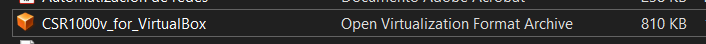
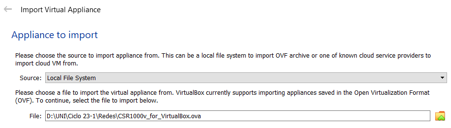
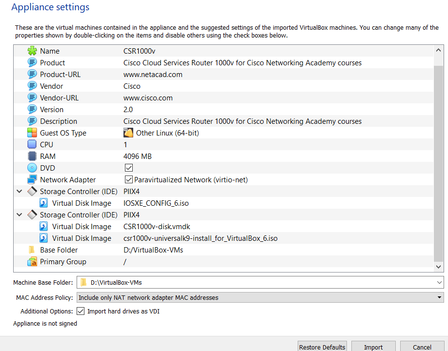
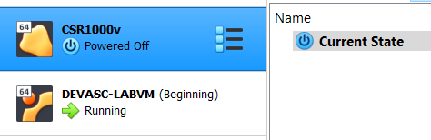
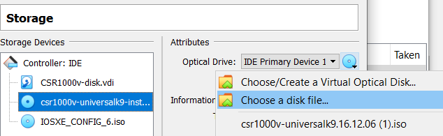

# Instalación de la máquina virtual CSR1000v <!-- omit in toc -->

- [Part 1: Instala CSR1000v VM en VirtualBox](#part-1-instala-csr1000v-vm-en-virtualbox)
  - [Paso 1. Solo parea el intructor](#paso-1-solo-parea-el-intructor)
  - [Paso 2. Descarga el archivo OVA de CSR1000v](#paso-2-descarga-el-archivo-ova-de-csr1000v)
  - [Paso 3. Instala archivo OVA de CSR1000v](#paso-3-instala-archivo-ova-de-csr1000v)
  - [Paso 4. Actualiza la ubicación de la instalación del archivo ISO](#paso-4-actualiza-la-ubicación-de-la-instalación-del-archivo-iso)
- [Paso 5. Para VirtualBox en Mac y Linux, verifique que el CSR1000v está utilizando un adaptador Host-Only](#paso-5-para-virtualbox-en-mac-y-linux-verifique-que-el-csr1000v-está-utilizando-un-adaptador-host-only)
- [Part 2: Verificar comunicaciones a CSR1000v](#part-2-verificar-comunicaciones-a-csr1000v)

> Para este laboratorio seguimos [esta guía en inglés](https://www.studocu.com/es-mx/document/universidad-nacional-autonoma-de-mexico/ingles/763-lab-automated-testing-using-pyats-and-genie/24191508)

## Part 1: Instala CSR1000v VM en VirtualBox

### Paso 1. Solo parea el intructor

### Paso 2. Descarga el archivo OVA de CSR1000v

### Paso 3. Instala archivo OVA de CSR1000v

### Paso 4. Actualiza la ubicación de la instalación del archivo ISO

## Paso 5. Para VirtualBox en Mac y Linux, verifique que el CSR1000v está utilizando un adaptador Host-Only

## Part 2: Verificar comunicaciones a CSR1000v

