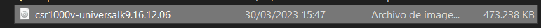
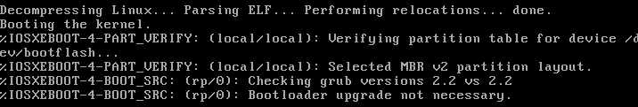

# Instalación de la máquina virtual CSR1000v <!-- omit in toc -->

- [Part 1. Instala CSR1000v VM en VirtualBox](#part-1-instala-csr1000v-vm-en-virtualbox)
  - [Paso 1. Solo parea el intructor](#paso-1-solo-parea-el-intructor)
  - [Paso 2. Descarga el archivo OVA de CSR1000v](#paso-2-descarga-el-archivo-ova-de-csr1000v)
  - [Paso 3. Instala archivo OVA de CSR1000v](#paso-3-instala-archivo-ova-de-csr1000v)
  - [Paso 4. Actualiza la ubicación de la instalación del archivo ISO](#paso-4-actualiza-la-ubicación-de-la-instalación-del-archivo-iso)
  - [Paso 5. Para VirtualBox en Mac y Linux, verifica que el CSR1000v está utilizando un adaptador Host-Only](#paso-5-para-virtualbox-en-mac-y-linux-verifica-que-el-csr1000v-está-utilizando-un-adaptador-host-only)
  - [Paso 6. Inicia la máquina virtual CSR1000v](#paso-6-inicia-la-máquina-virtual-csr1000v)
  - [Paso 7. Proceso de carga de la VM](#paso-7-proceso-de-carga-de-la-vm)
- [Part 2. Verifica comunicaciones a CSR1000v](#part-2-verifica-comunicaciones-a-csr1000v)
  - [Paso 1. Verifica la dirección IPv4 de CSR1000v](#paso-1-verifica-la-dirección-ipv4-de-csr1000v)
  - [Paso 2. Inicia la máquina virtual DEVASC](#paso-2-inicia-la-máquina-virtual-devasc)
  - [Paso 3. Haz Ping a CSR1000v desde DEVASC](#paso-3-haz-ping-a-csr1000v-desde-devasc)
  - [Paso 4. Establece una sesión shell segura (SSH) con CSR1000v](#paso-4-establece-una-sesión-shell-segura-ssh-con-csr1000v)
  - [Paso 5. Desde la DEVASC VM, accede a la CSR1000v WebUI (Web User Interface)](#paso-5-desde-la-devasc-vm-accede-a-la-csr1000v-webui-web-user-interface)
  - [Paso 6. Desde su ordenador local, accede a la CSR1000v WebUI (Web User Interface)](#paso-6-desde-su-ordenador-local-accede-a-la-csr1000v-webui-web-user-interface)
- [Conclusiones](#conclusiones)

> Para este laboratorio seguimos [esta guía en inglés](https://www.studocu.com/es-mx/document/universidad-nacional-autonoma-de-mexico/ingles/763-lab-automated-testing-using-pyats-and-genie/24191508)

## Part 1. Instala CSR1000v VM en VirtualBox

### Paso 1. Solo parea el intructor

### Paso 2. Descarga el archivo OVA de CSR1000v

### Paso 3. Instala archivo OVA de CSR1000v

### Paso 4. Actualiza la ubicación de la instalación del archivo ISO

### Paso 5. Para VirtualBox en Mac y Linux, verifica que el CSR1000v está utilizando un adaptador Host-Only

Nos saltamos este paso porque usamos Windows.

### Paso 6. Inicia la máquina virtual CSR1000v

Antes de iniciar, verificamos el adaptador:

### Paso 7. Proceso de carga de la VM

Una vez iniciada la VM, este paso es el más sencillo: no hay que hacer nada más que esperar. De hecho, si haces algo, el proceso se puede interrumpir y luego puede ser difícil hacerlo funcionar.

El proceso genera un montón de mensajes. El último que se muestra dice que la rutina de máximo nivel ha terminado:

En este punto ya podemos presionar Enter para acceder a la línea de comandos:

El comando _enable_ cambia el símbolo de mayor que (>) por una almohadilla (#):

Esto nos permite usar una mayor cantidad de comandos.

## Part 2. Verifica comunicaciones a CSR1000v

### Paso 1. Verifica la dirección IPv4 de CSR1000v

Con el comando `show ip interface brief` vemos que nuestra ip es 192.168.56.105. Termina en 105 y eno en 101 porque no es la primera vez que instalamos esta VM.

Esta dirección IP es importante porque será la que usaremos en este y en los siguientes laboratorios. Por ejemplo, la necesitaremos para conectarnos desde DEVASC a este dispositivo virtual a través de una sesión SSH.

### Paso 2. Inicia la máquina virtual DEVASC

### Paso 3. Haz Ping a CSR1000v desde DEVASC

Al parecer este comando envía por defecto 56 paquetes de datos.Son muchos, así que usamos peresionamos Control + C para interrumpir el proceso y obtener un resultado parcial de los envíos.

Aquí enviamos 3 paquetes y recibimos también 3. Esto es suficiente para comprobar que la conexión está funcionando correctamente.

### Paso 4. Establece una sesión shell segura (SSH) con CSR1000v

Cuando entramos por segunda vez sí recibimos el mismo diálogo que muestran en la guía:

### Paso 5. Desde la DEVASC VM, accede a la CSR1000v WebUI (Web User Interface)

### Paso 6. Desde su ordenador local, accede a la CSR1000v WebUI (Web User Interface)

## Conclusiones

