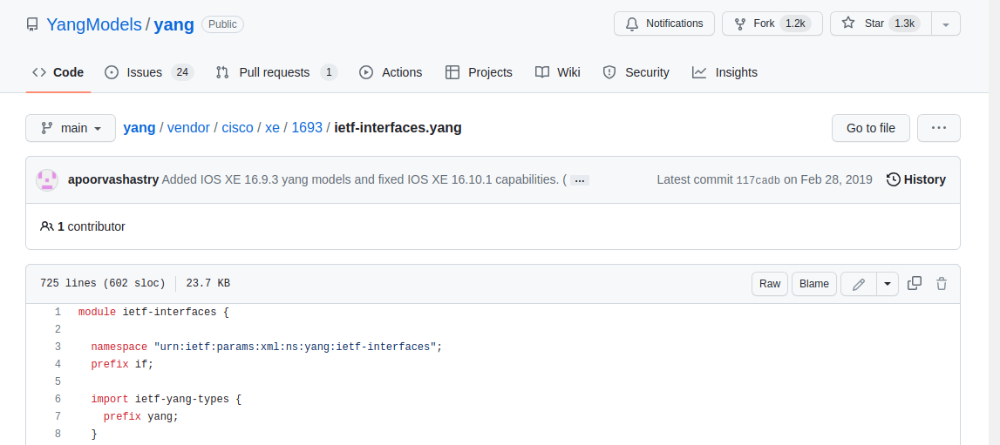
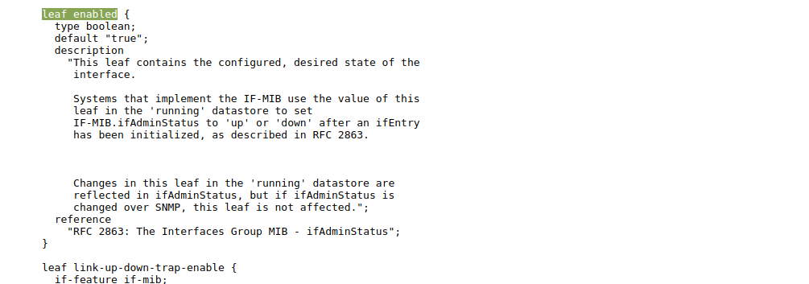
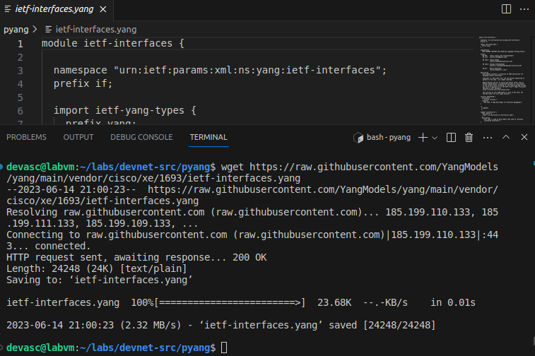
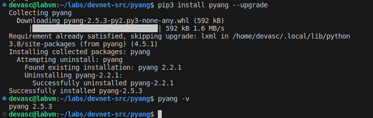
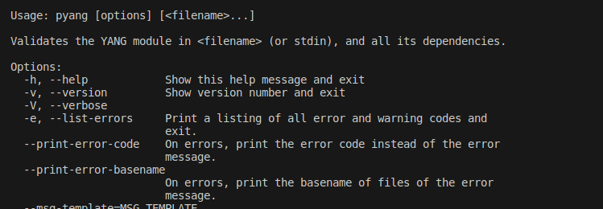
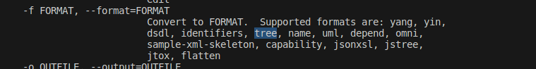
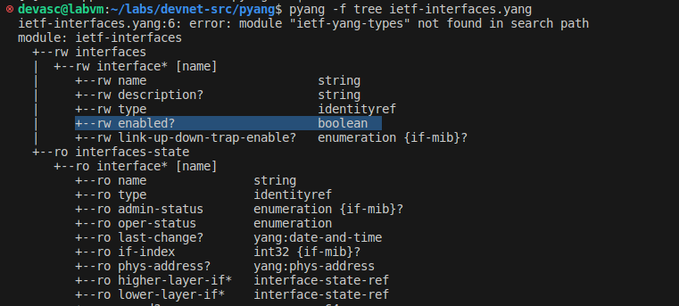

# Explorar los modelos YANG <!-- omit in toc -->

- [Parte 1. Iniciar la máquina virtual DEVASC](#parte-1-iniciar-la-máquina-virtual-devasc)
- [Parte 2. Explorar un modelo YANG en GitHub](#parte-2-explorar-un-modelo-yang-en-github)
  - [Paso 1. Explore los modelos YANG de Cisco IOS XE en el repositorio de GitHub](#paso-1-explore-los-modelos-yang-de-cisco-ios-xe-en-el-repositorio-de-github)
  - [Paso 2. Copie el modelo ietf-interfaces.yang en una carpeta de su máquina virtual](#paso-2-copie-el-modelo-ietf-interfacesyang-en-una-carpeta-de-su-máquina-virtual)
- [Parte 3. Explorar un modelo YANG utilizando pyang](#parte-3-explorar-un-modelo-yang-utilizando-pyang)
  - [Paso 1. Comprueba que pyang está instalado y actualizado](#paso-1-comprueba-que-pyang-está-instalado-y-actualizado)
  - [Paso 2. Transformar el modelo ietf-interfaces.yang](#paso-2-transformar-el-modelo-ietf-interfacesyang)
- [Conclusiones y reflexiones](#conclusiones-y-reflexiones)

> Para este laboratorio seguimos [esta guía en inglés.](https://itexamanswers.net/8-3-5-lab-explore-yang-models-answers.html)

---
## Parte 1. Iniciar la máquina virtual DEVASC

## Parte 2. Explorar un modelo YANG en GitHub

### Paso 1. Explore los modelos YANG de Cisco IOS XE en el repositorio de GitHub

Localizamos el archivo en GitHub. Se trata del modelo Yang de un dispositivo Cisco.



Dentro de este archivo se define una hoja con la que estamos familiarizados por laboratorios en los que usamos el router virutal CSR1kv:



Aquí se detalla que _enable_ es un comando para actualizar el estatus como administrador.

### Paso 2. Copie el modelo ietf-interfaces.yang en una carpeta de su máquina virtual



---
## Parte 3. Explorar un modelo YANG utilizando pyang

### Paso 1. Comprueba que pyang está instalado y actualizado


Actualizamos la versión:



### Paso 2. Transformar el modelo ietf-interfaces.yang

Aplicamos el siguiente comando:

Podemos visualizar la ayuda para esta herramienta con el comando `pyang -h | more`



La opción que nos interesa es la que permite formatear la información del modelo YANG como un árbol:



Y este es el comando que debemos aplicar para este propósito:

```bash
pyang -f tree yang_model_file.yang
```

Aquí encontramos la hoja _enabled_ que vimos antes.



---
## Conclusiones y reflexiones

