# Laboratorio 11: Uso de NETCONF para acceder a un dispositivo IOS XE <!-- omit in toc -->

- [Parte 1. Inicia las máquinas virtuales y verifica la conectividad](#parte-1-inicia-las-máquinas-virtuales-y-verifica-la-conectividad)
  - [Paso 1. Inicia las máquinas virtuales](#paso-1-inicia-las-máquinas-virtuales)
  - [Paso 2. Verifica la conectividad entre las máquinas virtuales](#paso-2-verifica-la-conectividad-entre-las-máquinas-virtuales)
  - [Paso 3. Verifica la conectividad SSH a la máquina virtual CSR1kv](#paso-3-verifica-la-conectividad-ssh-a-la-máquina-virtual-csr1kv)
- [Parte 2. Usa una sesión NETCONF para recopilar información](#parte-2-usa-una-sesión-netconf-para-recopilar-información)
  - [Paso 1. Verifica si NETCONF se está ejecutando en el CSR1kv](#paso-1-verifica-si-netconf-se-está-ejecutando-en-el-csr1kv)
  - [Paso 2. Accede al proceso NETCONF a través de una terminal SSH](#paso-2-accede-al-proceso-netconf-a-través-de-una-terminal-ssh)
  - [Paso 3. Inicia una sesión NETCONF enviando un mensaje de saludo desde el cliente](#paso-3-inicia-una-sesión-netconf-enviando-un-mensaje-de-saludo-desde-el-cliente)
  - [Paso 4. Envía mensajes RPC a un dispositivo IOS XE](#paso-4-envía-mensajes-rpc-a-un-dispositivo-ios-xe)
  - [Paso 5. Cierra la sesión NETCONF](#paso-5-cierra-la-sesión-netconf)
- [Parte 3. Usa ncclient para conectarte a NETCONF](#parte-3-usa-ncclient-para-conectarte-a-netconf)
  - [Paso 1. Verifica que ncclient esté instalado y listo para usar](#paso-1-verifica-que-ncclient-esté-instalado-y-listo-para-usar)
  - [Paso 2. Crea un script para usar ncclient para conectarte al servicio NETCONF](#paso-2-crea-un-script-para-usar-ncclient-para-conectarte-al-servicio-netconf)
  - [Paso 3. Agrega una función de impresión al script para que se muestren las capacidades NETCONF para ### el CSR1kv](#paso-3-agrega-una-función-de-impresión-al-script-para-que-se-muestren-las-capacidades-netconf-para--el-csr1kv)
- [Parte 4. Usa ncclient para recuperar la configuración](#parte-4-usa-ncclient-para-recuperar-la-configuración)
  - [Paso 1. Usa la función get\_config() para recuperar la configuración en ejecución de R1](#paso-1-usa-la-función-get_config-para-recuperar-la-configuración-en-ejecución-de-r1)
  - [Paso 2. Usa Python para embellecer el XML.](#paso-2-usa-python-para-embellecer-el-xml)
  - [Paso 3. Usa un filtro con get\_config() para recuperar solo un modelo YANG específico](#paso-3-usa-un-filtro-con-get_config-para-recuperar-solo-un-modelo-yang-específico)
- [Parte 5. Usa ncclient para configurar un dispositivo](#parte-5-usa-ncclient-para-configurar-un-dispositivo)
  - [Paso 1. Usa ncclient para editar el nombre de host del CSR1kv](#paso-1-usa-ncclient-para-editar-el-nombre-de-host-del-csr1kv)
  - [Paso 2. Usa ncclient para crear una nueva interfaz loopback en R1](#paso-2-usa-ncclient-para-crear-una-nueva-interfaz-loopback-en-r1)
  - [Paso 3. Intenta crear una nueva interfaz loopback con la misma dirección IPv4](#paso-3-intenta-crear-una-nueva-interfaz-loopback-con-la-misma-dirección-ipv4)
- [Parte 6. Desafío: Modifica el programa utilizado en este laboratorio](#parte-6-desafío-modifica-el-programa-utilizado-en-este-laboratorio)
- [Conclusiones y reflexiones](#conclusiones-y-reflexiones)

> Para este laboratorio usamos [esta guía en inglés.](https://itexamanswers.net/8-3-6-lab-use-netconf-to-access-an-ios-xe-device-answers.html)

---
## Parte 1. Inicia las máquinas virtuales y verifica la conectividad

### Paso 1. Inicia las máquinas virtuales

### Paso 2. Verifica la conectividad entre las máquinas virtuales

La IP de nuestro router virtual es 192.169.56.105:

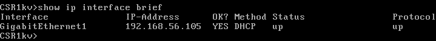

Verificamos la conectividad entre Devasc y el router:

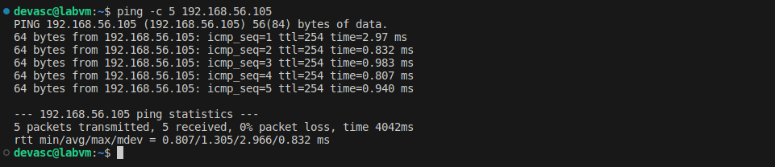

### Paso 3. Verifica la conectividad SSH a la máquina virtual CSR1kv

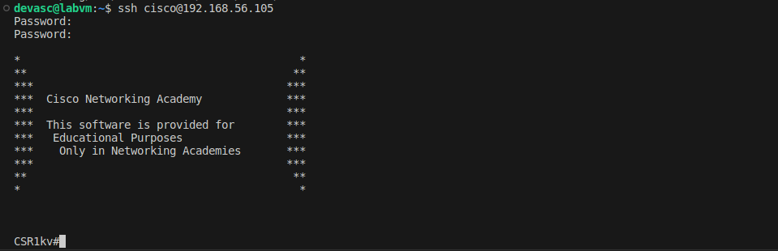

---
## Parte 2. Usa una sesión NETCONF para recopilar información

### Paso 1. Verifica si NETCONF se está ejecutando en el CSR1kv

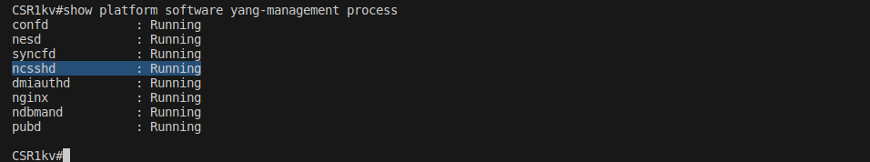

Si Netconf no estuviera corriento en el router, podríamos hacer un cambio en la configuración global:

```
CSR1kv# config t
CSR1kv (config)# netconf-yang
```

### Paso 2. Accede al proceso NETCONF a través de una terminal SSH

Cerramos la anterior sesión ssh y volvemos a entrar, pero esta vez con Netconf como subsistema.

```bash
ssh cisco@192.168.56.105 -p 830 -s netconf
```

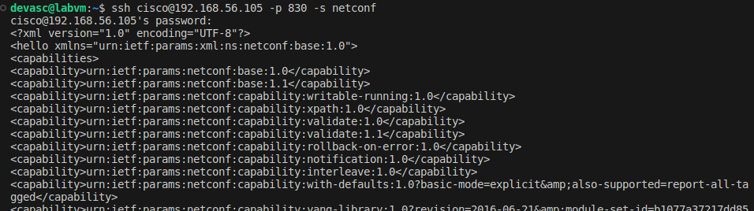

La última parte de la respuesta recalca que es un mensaje que viene del subsistema de Netconf (]]>]]>) y lo identifica como un saludo (hello).

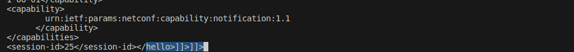

Ahora vamos al termina del router y verficamos que la sesión se inició en este dispositivo y fue registrada:

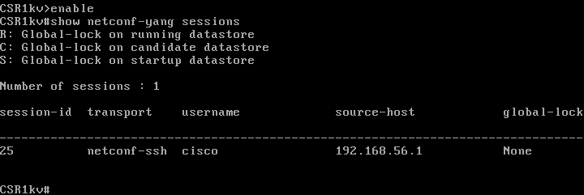

### Paso 3. Inicia una sesión NETCONF enviando un mensaje de saludo desde el cliente

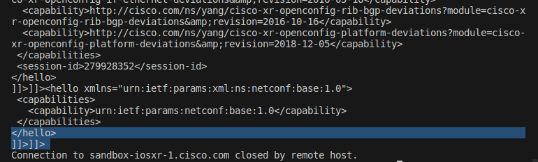


### Paso 4. Envía mensajes RPC a un dispositivo IOS XE

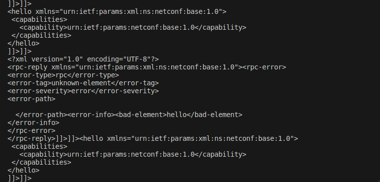


Después de estos errores aprendimos que el mensaje _hello_ por sí solo no hace nada, pero es necesario enviarlo al inicio de la sesión para poder hacer otras operaciones. Aquí obtenemos el resultado esperado:

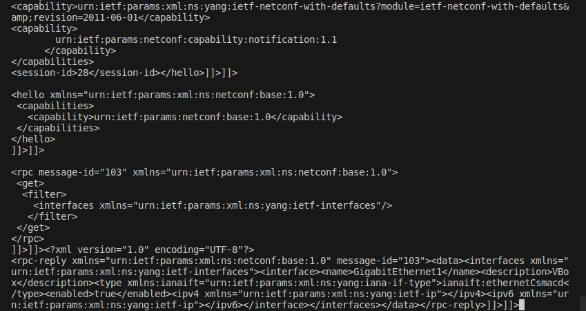

Y aquí formateamos con una extensión de VS Code el resultado XML del router:

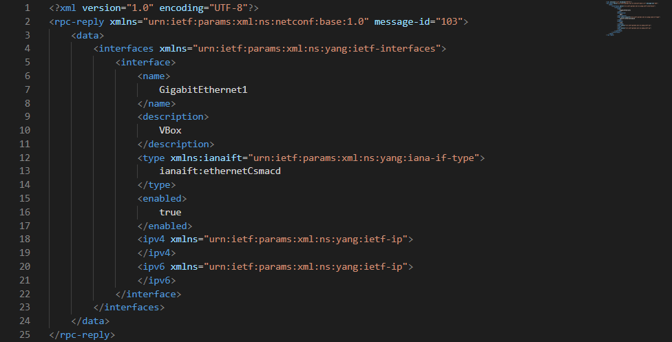

### Paso 5. Cierra la sesión NETCONF

Enviamos la petición para cerrar la sesión con el siguiente mensaje XML:

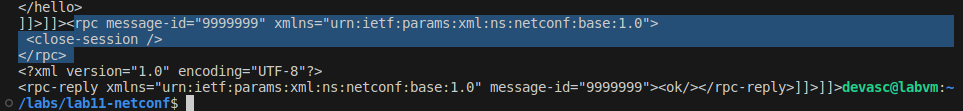

En la terminal del router podemos ver que ya no hay sesiones abiertas:

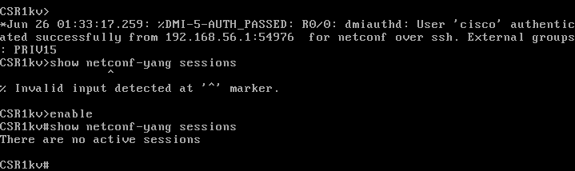

---
## Parte 3. Usa ncclient para conectarte a NETCONF

### Paso 1. Verifica que ncclient esté instalado y listo para usar

```bash
pip3 list --format=columns | more
```

### Paso 2. Crea un script para usar ncclient para conectarte al servicio NETCONF

Hasta ahora solo hemos ingresado manualmente los mensajes para realizar operaciones. Ahora usaremos Python. Corremos este script:

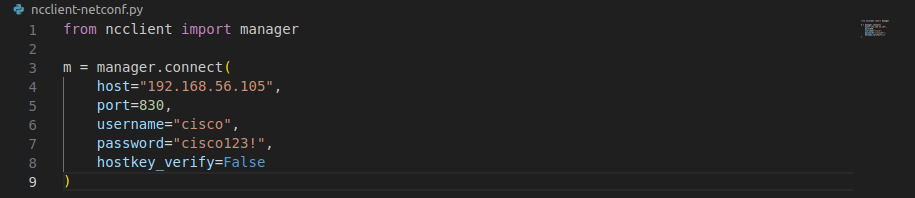

Y no obtenemos nada en la terminal de Devasc, pero sí en el router:

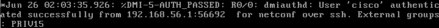

### Paso 3. Agrega una función de impresión al script para que se muestren las capacidades NETCONF para ### el CSR1kv

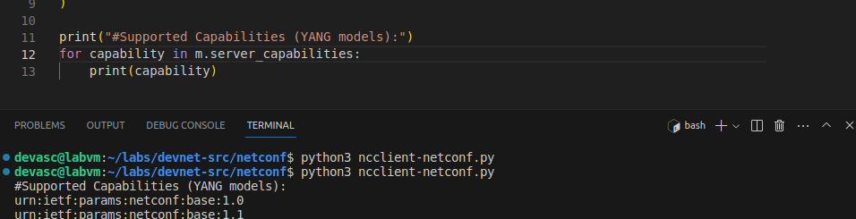

---
## Parte 4. Usa ncclient para recuperar la configuración

### Paso 1. Usa la función get_config() para recuperar la configuración en ejecución de R1

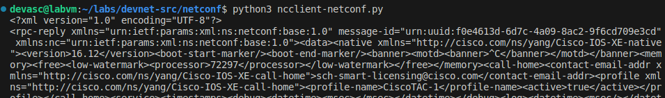

### Paso 2. Usa Python para embellecer el XML.

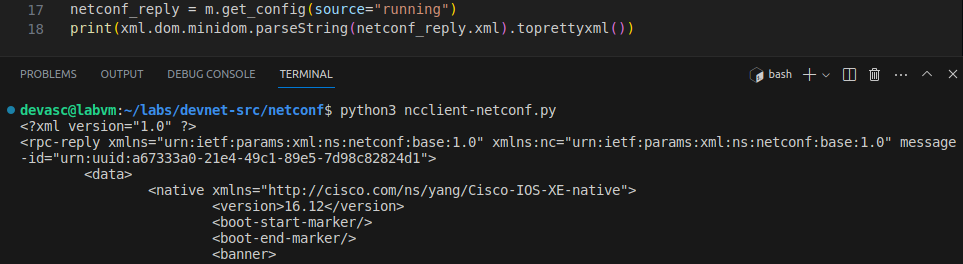

### Paso 3. Usa un filtro con get_config() para recuperar solo un modelo YANG específico

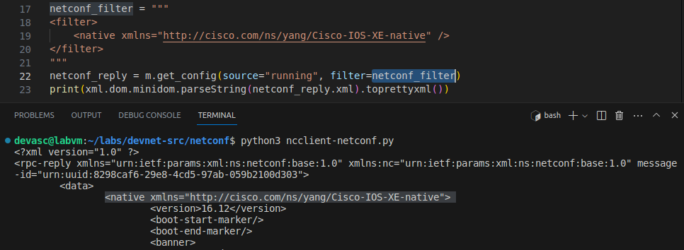

---
## Parte 5. Usa ncclient para configurar un dispositivo

### Paso 1. Usa ncclient para editar el nombre de host del CSR1kv

Esto es lo que vamos a cambiar:

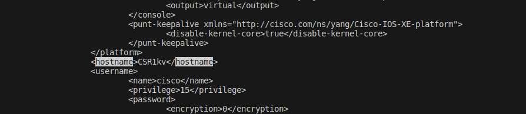

Usamos este código para editar el nombre:

'''python
netconf_hostname = """
<config>
  <native xmlns="http://cisco.com/ns/yang/Cisco-IOS-XE-native">
     <hostname>CSR1vk</hostname>
  </native>
</config>
"""

# target: the targeted Netconf datastore to be updated
# config: the configuration modification that is to be sent
netconf_reply = m.edit_config(target="running", config=netconf_hostname)
'''

Así se ve ahora el nombre en la terminal del router:

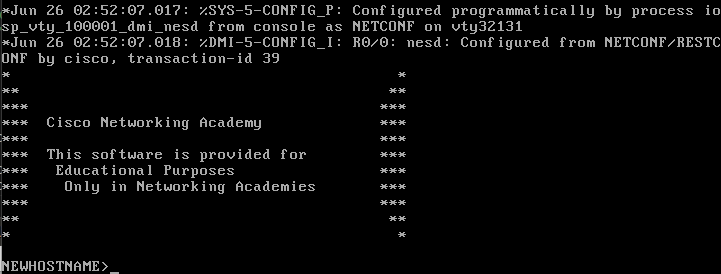

Y, de la misma forma, restauramos el nombre de vuelta. Así se ve en el router:

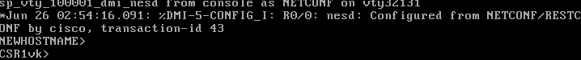


### Paso 2. Usa ncclient para crear una nueva interfaz loopback en R1

```python
netconf_loopback = """
<config>
 <native xmlns="http://cisco.com/ns/yang/Cisco-IOS-XE-native">
  <interface>
   <Loopback>
    <name>1</name>
    <description>My first NETCONF loopback</description>
    <ip>
     <address>
      <primary>
       <address>10.1.1.1</address>
       <mask>255.255.255.0</mask>
      </primary>
     </address>
    </ip>
   </Loopback>
  </interface>
 </native>
</config>
"""

netconf_reply = m.edit_config(target="running", config=netconf_loopback)
print(xml.dom.minidom.parseString(netconf_reply.xml).toprettyxml())
```

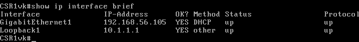

### Paso 3. Intenta crear una nueva interfaz loopback con la misma dirección IPv4

```python
netconf_newloop = """
<config>
 <native xmlns="http://cisco.com/ns/yang/Cisco-IOS-XE-native">
  <interface>
   <Loopback>
    <name>2</name>
    <description>My second NETCONF loopback</description>
    <ip>
     <address>
      <primary>
       <address>10.1.1.1</address>
       <mask>255.255.255.0</mask>
      </primary>
     </address>
    </ip>
   </Loopback>
  </interface>
 </native>
</config>
"""
netconf_reply = m.edit_config(target="running", config=netconf_newloop)
```

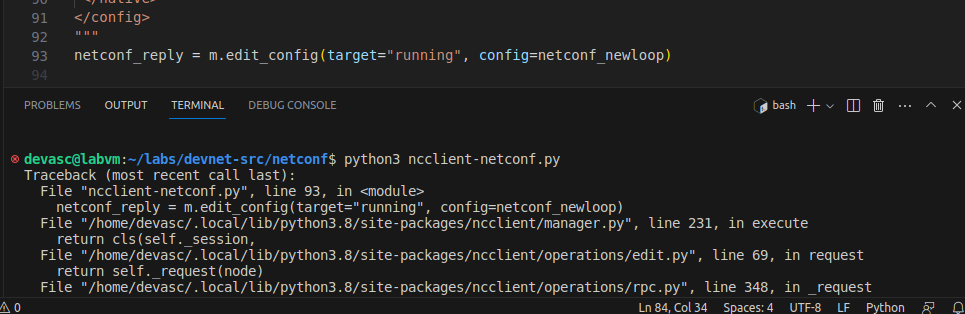

---
## Parte 6. Desafío: Modifica el programa utilizado en este laboratorio

Ahora vamos a hacer algo nuevo usando las bases que aprendimos. Vamos a eliminar la interfaz Loopback que creamos para el router.

En nuestro primer intento, agregamos el atributo `xmlns:nc="urn:ietf:params:xml:ns:netconf:base:1.0"` en la etiqueta `<config>`, y el atributo `nc:operation="delete"` en la etiqueta `\<interface\>`. No funciona:

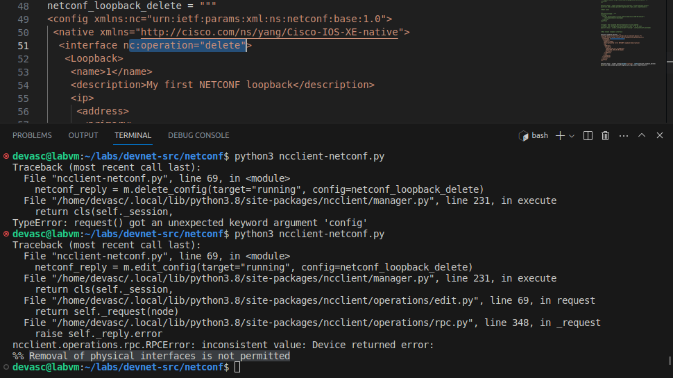

Dice que no podemos eliminar interfaces físicas. El mensaje de error no es muy claro, ya que aquí no hay nada físico. Sin embargo, podemos suponer que quizás estamos tratando de eliminar toda la estructura que sostiene las interfaces. Por eso probamos bajar un nivel.

Colocamos entonces el atributo `nc:operation="delete"` en la etiqueta `\<Loopback\>` que está un nivel más abajo. Este es el código relevante:

```python
netconf_loopback_delete = """
<config xmlns:nc="urn:ietf:params:xml:ns:netconf:base:1.0">
 <native xmlns="http://cisco.com/ns/yang/Cisco-IOS-XE-native">
  <interface>
   <Loopback nc:operation="delete">
    <name>1</name>
    <description>My first NETCONF loopback</description>
    <ip>
     <address>
      <primary>
       <address>10.1.1.1</address>
       <mask>255.255.255.0</mask>
      </primary>
     </address>
    </ip>
   </Loopback>
  </interface>
 </native>
</config>
"""

netconf_reply = m.edit_config(target="running", config=netconf_loopback_delete)
print(xml.dom.minidom.parseString(netconf_reply.xml).toprettyxml())
```
Y en la terminal del router virtual comprobamos que la operación eliminó como esperabamos la interface de Loopback:

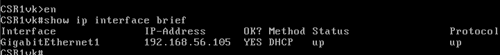

---
## Conclusiones y reflexiones

Aprendimos a usar Netconf para recoger información de los dispositivos de red, así como configurarlos editando sus datos. Además, aprendimos a hacer esto a través de un script de Python, que vimos que facilita esta tarea de administración de dispositivos.

