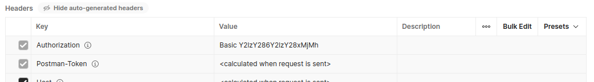
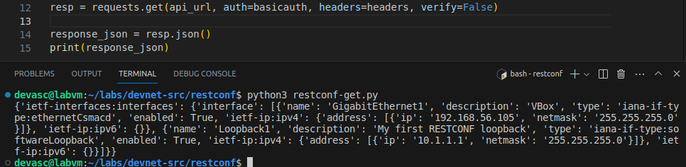

# Laboratorio 12. Uso de Restconf para acceder a un dispositivos IOS XE <!-- omit in toc -->

- [Parte 1. Construye la red y verifica la conectividad](#parte-1-construye-la-red-y-verifica-la-conectividad)
  - [Paso 1. Inicia las máquinas virtuales.](#paso-1-inicia-las-máquinas-virtuales)
  - [Paso 2. Verifica la conectividad entre las máquinas virtuales](#paso-2-verifica-la-conectividad-entre-las-máquinas-virtuales)
  - [Paso 3. Verifica la conectividad SSH a la máquina virtual CSR1kv](#paso-3-verifica-la-conectividad-ssh-a-la-máquina-virtual-csr1kv)
- [Parte 2. Configura un dispositivo IOS XE para el acceso RESTCONF](#parte-2-configura-un-dispositivo-ios-xe-para-el-acceso-restconf)
  - [Paso 1. Verifica que los demonios RESTCONF estén en ejecución](#paso-1-verifica-que-los-demonios-restconf-estén-en-ejecución)
  - [Paso 2. Habilita y verifica el servicio RESTCONF](#paso-2-habilita-y-verifica-el-servicio-restconf)
  - [Paso 3. Habilita y verifica el servicio HTTPS](#paso-3-habilita-y-verifica-el-servicio-https)
- [Parte 3. Abre y configura Postman](#parte-3-abre-y-configura-postman)
  - [Paso 1. Abre Postman](#paso-1-abre-postman)
  - [Paso 2. Deshabilita la verificación de certificación SSL](#paso-2-deshabilita-la-verificación-de-certificación-ssl)
- [Parte 4. Utiliza Postman para enviar solicitudes GET](#parte-4-utiliza-postman-para-enviar-solicitudes-get)
  - [Paso 1. Explora la interfaz de usuario de Postman](#paso-1-explora-la-interfaz-de-usuario-de-postman)
  - [Paso 2. Ingresa la URL para un CSR1kv.](#paso-2-ingresa-la-url-para-un-csr1kv)
  - [Paso 3. Ingresa las credenciales de autenticación.](#paso-3-ingresa-las-credenciales-de-autenticación)
  - [Paso 4. Establece JSON como el tipo de datos para enviar y recibir desde el CSR1kv](#paso-4-establece-json-como-el-tipo-de-datos-para-enviar-y-recibir-desde-el-csr1kv)
  - [Paso 5. Envía la solicitud API al CSR1kv.](#paso-5-envía-la-solicitud-api-al-csr1kv)
  - [Paso 6. Utiliza una solicitud GET para recopilar información sobre todas las interfaces en el CSR1kv](#paso-6-utiliza-una-solicitud-get-para-recopilar-información-sobre-todas-las-interfaces-en-el-csr1kv)
  - [Paso 7. Utiliza una solicitud GET para recopilar información sobre una interfaz específica en el CSR1kv](#paso-7-utiliza-una-solicitud-get-para-recopilar-información-sobre-una-interfaz-específica-en-el-csr1kv)
- [Parte 5. Usa Postman para enviar una solicitud PUT](#parte-5-usa-postman-para-enviar-una-solicitud-put)
  - [Paso 1. Duplica y modifica la última solicitud GET](#paso-1-duplica-y-modifica-la-última-solicitud-get)
  - [Paso 2. Configura el cuerpo de la solicitud especificando la información para el nuevo loopback](#paso-2-configura-el-cuerpo-de-la-solicitud-especificando-la-información-para-el-nuevo-loopback)
- [Parte 6. Utiliza un script Python para enviar solicitudes GET](#parte-6-utiliza-un-script-python-para-enviar-solicitudes-get)
  - [Paso 1. Crea el directorio RESTCONF y comienza el script](#paso-1-crea-el-directorio-restconf-y-comienza-el-script)
  - [Paso 2. Crea las variables que serán los componentes de la solicitud](#paso-2-crea-las-variables-que-serán-los-componentes-de-la-solicitud)
- [Parte 7. Utiliza un script Python para enviar una solicitud PUT](#parte-7-utiliza-un-script-python-para-enviar-una-solicitud-put)
  - [Paso 1. Importa módulos y deshabilita las advertencias de SSL](#paso-1-importa-módulos-y-deshabilita-las-advertencias-de-ssl)
  - [Paso 2. Crea las variables que serán los componentes de la solicitud](#paso-2-crea-las-variables-que-serán-los-componentes-de-la-solicitud-1)
  - [Paso 3. Crea una variable para enviar la solicitud y almacenar la respuesta JSON](#paso-3-crea-una-variable-para-enviar-la-solicitud-y-almacenar-la-respuesta-json)
- [Conclusiones y reflexiones](#conclusiones-y-reflexiones)

> Para este laboratorio usamos [esta guía en inglés.](https://itexam24.com/8-3-7-lab-use-restconf-to-access-an-ios-xe-device-answers/)

---
## Parte 1. Construye la red y verifica la conectividad 

### Paso 1. Inicia las máquinas virtuales. 

### Paso 2. Verifica la conectividad entre las máquinas virtuales

### Paso 3. Verifica la conectividad SSH a la máquina virtual CSR1kv

---
## Parte 2. Configura un dispositivo IOS XE para el acceso RESTCONF 

### Paso 1. Verifica que los demonios RESTCONF estén en ejecución

El demonio que necesitamos ahora es _nginx_, que es el servidor HTTPS, y vemos que está corriendo:

### Paso 2. Habilita y verifica el servicio RESTCONF

Ya está habilitado.

### Paso 3. Habilita y verifica el servicio HTTPS

Ya está habilitado.

---
## Parte 3. Abre y configura Postman 

### Paso 1. Abre Postman

### Paso 2. Deshabilita la verificación de certificación SSL

---
## Parte 4. Utiliza Postman para enviar solicitudes GET 

### Paso 1. Explora la interfaz de usuario de Postman

### Paso 2. Ingresa la URL para un CSR1kv. 

### Paso 3. Ingresa las credenciales de autenticación. 

### Paso 4. Establece JSON como el tipo de datos para enviar y recibir desde el CSR1kv

### Paso 5. Envía la solicitud API al CSR1kv. 

A pesar de que obtenemos una respuesta satisfactoria a la petición GET, por alguna razón que desconocemos nos llegó en formato XML en vez de JSON:

### Paso 6. Utiliza una solicitud GET para recopilar información sobre todas las interfaces en el CSR1kv

### Paso 7. Utiliza una solicitud GET para recopilar información sobre una interfaz específica en el CSR1kv

Si inspeccionamos la respuesta en detalle, nos damos cuenta de que no hay dirección IP:

Esto ocurre porque Virtual Box usa el método DHCP para obtener la IP. Vamos a cambiar esto en la máquina virtual configurando su interface de red para que el método de la IP sea manual:

Con este cambio la respuesta XML ahora sí contiene la IP de la VM:

---
## Parte 5. Usa Postman para enviar una solicitud PUT 

### Paso 1. Duplica y modifica la última solicitud GET

Si solo cambiamos de GET a PUT y seleccionamos en Body la opción _raw_, obtenemos como respuesta el error 415:

En el laboratorio dice que deberíamos esperar un error 400.

### Paso 2. Configura el cuerpo de la solicitud especificando la información para el nuevo loopback

Corregimos un par de errores tnto en el mensaje como en el tipo de datos para recibir (se había puesto como _application/yang-data+son_ en vez de _application/yang-data+json_).

---
## Parte 6. Utiliza un script Python para enviar solicitudes GET 

### Paso 1. Crea el directorio RESTCONF y comienza el script

### Paso 2. Crea las variables que serán los componentes de la solicitud

---
## Parte 7. Utiliza un script Python para enviar una solicitud PUT

### Paso 1. Importa módulos y deshabilita las advertencias de SSL

### Paso 2. Crea las variables que serán los componentes de la solicitud

### Paso 3. Crea una variable para enviar la solicitud y almacenar la respuesta JSON

---
## Conclusiones y reflexiones

Aprendimos que tanto obtener como modificar información de la configuración de un dispositivo de red es más fácil usando Restconf. Tiene sentido, porque este constituye un subconjunto de las pocibilidades que ofrece Netconf.

También notamos que, si queremos usar Restconf en un script de Python, estamos obligados a usar la biblioteca _request_, lo cual no sucede con Netconf. Pero esto es bueno, ya que esta biblioteca ofrece unos métodos que siguen los principios arquitectónicos de las API REST. Nos podemos documentar sobre estos métodos en [este enlace](https://www.w3schools.com/python/module_requests.asp).