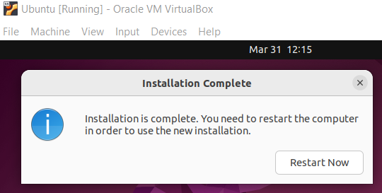
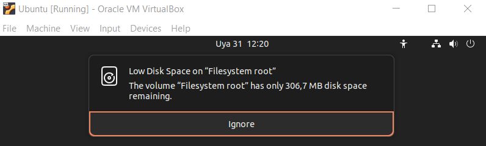

# Laboratorio 1: Instalación de una máquina virtual en Linux y exploración de la GUI <!-- omit in toc -->

- [Parte 1. Preparar una computadora para la virtualización](#parte-1-preparar-una-computadora-para-la-virtualización)
  - [Paso 1. Descargar e instalar VirtualBox](#paso-1-descargar-e-instalar-virtualbox)
  - [Paso 2. Descargar una imagen de Linux](#paso-2-descargar-una-imagen-de-linux)
  - [Paso 3. Crear una máquina virtual nueva](#paso-3-crear-una-máquina-virtual-nueva)
- [Parte 2. Instalar Ubuntu en la máquina virtual](#parte-2-instalar-ubuntu-en-la-máquina-virtual)
  - [Paso 1. Monte la imagen](#paso-1-monte-la-imagen)
  - [Paso 2. Instale el sistema operativo](#paso-2-instale-el-sistema-operativo)
  - [Problemas](#problemas)
- [Parte 3. Explora la interfaz gráfica de usuario](#parte-3-explora-la-interfaz-gráfica-de-usuario)
  - [Paso 1. Instalar Guest Additions](#paso-1-instalar-guest-additions)
  - [Paso 2. Abrir un navegador web](#paso-2-abrir-un-navegador-web)
- [Pregunta de reflexión](#pregunta-de-reflexión)


## Parte 1. Preparar una computadora para la virtualización

### Paso 1. Descargar e instalar VirtualBox


### Paso 2. Descargar una imagen de Linux

Usamos la última versión LTS* de Ubuntu actualmente: Ubuntu 22.04.1 


*LTS: Long-term support (soporte a largo plazo)

### Paso 3. Crear una máquina virtual nueva

Creamos una VM en el disco D con las siguientes características:
- Ubuntu (64-bits)
- 2 GB de RAM
- 10 GB de disco duro (reservado dinámicamente)


Ya la tenemos, pero le falta el sistema operativo. Esto es lo que sucede si intentamos iniciarla sin haberle instalado ninguna imagen de sistema operativo:


## Parte 2. Instalar Ubuntu en la máquina virtual

### Paso 1. Monte la imagen

Instalamos Ubuntu y optamos por la instalación mínima, sin utilidades como office, juegos, etc.


### Paso 2. Instale el sistema operativo




### Problemas




El mensaje de «low disk space» volvió a salir:


Tuvimos que eliminar la VM, ya que dejó de responder. La solución por la que optamos al final fue volver a instalar la VM con el triple de la capacidad recomendada: 30 GB. Esto habría sido muy difícil para la máquina _host_ si no se pudiera alojar una VM en el disco D (en el disco C había poca capacidad). Desconocíamos esta posibilidad.

## Parte 3. Explora la interfaz gráfica de usuario

### Paso 1. Instalar Guest Additions


Hubo problemas con esta instalación, pero se logró hacer. Estos fueron los pasos:
- Devices > Insert Guest Additions CD Image...
- Clic derecho en el disco que ahora aparece en la barra lateral de la izquierda (VBox_GAs_6.1.40) > New window
- Se abre un directorio > clic derecho > Open in Terminal
- En la terminal introducimos los siguientes comandos:
    ```
    sudo apt-get -y update

    sudo apt-get -y install build-essential gcc make perl dkms 
    
    reboot

    sudo ./VBoxLinuxAdditions.run
    ```
Listo, ya se puede compartir el portapapeles y transferir archivos solo con el mouse (drag and drop) entre el sistema _host_ y el _guest_ de forma bidreccional, así como cambiar el tamaño de la ventana de la máquina virtual.

### Paso 2. Abrir un navegador web

En la siguiente imagen se muestra el navegador web FireFox y el terminal, que ya tuvimos que usar para resolver la instalación de Guest Additions.


## Pregunta de reflexión 

>**¿Cuáles son las ventajas y desventajas de usar una máquina virtual?**

Usar una VM tiene las siguientes ventajas:
- Facilita la instalación de un sistema operativo distinto al que tiene el _host_.
- No compromete la integridad del _host_, por lo que permite probar software potencialmente malicioso o comandos peligrosos sin que se dañe nuestra computadora.
- Permite crear un entorno aislado de nuestro _host_ dedicado al desarrollo de un producto de software.

Pero tiene las siguientes desventajas:
- Una VM es lenta en comparación a otras opciones de virtualización, como los contenedores.
- Una VM consume muchos recursos de memoria en comparación a los contenedores.

Sin embargo, las VM van más allá de emular virtualmente una computadora de escritorio: se pueden virtualizar desde componentes de infraestrutura de red como routers a un datacenter completo.

Hace 20 años la virtualización no existía. La única forma en la que una empresa podía implementar un servicio nuevo era instalando un nuevo servidor. Esto tiene varias consecuencias negativas. Por un lado, es muy costoso mantener no solo todos los servidores, sino la infraestructura que los conecta y el personal que los mantiene. Por otro lado, todo un servicio se detiene si el servidor que lo soporta falla. Adicionalmente, por todo esto es muy difícil que el sistema pueda escalar.

La virtualización hace posible resolverlo todo. En un solo servidor puedes tener varias máquinas virtuales ofreciendo un servicio distinto cada una, y todas ellas conectadas a través de una infraestructura de red completamente virtualizada dentro del mismo servidor. La computación en la nube (cloud computing) se basa en esto para ofrecer a través de Internet los servicios virtualizados en enormes granjas de servidores. Esto es llamado SaaS (Software as a Service). Pero también se puede ofrecer el poder de cómputo de las máquinas virtuales: PaaS (Platform as a Service). Incluso se puede ofrecer la propia infraestructura virtualizada: IaaS (Infraestructure as a Service).

La virtualización ofrece todo un mundo posibilidades fascinantes que solo estamos comenzando a explorar.
