# Laboratorio 2: Instalar el entorno de laboratorio de máquinas virtuales <!-- omit in toc -->

- [Parte 1. Preparar una computadora para la virtualización.](#parte-1-preparar-una-computadora-para-la-virtualización)
  - [Paso 1.](#paso-1)
  - [Paso 2. Importe la VM de DEVASC](#paso-2-importe-la-vm-de-devasc)
- [Parte 2. Explore la GUI de DEVASC VM.](#parte-2-explore-la-gui-de-devasc-vm)
  - [Inciso: snapshot](#inciso-snapshot)
- [Parte 3. Crear cuentas de entorno de laboratorio.](#parte-3-crear-cuentas-de-entorno-de-laboratorio)
  - [Paso 1. Crear cuenta DevNet](#paso-1-crear-cuenta-devnet)
  - [Paso 2. Crear una cuenta GitHub (Hecho previamente)](#paso-2-crear-una-cuenta-github-hecho-previamente)
  - [Paso 3. Crear una cuenta de Webex](#paso-3-crear-una-cuenta-de-webex)
  - [Paso 4. Apague la VM](#paso-4-apague-la-vm)
- [Parte 4. Instalar la aplicación de Webex en su dispositivo.](#parte-4-instalar-la-aplicación-de-webex-en-su-dispositivo)


## Parte 1. Preparar una computadora para la virtualización.

### Paso 1. 

### Paso 2. Importe la VM de DEVASC

Archivo > Importar aplicación
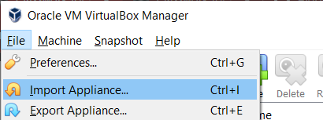

Ubicamos el archivo OVA de la VM DEVASC y lo seleccionamos:
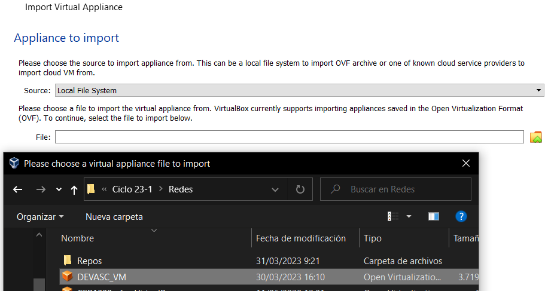

Elegimos la ubicación en la que se almacenará la VM y finalmente le damos al botón de importar:
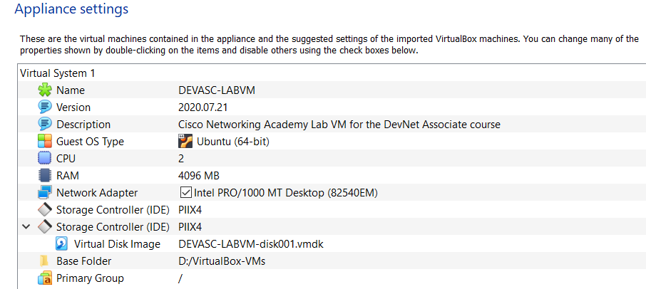

En nuestro caso todo lo vamos a almacenar en el disco local(D:).

## Parte 2. Explore la GUI de DEVASC VM.

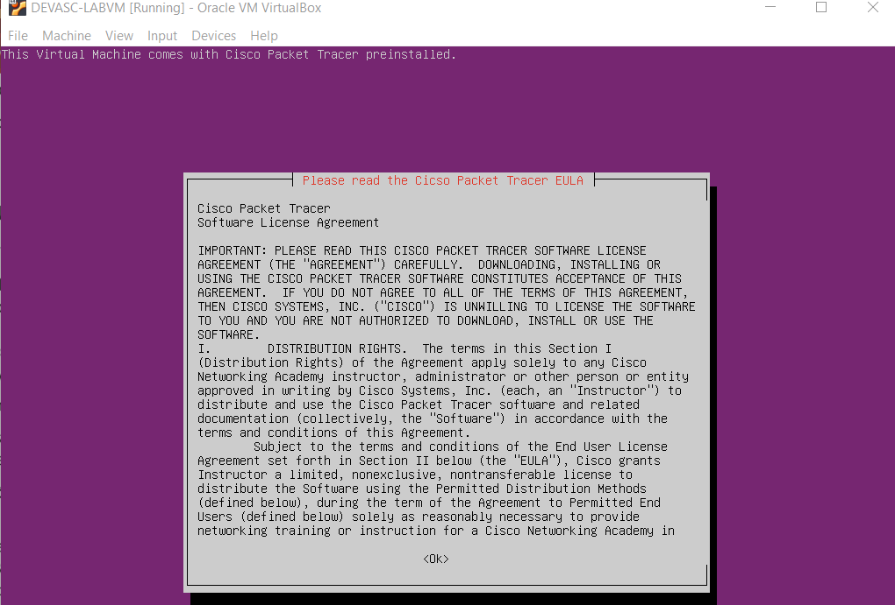

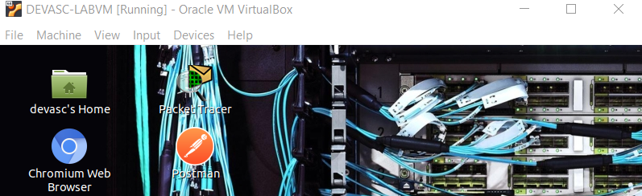

### Inciso: snapshot

En este punto nos animan a explorar y experimentar sin miedo, porque siempre podremos desintalar la VM e importar una copia nueva del OVA descargado. Sin embargo, pensamos que es mejor tomar snapshots. Así evitamos perder tiempo al volver a hacer algunos laboratorios que están encadenados unos con otros. Conforme avancemos los laboratorios haremos sucesivas _snapshots_ de las VM que usaremos.

Tomar una _snapshot_ de una VM es guarda el estado actual de la VM para poder volver a este en el futuro por si algo sale mal. A continuación ilustramos el procedimiento:

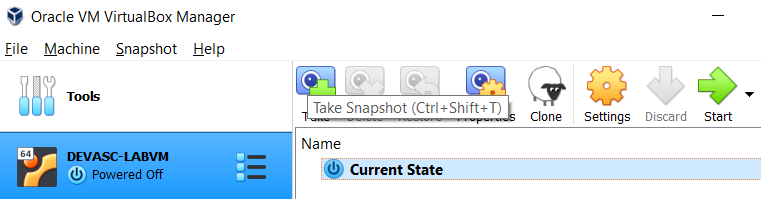

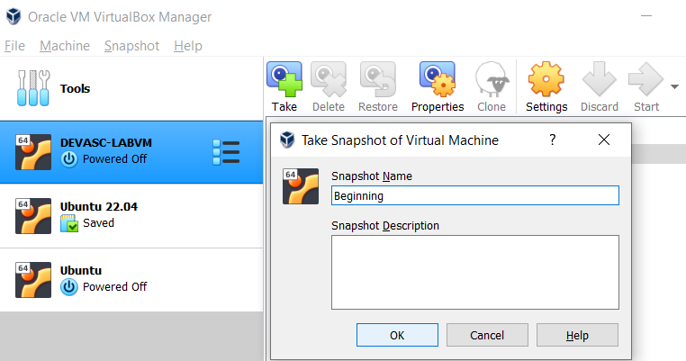

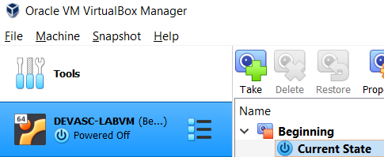

## Parte 3. Crear cuentas de entorno de laboratorio.

### Paso 1. Crear cuenta DevNet

[developer.cisco.com](https://developer.cisco.com) > Registrarse gratis (sign up free)
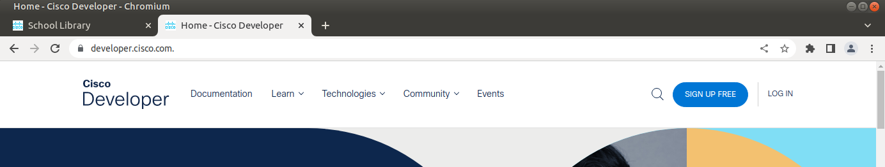

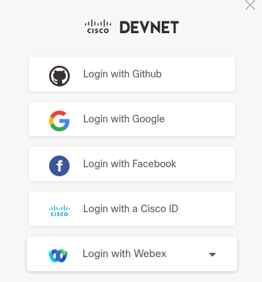

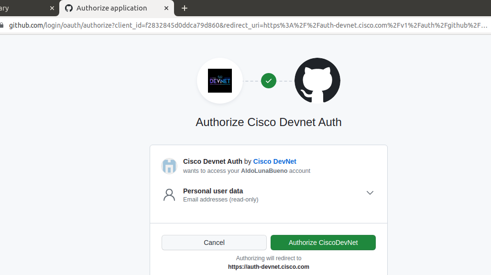

Cuando uno se registra aquí, sucede algo raro: la página vuelve a ser la del inicio y vuelve a invitar al usuario a registrarse gratuitamente (la primera captura) como si no se hubiera registrado ya. Aparentemente hay que recargar la página para que ya se habra con la nueva cuenta.

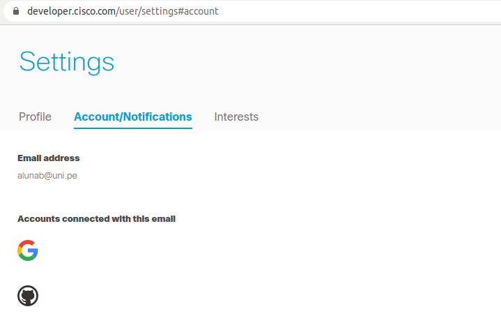

### Paso 2. Crear una cuenta GitHub (Hecho previamente)

### Paso 3. Crear una cuenta de Webex

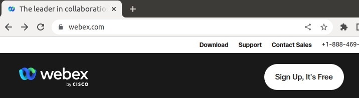

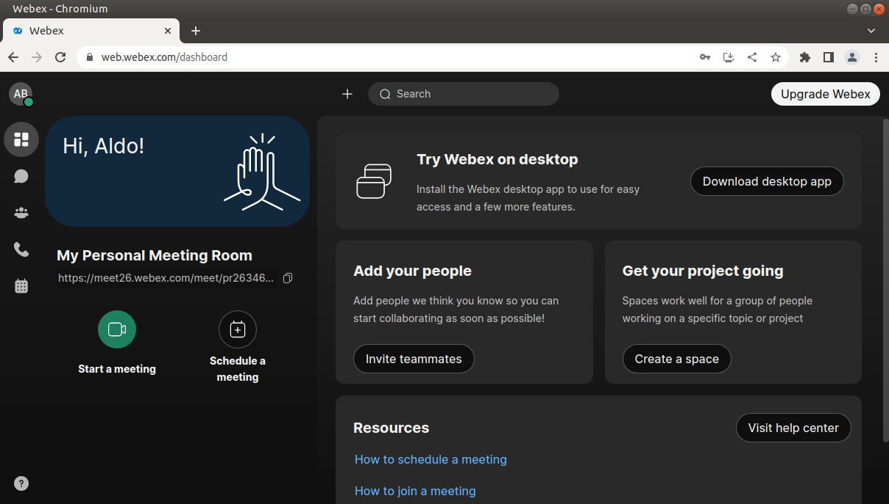

### Paso 4. Apague la VM

Aquí apagamos la VM guardando su estado:
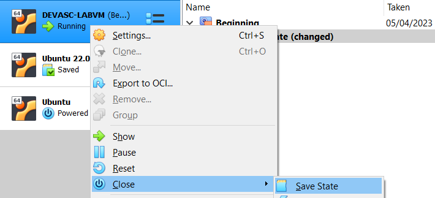

También podemos hacer lo mismo digitando el siguiente comando en la terminal dentro de la VM:
``` 
sudo shutdown -h now
```
Para reiniciarla, podemos usar este otro comando:
``` 
sudo reboot
```

## Parte 4. Instalar la aplicación de Webex en su dispositivo.

Iniciamos la instalación aceptando la parte legal. Vemos que estamos instalandoo la versión 43.4.0 de Webex:
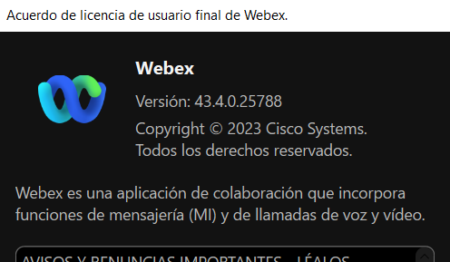

Ya iniciamos sesión con las credenciales creadas en el paso 3 de la parte 3.

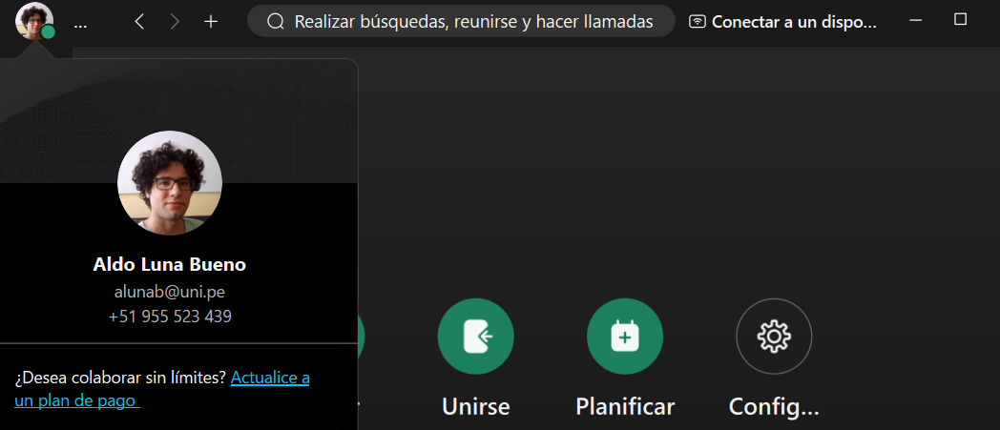