# Laboratorio 2b: Explorar las herramientas de desarrollo de Python <!-- omit in toc -->

- [Parte 1. Iniciar la VM DEVASC (Hecho)](#parte-1-iniciar-la-vm-devasc-hecho)
- [Parte 2. Revisar la instalación de Python](#parte-2-revisar-la-instalación-de-python)
- [Parte 3. Entornos virtuales PIP y Python](#parte-3-entornos-virtuales-pip-y-python)
  - [Paso 1. Cree un entorno virtual de Python 3](#paso-1-cree-un-entorno-virtual-de-python-3)
  - [Paso 2. Activar y probar el entorno virtual de Python 3](#paso-2-activar-y-probar-el-entorno-virtual-de-python-3)
  - [Paso 3. Compruebe los paquetes actuales instalados en el entorno del sistema](#paso-3-compruebe-los-paquetes-actuales-instalados-en-el-entorno-del-sistema)
- [Parte 4. Compartir su entorno virtual](#parte-4-compartir-su-entorno-virtual)
- [Conclusiones](#conclusiones)


## Parte 1. Iniciar la VM DEVASC (Hecho)

## Parte 2. Revisar la instalación de Python

Vamos al terminal, introducimos el comando ` python3 -V` (mayúscula), y nos dice que la versión que tenemos es Python 3.8.2.

Con el comando `which python3` vemos dónde se ubica el el entorno local de Python: `/usr/bin/python3`

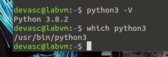

## Parte 3. Entornos virtuales PIP y Python

### Paso 1. Cree un entorno virtual de Python 3

```
python3 -m venv Virtual_ENVironment_name
```

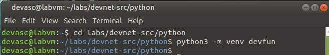


### Paso 2. Activar y probar el entorno virtual de Python 3

En esta oportunidad tomamos la iniciativa de probar un comando para ver claramente la estructura de los directorios y archivos que surgieron al crear el entorno virtual:

```
tree -L 3
```

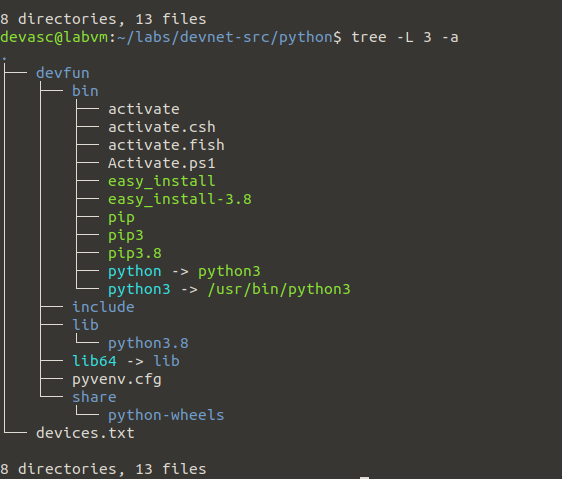

Ahí se muestran dos rutas importantes para el resto del laboratorio: _devfun/bin/activate_ y _devfun/bin/pip3_.

Activamos el entorno virtual con `source devfun/bin/activate`:

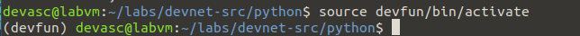

Ya dentro del entorno virtual, instalamos el paquete _request_ con `pip3 python request`. Luego de verificar la instalación con `pip3 frezze`, salimos del entorno virtual con `deactivate`.

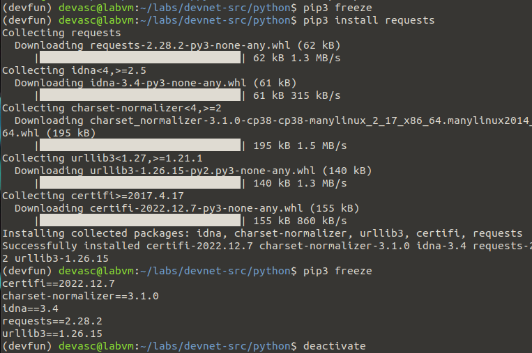

### Paso 3. Compruebe los paquetes actuales instalados en el entorno del sistema

Ahora fuera del entorno virutal, en el entorno del sistema, usamos `python3 -m pip frezze` para ver los paquetes instalados.

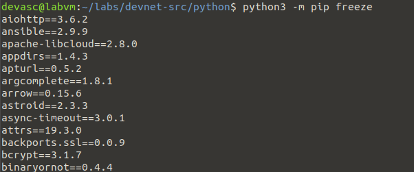

¡Son muchos! La lista continúa. Hay muchos más paquetes instalados en el entorno del sistema que en el entorno virtual de Python que acabamos de preparar. 

> En un entorno virtual es más difícil que algo se salga de control porque solo tenemos lo que necesitamos. Por eso es mejor desarrollar en un entorno virtual. 

Adicionalmente, con el comando `python3 -m pip freeze | grep requests` vemos la versión del paquete _request_ en el entorno del sistema:

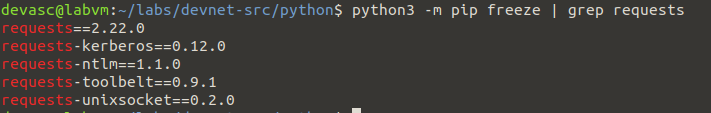

## Parte 4. Compartir su entorno virtual

Vamos a demostrar que se puede replica un entorno virtual basádonos en la lista de paquetes que obtenemos con el comando `pip3 freeze`.

Primero activamos nuevamente el entorno virtual _devfun_ con `source devfun/bin/activate`, luego listamos los paquetes que instalamos con `pip3 freeze` y guardamos este resultado en un documento llamado _requirements.txt_:

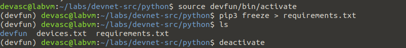

Ahora creamos un nuevo entorno virtual _devnew_ que pretendemos que sea la replica de _devfun_. Lo hacemos con `python3 -m venv devnew`. Luego lo activamos con `source devnew/bin/activate` e introducimos el comando clave para hacer la replica: 

```
pip3 install -r requirements.txt
```

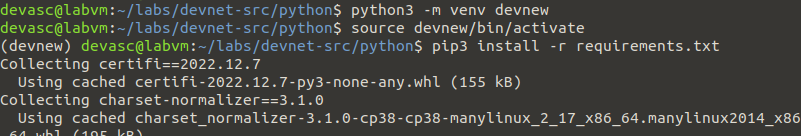


Verificamos que _devnew_ y _devfun_ realmente tienen los mismos paquetes instaldos:

_devnew_:
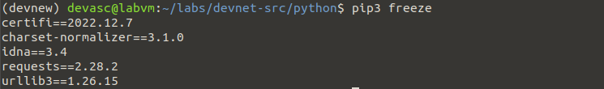
_devfun_:
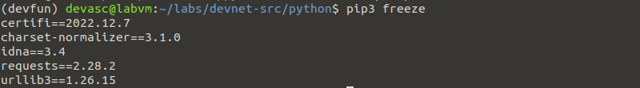

Finalmente, desactivamos el nuevo entorno virtual con el comando `deactivate`

## Conclusiones

Aprendimos que un entorno virtual de Python (_venv_ por **v**irtual **env**ironment) nos permite aislar nuestro proyecto del resto del entorno del sistema. Esto es bueno porque evita las dependencias competitivas de las numerosas herramientas que puede haber en el entorno del sistema (instaladas globalmente). Además, también aprendimos que un entorno virtual se puede replicar fácilmente para que otros desarrolladores usen el mismo entorno y no haya conflictos. 

Me planteé un pregunta:

**¿Qué lenguajes permiten habilitar entornos virtuales de desarrollo?**

Veamos el caso de Java. Si revisamos la documentación, no existe un comando equivalente a `python3 -m venv virtual_env_name` porque Java ya incorpora por defecto los entornos virtuales. Cada proyecto es su propio entorno virtual, ya que tiene su propio conjunto de dependencias y bibliotecas y corre en la máquina virtual de Java (JVM), un entorno aislado del sistema _host_.

En el caso de JavaScript, no tiene un entorno virtual como Java. En cambio, JavaScript se ejecuta en el navegador web del usuario.

Según [una respuesta en un foro de Quora](https://qr.ae/prjESj), al parecer hay algo equivalente a los entornos virtuales de Python en Node.js y en Haskell.