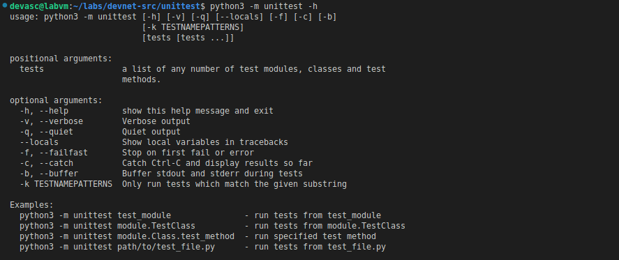
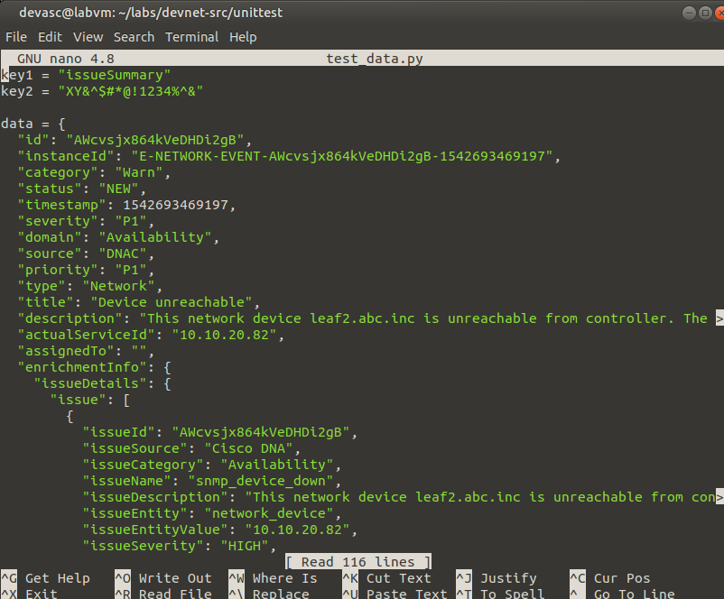
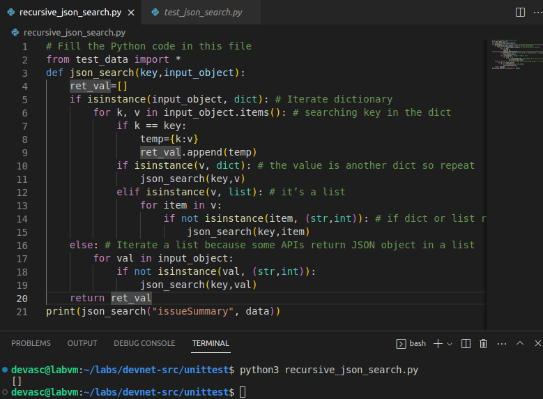
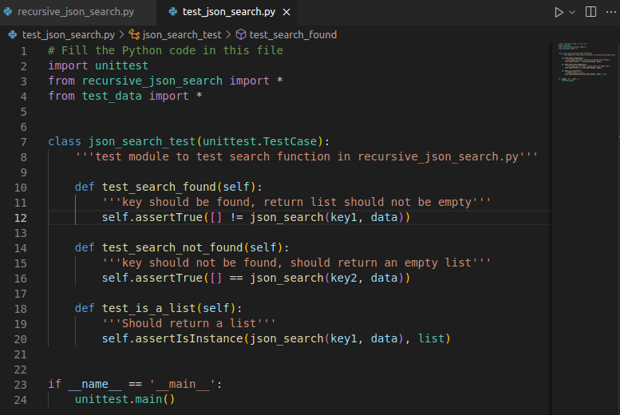
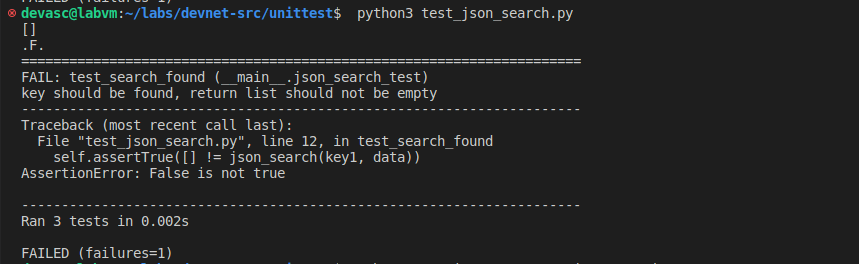
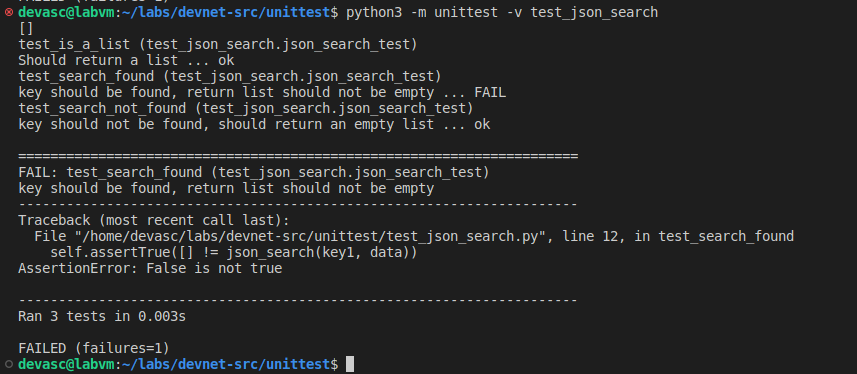
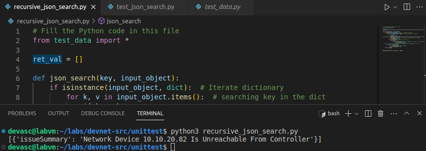
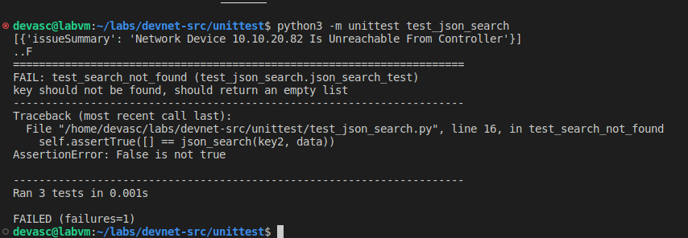
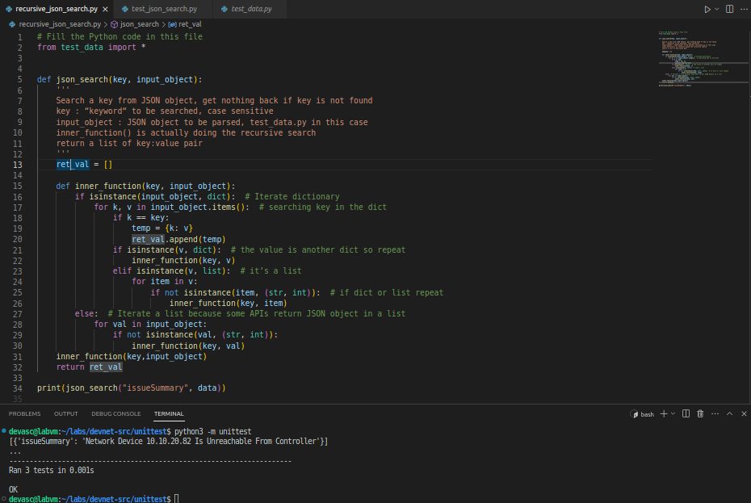
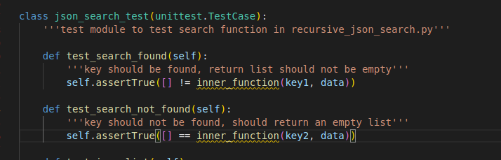

# Laboratorio 3a: Crear una prueba unitaria de Python <!-- omit in toc -->

- [Parte 1. Iniciar la máquina virtual DEVASC](#parte-1-iniciar-la-máquina-virtual-devasc)
- [Parte 2. Explorar las opciones del framework unittest](#parte-2-explorar-las-opciones-del-framework-unittest)
- [Parte 3. Prueba una función de Python con unittest](#parte-3-prueba-una-función-de-python-con-unittest)
  - [Paso 1. Revisa el archivo test\_data.py](#paso-1-revisa-el-archivo-test_datapy)
  - [Paso 2. Crea la función json\_search() que vas a probar](#paso-2-crea-la-función-json_search-que-vas-a-probar)
  - [Paso 3. Crea algunas pruebas unitarias que comprueben si la función funciona según lo previsto](#paso-3-crea-algunas-pruebas-unitarias-que-comprueben-si-la-función-funciona-según-lo-previsto)
  - [Paso 4. Ejecuta la prueba para ver los resultados iniciales](#paso-4-ejecuta-la-prueba-para-ver-los-resultados-iniciales)
  - [Paso 5. Investiga y corrige el primer error en el script recursive\_json\_search.py](#paso-5-investiga-y-corrige-el-primer-error-en-el-script-recursive_json_searchpy)
  - [Paso 6. Vuelve a ejecutar la prueba para comprobar si se han corregido todos los errores del script](#paso-6-vuelve-a-ejecutar-la-prueba-para-comprobar-si-se-han-corregido-todos-los-errores-del-script)
  - [Paso 7. Investiga y corrige el segundo error en el script recursive\_json\_search.py](#paso-7-investiga-y-corrige-el-segundo-error-en-el-script-recursive_json_searchpy)
- [Conclusiones y reflexiones](#conclusiones-y-reflexiones)

> Para este laboratorio seguimos [esta guía en inglés.](https://www.ccna6rs.com/3-5-7-lab-create-a-python-unit-test-answers/)

## Parte 1. Iniciar la máquina virtual DEVASC


## Parte 2. Explorar las opciones del framework unittest

Para esto usamos el siguiente comando:

```
python3 -m unittest -h
```



## Parte 3. Prueba una función de Python con unittest

### Paso 1. Revisa el archivo test_data.py



### Paso 2. Crea la función json_search() que vas a probar

Creamos la función recursiva `json_search()`, con la que queremos capturar todos los pares clave-valor que coinciden con una clave dada y que están dentro de un diccionario dado. La estructura anidada del diccionario es lo que motiva que la función sea recursiva: queremos buscar los pares clave-valor en cualquier nivel dentro del diccionario.



### Paso 3. Crea algunas pruebas unitarias que comprueben si la función funciona según lo previsto

Tenemos que asegurarnos de tres cosas: que la función retorne una lista no vacía cuando la clave dada existe en el diccionario, que la función retorne una lista vacía cuando no, y que lo que retorna la función siempre sea una lista.

Esto lo hacemos definiendo la clase de prueba `json_search_test`, que hereda de la clase `unittest.TestCase`:



### Paso 4. Ejecuta la prueba para ver los resultados iniciales

Cuando ejecutamos la prueba, vemos que falla la que espera una lista no vacía dada una clave que existe en el diccionario. 



Pero observamos que el superresumen de las pruebas que aparece al principio (.F.) no sigue el orden de las pruebas definidas en el archivo _test_json_search.py_, ya que la que falla es la primera de ellas, no la segunda. Entonces, ahora sabemos que las pruebas no necesariamente se ejecutan en el orden en que han sido definidas.



### Paso 5. Investiga y corrige el primer error en el script recursive_json_search.py

La variable `ret_val`, al estar dentro de la función recursiva, se vacía en las llamadas recursivas en la línea `ret_val = []`. La primera solución que se nos puede ocurrir es volverla una variable global. Esto resulve el primer error, como se puede apreciar al ejecutarla con este cambio:



### Paso 6. Vuelve a ejecutar la prueba para comprobar si se han corregido todos los errores del script

Sin embargo, pese a haberse resulto el primer error, al volver global la variable `ret_val` se introduce otro error: esta variable se queda con la información que capturó en otras pruebas. Si primero se ejecuta la prueba en la que devuelve una lista no vacía, con información, luego la prueba en la que debe devolver una lista vacía fallará porque la variable que se retorna contiene la información que capturó en la anterior prueba.



### Paso 7. Investiga y corrige el segundo error en el script recursive_json_search.py

Tanto el primer error como el que introdujimos luego se pueden resolver cambiando la definición de la función `json_search()` de forma que la variable `ret_val` vuelva a ser local, pero no se vacíe en las llamadas recursivas. Para ello definimos una función con el mismo nombre que servirá para **envolver** tanto la variable localmente como una función interna `inner_function()` que pasará a contener toda la lógica recursiva. No se nos debe olvidar que debemos llamar esta función interna dentro de la función envoltorio para que sea ejecutada al llamar la función envoltorio, así como retornar el valor de la variable.



Como ya pasaron todas las pruebas, podemos eliminar el `print` del final, que demostró ser un forma poco fiable de probar nuestra función.

A propósito, hicimos el intento de renombrar la función `json_search()` como `inner_function()` para ahorrarnos tener que reescribir manualmente las llamadas recursivas, pero se renombró también en el archivo de las pruebas unitarias. Este es un comportamiento de VSCode que desconocíamos y que, obviamente, no era deseable en este caso.



## Conclusiones y reflexiones

**¿Por qué las pruebas unitarias son importantes?**

Las pruebas unitarias no solo sirven para detectar y corregir errores en el código, como hemos visto en este laboratorio, sino también para mejorar su calidad, legibilidad y mantenibilidad. Al escribir pruebas unitarias, nos obligamos a pensar en el diseño y la estructura de nuestro código, así como en los casos de uso y las condiciones límite. Además, las pruebas unitarias facilitan la refactorización y la integración continua del código, lo que agiliza el desarrollo y la entrega del software. 

Por estas razones, las pruebas unitarias son una práctica esencial para cualquier programador que quiera crear software de calidad y confianza.

**¿Y cómo ayudan a mejorar la legibilidad del código?**

Las pruebas unitarias ayudan a que el código sea más legible de tres formas:

- Obligan a los desarrolladores a escribir código modular y desacoplado, lo que facilita su comprensión y mantenimiento.

- Documentan el comportamiento esperado de cada unidad de código, lo que ayuda a los desarrolladores a entender su propósito y su lógica.

- Permiten refactorizar el código con confianza, lo que ayuda a eliminar el código redundante o innecesario y a mejorar su claridad y coherencia.