# Laboratorio 3b: Analizar diferentes tipos de datos con Python <!-- omit in toc -->

- [Parte 1. Inicia la máquina virtual DEVASC](#parte-1-inicia-la-máquina-virtual-devasc)
- [Parte 2. Analiza XML en Python](#parte-2-analiza-xml-en-python)
  - [Paso 1. Crea un script para analizar los datos XML](#paso-1-crea-un-script-para-analizar-los-datos-xml)
  - [Paso 2. Ejecuta el script](#paso-2-ejecuta-el-script)
- [Parte 3. Analiza JSON en Python](#parte-3-analiza-json-en-python)
  - [Paso 1: Crear un script para analizar los datos JSON](#paso-1-crear-un-script-para-analizar-los-datos-json)
  - [Paso 2: Ejecuta el script para imprimir los datos JSON y modifícalo para imprimir los datos de interés](#paso-2-ejecuta-el-script-para-imprimir-los-datos-json-y-modifícalo-para-imprimir-los-datos-de-interés)
  - [Paso 3: Imprime los datos JSON analizados en formato YAML](#paso-3-imprime-los-datos-json-analizados-en-formato-yaml)
- [Parte 4. Analiza YAML en Python](#parte-4-analiza-yaml-en-python)
  - [Paso 1. Crea un script para analizar los datos YAML](#paso-1-crea-un-script-para-analizar-los-datos-yaml)
  - [Paso 2. Ejecuta el script para imprimir los datos YAML y luego modifícalo para imprimir los datos de interés](#paso-2-ejecuta-el-script-para-imprimir-los-datos-yaml-y-luego-modifícalo-para-imprimir-los-datos-de-interés)
  - [Paso 3. Imprime los datos YAML analizados en formato JSON](#paso-3-imprime-los-datos-yaml-analizados-en-formato-json)
- [Conclusiones y reflexiones](#conclusiones-y-reflexiones)
- [Bibliografía](#bibliografía)

> Para este laboratorio seguimos [esta guía en inglés](https://www.ccna6rs.com/3-6-6-lab-parse-different-data-types-with-python-answers/)

## Parte 1. Inicia la máquina virtual DEVASC

## Parte 2. Analiza XML en Python

### Paso 1. Crea un script para analizar los datos XML

En este script usamos el módulo `ElementTree` para analizar el archivo _myfile.xml_.

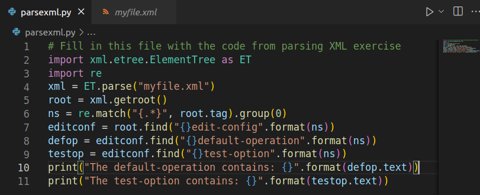

Notamos que la variable `ns` almacena el namespace. El namespace es como un vocabulario, una colección de elementos y atributos identificados por una URI.

En el archivo _myfile.xml_ encontramos un atributo llamado `xmlns` en la raíz `rpc`. Su nombre significa XML namespace, así que es el namespace de la raíz. Y su valor asociado es la URI: _urn:ietf:params:xml:ns:netconf:base:1.0_.

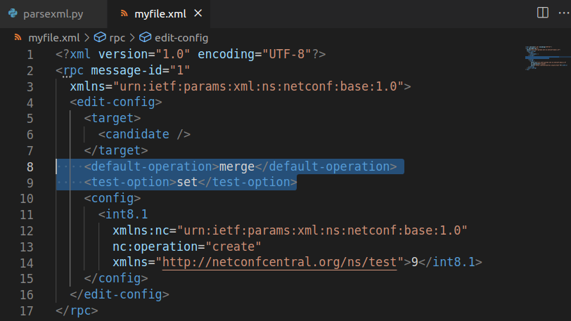

En este caso, como se ve en la imagen, la URI es en particular una URN, no una URL. Por esto solo sirve como un identificador, no como un enlace para acceder al vocabulario del que hablamos.

Entonces, esta URN es el namespace del elemento raiz `rpc` y, como si fuera una herencia, el namespace de todos los elementos que contiene la raíz. Esto significa que todos los elementos que vemos, como `target` o `default-operation`, deberían estar definidos por el estándar asociado a la URN asignada como namespace.

Por eso en el script de Python, a menos que se registre el namespace con otro nombre, los elementos se buscan con el incómodo _{urn:ietf:params:xml:ns:netconf:base:1.0}_ antes del tag en métodos como `find()` o `findall()`.

### Paso 2. Ejecuta el script

Luego de localizar dos elementos XML y guardarlos en las variables `defop` y `testop`, estamos listos para imprimir el texto que contienen a  través del campo `text`:

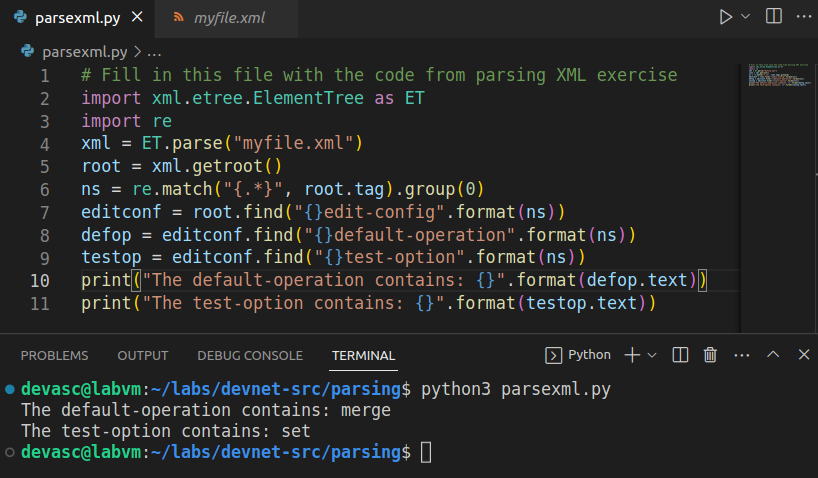

## Parte 3. Analiza JSON en Python

### Paso 1: Crear un script para analizar los datos JSON

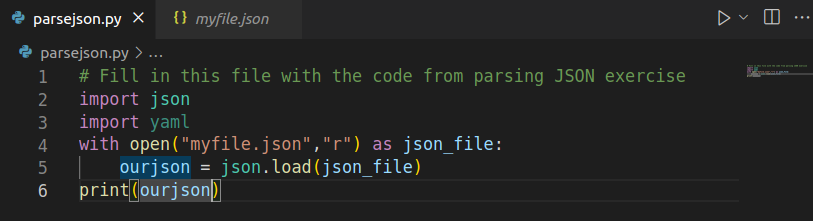

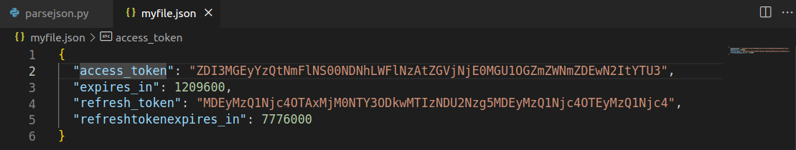

### Paso 2: Ejecuta el script para imprimir los datos JSON y modifícalo para imprimir los datos de interés

En este script usamos el módulo `json` para analizar el archivo _myfile.json_

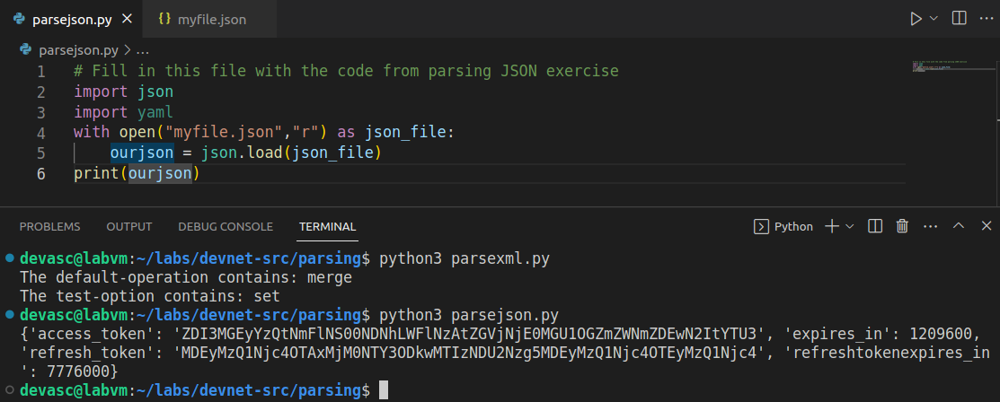

No hay mucho que decir, salvo que es mucho más fácil analizar un archivo JSON que un archivo XML. Basicamente, los datos están estructurados como un simple diccionario de Python. Por eso es más fácil de analizar.

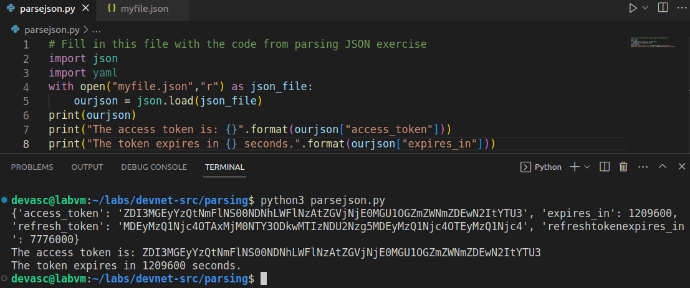

### Paso 3: Imprime los datos JSON analizados en formato YAML

Ahora usaremos el módulo `yaml` para imprimir los datos en formato YAML con el método `dump()`:

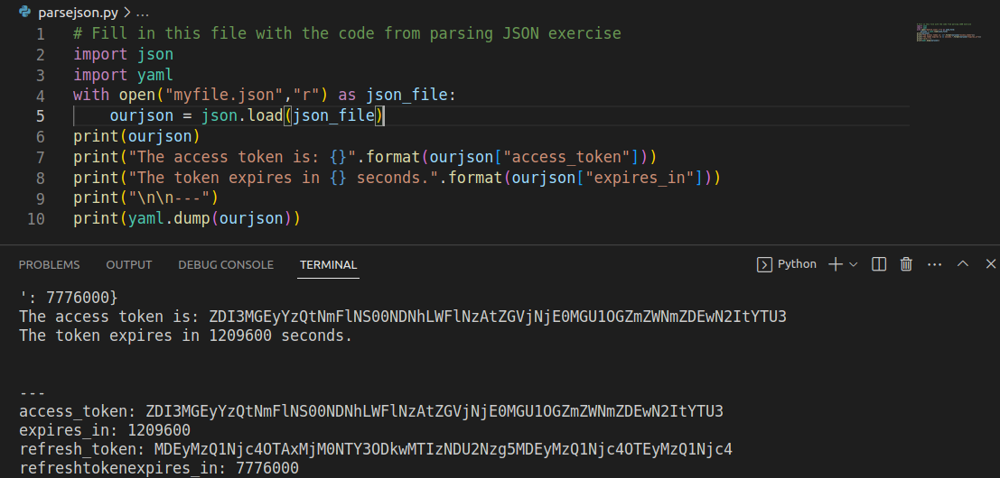

## Parte 4. Analiza YAML en Python

### Paso 1. Crea un script para analizar los datos YAML

Notamos que los módulos `json` y `yaml` se parecen mucho en sus métodos y en la forma en la que estructuran la información. Aquí la única diferencia es que el método para obtener los datos del archivo _myfile.yaml_ es `safe_load()`, y no `load()` como en `json`.

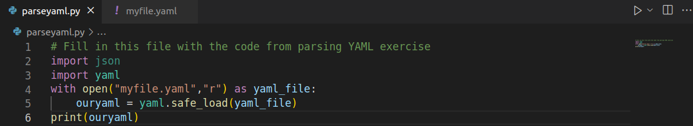

El archivo está estructurado en pares clave-valor:

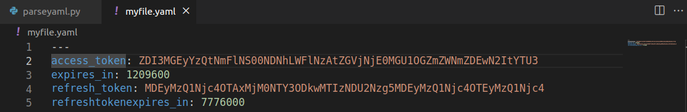

### Paso 2. Ejecuta el script para imprimir los datos YAML y luego modifícalo para imprimir los datos de interés

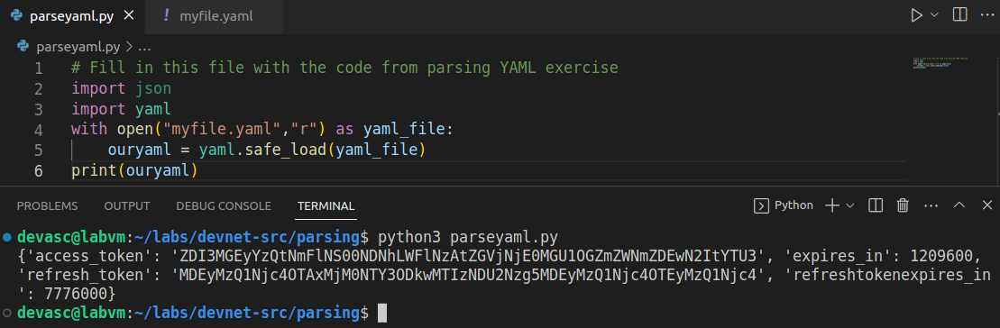

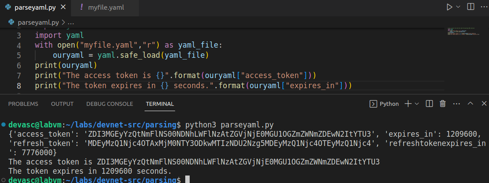

### Paso 3. Imprime los datos YAML analizados en formato JSON

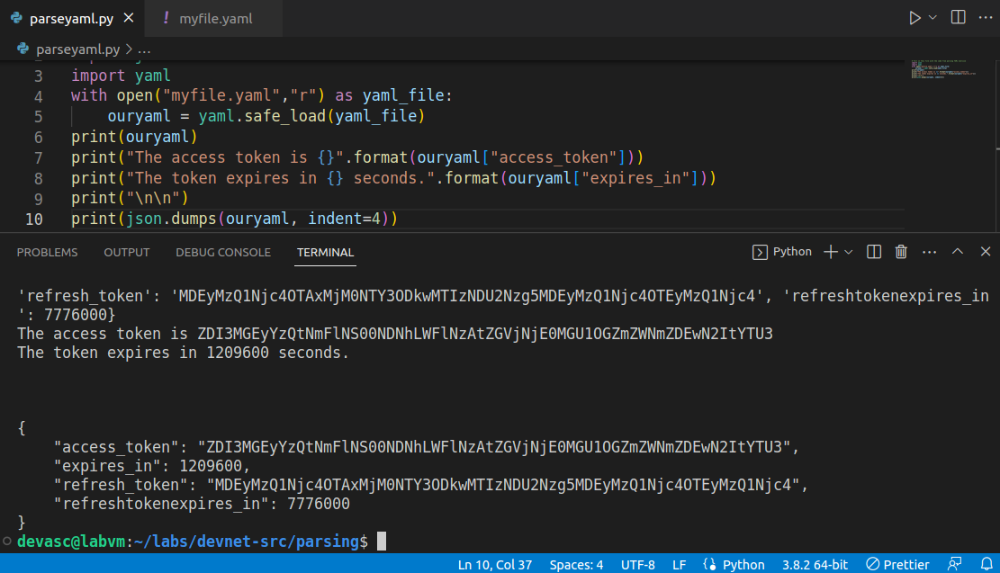

## Conclusiones y reflexiones

**¿Cómo son los distintos formatos vistos en el laboratorio?**

XML, JSON y YAML son formatos de serialización de datos que permiten transmitir y compartir información más compleja entre sistemas diferentes, con estructuras jerárquicas y atributos variables.
  
- XML es un lenguaje de marcado extensible que define un conjunto de reglas para codificar información de manera que sea legible por un ser humano y por un ordenador. Se usa ampliamente para transmitir información en servicios webs y APIs REST y para archivos de configuración. Una de sus fortalezas es el soporte a Unicode, lo que permite escribir la información en cualquier idioma del mundo.
  
- JSON es un estándar abierto que utiliza texto plano para codificar información en la forma clave-valor. Aunque en sus inicios fue considerado como una parte de JavaScript, siempre ha sido independiente del lenguaje de programación y se encuentra disponible para los más populares. También es ampliamente usado para intercambio de información entre servicios web y APIs REST. Una de sus ventajas es que es compacto y una cadena JSON promedio tiene aproximadamente dos tercios del tamaño de los mismos datos en XML.
  
- YAML es un formato de serialización de datos que significa YAML no es lenguaje de marcado. La principal ventaja de usar YAML es la legibilidad y la capacidad de escritura. Si se tiene un archivo de configuración que debe ser más fácil de leer para los humanos, es mejor usar YAML. YAML también admite varios tipos de datos como casos, matrices, diccionarios, listas y escalares. YAML solo admite espacios, y distingue entre mayúsculas y minúsculas y espacio. Las pestañas no se aceptan universalmente.

**¿Qué tienen en común y en qué se diferencian?**

XML es un lenguaje de marcado, mientras que JSON y YAML son formatos de datos. XML usa etiquetas para definir los elementos y almacena los datos en una estructura de árbol, mientras que los datos en JSON se almacenan como un mapa con pares clave-valor. YAML, por otro lado, permite la representación de datos tanto en formato de lista o secuencia como en forma de mapa con pares clave-valor.
  
XML admite tipos de datos complejos como gráficos, imágenes y otros tipos de datos no primitivos. JSON solo admite cadenas, números, matrices, booleanos y objetos. YAML, por otro lado, admite tipos de datos complejos como sellos de fecha y hora, secuencias, valores anidados y recursivos y tipos de datos primitivos.
  
XML es voluminoso y lento en el análisis sintáctico, lo que conduce a una transmisión de datos relativamente lenta. Los archivos JSON son considerablemente más pequeños que los archivos XML y los datos JSON se analizan rápidamente por el motor JavaScript, lo que permite una transmisión de datos más rápida. YAML, como un superconjunto de JSON, también ofrece una transmisión de datos más rápida, pero es importante recordar que JSON y YAML se utilizan en diferentes escenarios.
  
XML es difícil de leer e interpretar, pero es bastante fácil interpretar los datos en formato JSON y es mucho más fácil leer los datos en YAML que en formato JSON.
  
XML se utiliza para el intercambio de datos (es decir, cuando un usuario quiere intercambiar datos entre dos aplicaciones). JSON es mejor como formato de serialización y se utiliza para servir datos a interfaces de programación de aplicaciones (API). YAML es más adecuado para la configuración.

**¿Cómo es el análisis de los datos en estos formatos?**

- El análisis de archivos XML requiere un software especializado que pueda leer y procesar las etiquetas y los atributos del lenguaje de marcado. El proceso de análisis puede ser lento y consumir mucha memoria, especialmente para archivos XML grandes.

- El análisis de archivos JSON es más sencillo y rápido que el de XML, ya que JSON usa una sintaxis más simple y compacta basada en pares clave-valor. JSON es compatible con muchos lenguajes de programación y se puede convertir fácilmente a objetos nativos.

- El análisis de archivos YAML es similar al de JSON, ya que YAML se basa en JSON y los archivos JSON son válidos en YAML. YAML tiene una sintaxis más legible y flexible que JSON, pero también más estricta en cuanto al uso de espacios y sangrías.

## Bibliografía

- [XML JSON YAML: Formatos para intercambiar información](https://hipertextual.com/2014/05/xml-json-yaml)

- [XML vs. JSON vs. YAML](https://community.cisco.com/t5/developer-general-knowledge-base/xml-vs-json-vs-yaml/ta-p/4729758)

- [YAML vs JSON vs XML | What is the Difference Between Them?](https://www.csestack.org/yaml-vs-json-vs-xml-difference/)

- [What's the Difference Between JSON, XML, and YAML?](https://www.electronicdesign.com/technologies/dev-tools/article/21800743/whats-the-difference-between-json-xml-and-yaml)

- [Introducción a YAML para principiantes](https://geekflare.com/es/yaml-introduction/)

- [19 herramientas de edición, analizador y formateador de JSON en línea](https://geekflare.com/es/json-online-tools/)