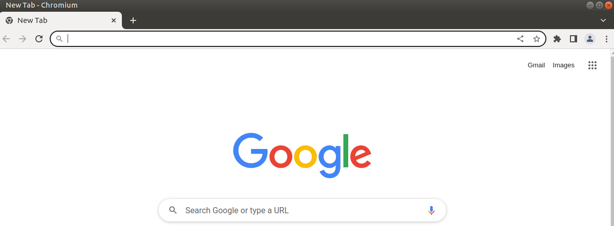
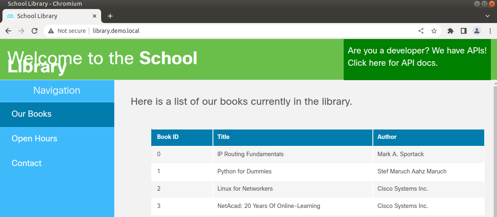
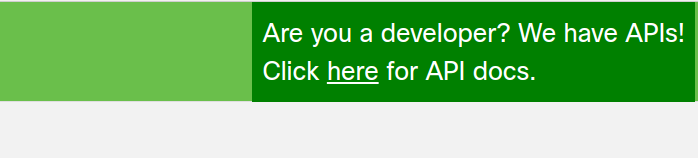
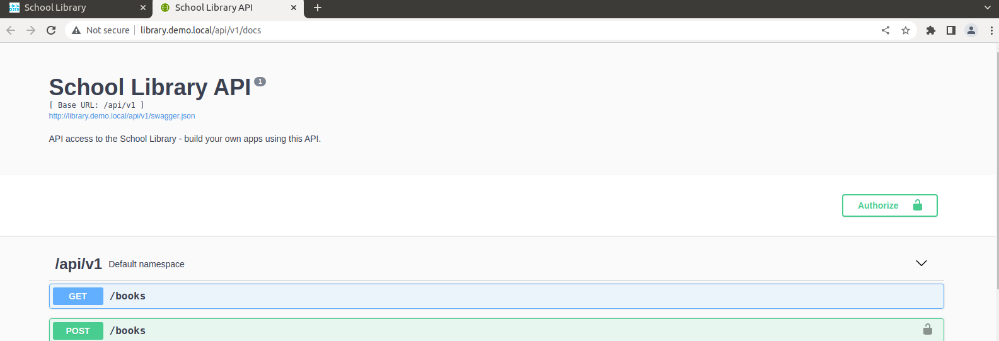
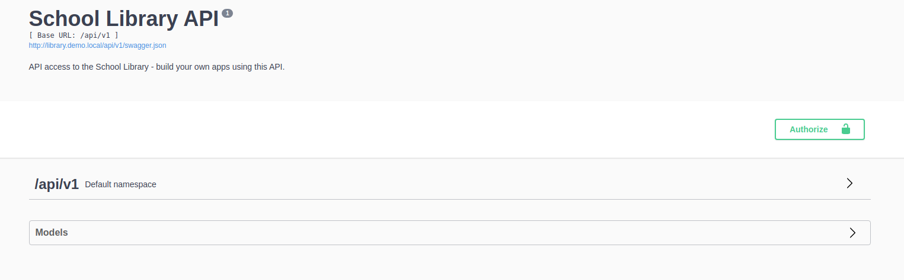
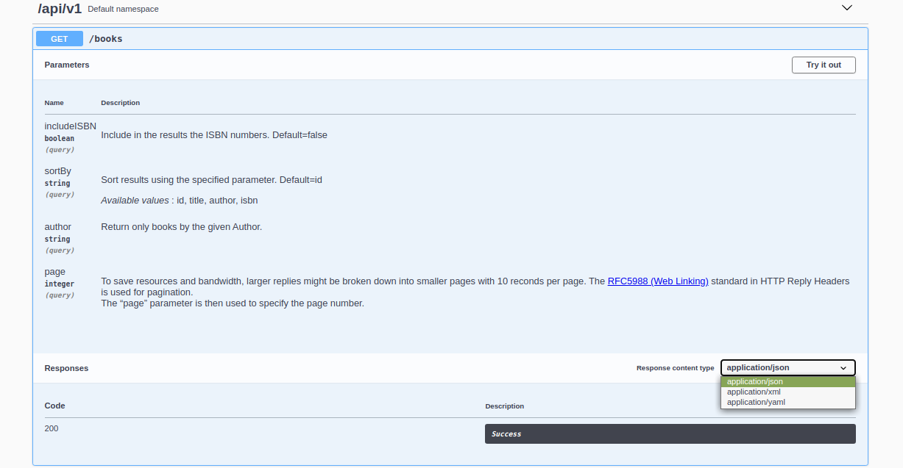
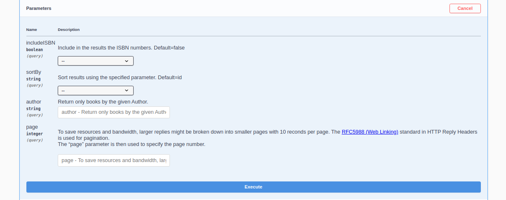
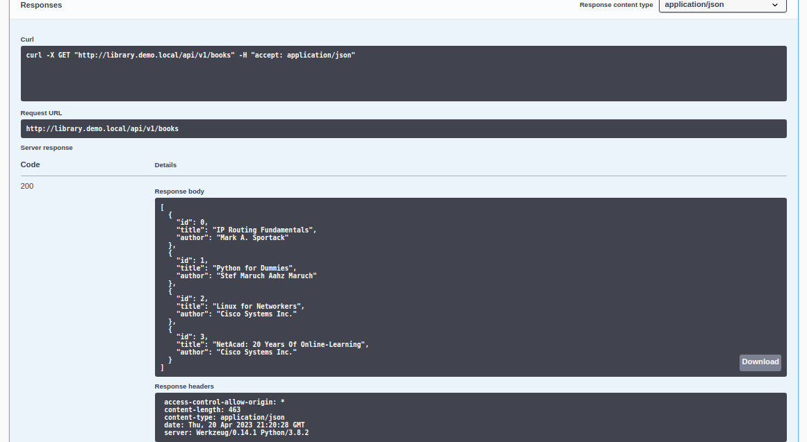

# Laboratorio 4a: Explora las API Rest con el Simulador API y Postman <!-- omit in toc -->

- [Parte 1. Inicia el DevNet VM](#parte-1-inicia-el-devnet-vm)
- [Parte 2. Explora la documentación de API usando el simulador de API](#parte-2-explora-la-documentación-de-api-usando-el-simulador-de-api)
  - [Paso 1. Abre el navegador web Chromium](#paso-1-abre-el-navegador-web-chromium)
  - [Paso 2. Conéctate al sitio web de la Biblioteca de la Escuela](#paso-2-conéctate-al-sitio-web-de-la-biblioteca-de-la-escuela)
  - [Paso 3. Ve a la página de documentos de API](#paso-3-ve-a-la-página-de-documentos-de-api)
  - [Paso 4. Obtenen la lista de libros con la API GET /books](#paso-4-obtenen-la-lista-de-libros-con-la-api-get-books)
  - [Paso 5. Utiliza la función «Try it out» en la documentación de la API](#paso-5-utiliza-la-función-try-it-out-en-la-documentación-de-la-api)
  - [Paso 6. Utiliza el comando CURL en una ventana terminal](#paso-6-utiliza-el-comando-curl-en-una-ventana-terminal)
  - [Paso 7. Enumera libros con su ISBN utilizando la API GET /books](#paso-7-enumera-libros-con-su-isbn-utilizando-la-api-get-books)
  - [Paso 8. Obtén un token usando la API POST /LoginViaBasic](#paso-8-obtén-un-token-usando-la-api-post-loginviabasic)
  - [Paso 9. Añade libros mediante la API POST /books](#paso-9-añade-libros-mediante-la-api-post-books)
  - [Paso 10. Enumera libros con la API GET /books](#paso-10-enumera-libros-con-la-api-get-books)
  - [Paso 11. Enumera un libro específico utilizando la API GET /books {id}](#paso-11-enumera-un-libro-específico-utilizando-la-api-get-books-id)
  - [Paso 12. Elimina un libro específico con la API DELETE /books {id}](#paso-12-elimina-un-libro-específico-con-la-api-delete-books-id)
  - [Paso 13. Enumera libros con la API GET /books](#paso-13-enumera-libros-con-la-api-get-books)
- [Parte 3. Usa el Postman para realizar llamadas API al simulador de API](#parte-3-usa-el-postman-para-realizar-llamadas-api-al-simulador-de-api)
  - [Paso 1. Abre Postman](#paso-1-abre-postman)
  - [Paso 2. Enumera los libros utilizando la API GET /books](#paso-2-enumera-los-libros-utilizando-la-api-get-books)
  - [Paso 3. Obtén un token usando la API POST /LoginViaBasic](#paso-3-obtén-un-token-usando-la-api-post-loginviabasic)
  - [Paso 4. Añade un libro mediante la API POST /books](#paso-4-añade-un-libro-mediante-la-api-post-books)
  - [Paso 5. Verifica el libro adicional con la API Get /books](#paso-5-verifica-el-libro-adicional-con-la-api-get-books)
  - [Paso 6. Utiliza parámetros adicionales con el API Get /books](#paso-6-utiliza-parámetros-adicionales-con-el-api-get-books)
- [Parte 4. Usa Python para agregar 100 libros para el simulador de API](#parte-4-usa-python-para-agregar-100-libros-para-el-simulador-de-api)
  - [Paso 1. Abre Visual Studio Code y navega hasta el directorio de la biblioteca escolar](#paso-1-abre-visual-studio-code-y-navega-hasta-el-directorio-de-la-biblioteca-escolar)
  - [Paso 2. Investiga las bibliotecas utilizadas por el programa add100RandomBooks.py](#paso-2-investiga-las-bibliotecas-utilizadas-por-el-programa-add100randombookspy)
  - [Paso 3. Practica generar datos aleatorios usando la biblioteca de falsificadores](#paso-3-practica-generar-datos-aleatorios-usando-la-biblioteca-de-falsificadores)
  - [Paso 4. Revisa las variables de función](#paso-4-revisa-las-variables-de-función)
  - [Paso 5. Revisa la función Obtener FichaAutenticadora (GetAuthToken)](#paso-5-revisa-la-función-obtener-fichaautenticadora-getauthtoken)
  - [Paso 6. Revisa la función AñadirLibro (AddBook)](#paso-6-revisa-la-función-añadirlibro-addbook)
  - [Paso 7. Revisa el código que invoca las dos funciones](#paso-7-revisa-el-código-que-invoca-las-dos-funciones)
  - [Paso 8. Ejecuta y verifica el programa add100RandomBooks.py](#paso-8-ejecuta-y-verifica-el-programa-add100randombookspy)

## Parte 1. Inicia el DevNet VM

## Parte 2. Explora la documentación de API usando el simulador de API

### Paso 1. Abre el navegador web Chromium

### Paso 2. Conéctate al sitio web de la Biblioteca de la Escuela

### Paso 3. Ve a la página de documentos de API

Tanto /api/v1 como Models son listas desplegables que se cierran o abren con un clic.

### Paso 4. Obtenen la lista de libros con la API GET /books

**Vamos a hacer una petición GET para obtener la lista de libros.**

Vemos que hay tres secciones: parámetros, respuestas y código. 

### Paso 5. Utiliza la función «Try it out» en la documentación de la API

Al seleccionar la opción _Try it out_, ahora se nos permite ingresar información en los campos de la sección de parámetros.

Lo dejamos todo vacío tal cual está y seleccionamos _Execute_ para hacer la petición GET.

En las respuestas que nos entrega observamos tres campos: _Curl_, _Request URL_ y _Server response_. Además, en _Server response_ tenemos el _Response body_ (la información que nos interesa obtener) y el _Response head_.

### Paso 6. Utiliza el comando CURL en una ventana terminal
### Paso 7. Enumera libros con su ISBN utilizando la API GET /books
### Paso 8. Obtén un token usando la API POST /LoginViaBasic
### Paso 9. Añade libros mediante la API POST /books
### Paso 10. Enumera libros con la API GET /books
### Paso 11. Enumera un libro específico utilizando la API GET /books {id}
### Paso 12. Elimina un libro específico con la API DELETE /books {id}
### Paso 13. Enumera libros con la API GET /books
## Parte 3. Usa el Postman para realizar llamadas API al simulador de API
### Paso 1. Abre Postman
### Paso 2. Enumera los libros utilizando la API GET /books
### Paso 3. Obtén un token usando la API POST /LoginViaBasic
### Paso 4. Añade un libro mediante la API POST /books
### Paso 5. Verifica el libro adicional con la API Get /books
### Paso 6. Utiliza parámetros adicionales con el API Get /books
## Parte 4. Usa Python para agregar 100 libros para el simulador de API
### Paso 1. Abre Visual Studio Code y navega hasta el directorio de la biblioteca escolar
### Paso 2. Investiga las bibliotecas utilizadas por el programa add100RandomBooks.py
### Paso 3. Practica generar datos aleatorios usando la biblioteca de falsificadores
### Paso 4. Revisa las variables de función
### Paso 5. Revisa la función Obtener FichaAutenticadora (GetAuthToken)
### Paso 6. Revisa la función AñadirLibro (AddBook)
### Paso 7. Revisa el código que invoca las dos funciones
### Paso 8. Ejecuta y verifica el programa add100RandomBooks.py