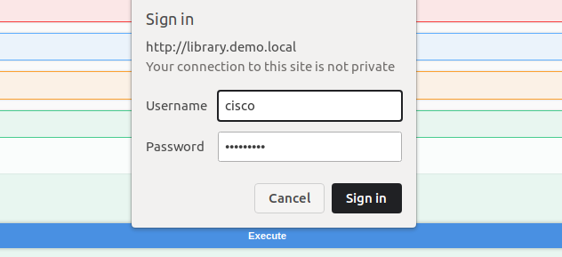
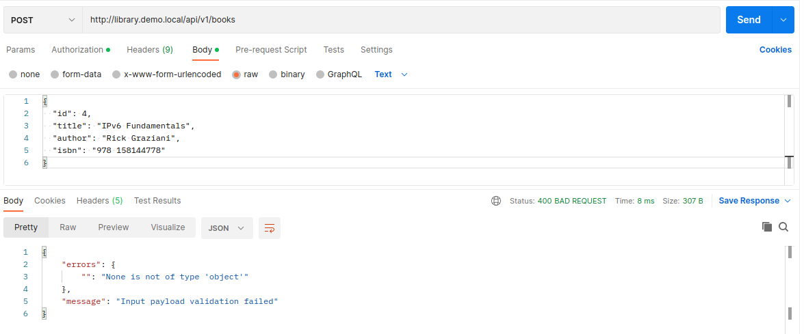
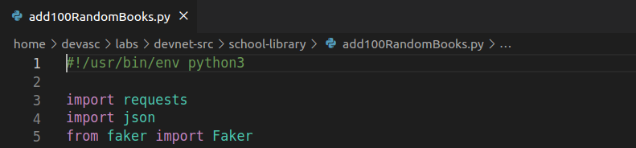

# Laboratorio 4a: Explora las API Rest con el Simulador API y Postman <!-- omit in toc -->

- [Parte 1. Inicia el DevNet VM](#parte-1-inicia-el-devnet-vm)
- [Parte 2. Explora la documentación de API usando el simulador de API](#parte-2-explora-la-documentación-de-api-usando-el-simulador-de-api)
  - [Paso 1. Abre el navegador web Chromium](#paso-1-abre-el-navegador-web-chromium)
  - [Paso 2. Conéctate al sitio web de la Biblioteca de la Escuela](#paso-2-conéctate-al-sitio-web-de-la-biblioteca-de-la-escuela)
  - [Paso 3. Ve a la página de documentos de API](#paso-3-ve-a-la-página-de-documentos-de-api)
  - [Paso 4. Obtenen la lista de libros con la API GET /books](#paso-4-obtenen-la-lista-de-libros-con-la-api-get-books)
  - [Paso 5. Utiliza la función «Try it out» en la documentación de la API](#paso-5-utiliza-la-función-try-it-out-en-la-documentación-de-la-api)
  - [Paso 6. Utiliza el comando CURL en una ventana terminal](#paso-6-utiliza-el-comando-curl-en-una-ventana-terminal)
  - [Paso 7. Enumera libros con su ISBN utilizando la API GET /books](#paso-7-enumera-libros-con-su-isbn-utilizando-la-api-get-books)
  - [Paso 8. Obtén un token usando la API POST /LoginViaBasic](#paso-8-obtén-un-token-usando-la-api-post-loginviabasic)
  - [Paso 9. Añade libros mediante la API POST /books](#paso-9-añade-libros-mediante-la-api-post-books)
  - [Paso 10. Obtén la lista de libros con la API GET /books](#paso-10-obtén-la-lista-de-libros-con-la-api-get-books)
  - [Paso 11. Lista un libro específico utilizando la API GET /books {id}](#paso-11-lista-un-libro-específico-utilizando-la-api-get-books-id)
  - [Paso 12. Elimina un libro específico con la API DELETE /books {id}](#paso-12-elimina-un-libro-específico-con-la-api-delete-books-id)
  - [Paso 13. Obtén la lista de los libros con la API GET /books](#paso-13-obtén-la-lista-de-los-libros-con-la-api-get-books)
- [Parte 3. Usa el Postman para realizar llamadas API al simulador de API](#parte-3-usa-el-postman-para-realizar-llamadas-api-al-simulador-de-api)
  - [Paso 1. Abre Postman](#paso-1-abre-postman)
  - [Paso 2. Enumera los libros utilizando la API GET /books](#paso-2-enumera-los-libros-utilizando-la-api-get-books)
  - [Paso 3. Obtén un token usando la API POST /LoginViaBasic](#paso-3-obtén-un-token-usando-la-api-post-loginviabasic)
  - [Paso 4. Añade un libro mediante la API POST /books](#paso-4-añade-un-libro-mediante-la-api-post-books)
  - [Paso 5. Verifica el libro adicional con la API Get /books](#paso-5-verifica-el-libro-adicional-con-la-api-get-books)
  - [Paso 6. Utiliza parámetros adicionales con el API Get /books](#paso-6-utiliza-parámetros-adicionales-con-el-api-get-books)
- [Parte 4. Usa Python para agregar 100 libros para el simulador de API](#parte-4-usa-python-para-agregar-100-libros-para-el-simulador-de-api)
  - [Paso 1. Abre Visual Studio Code y navega hasta el directorio de la biblioteca escolar](#paso-1-abre-visual-studio-code-y-navega-hasta-el-directorio-de-la-biblioteca-escolar)
  - [Paso 2. Investiga las bibliotecas utilizadas por el programa add100RandomBooks.py](#paso-2-investiga-las-bibliotecas-utilizadas-por-el-programa-add100randombookspy)
  - [Paso 3. Practica generar datos aleatorios usando la biblioteca de falsificadores](#paso-3-practica-generar-datos-aleatorios-usando-la-biblioteca-de-falsificadores)
  - [Paso 4. Revisa las variables de función](#paso-4-revisa-las-variables-de-función)
  - [Paso 5. Revisa la función para obtener token de autenticación (GetAuthToken)](#paso-5-revisa-la-función-para-obtener-token-de-autenticación-getauthtoken)
  - [Paso 6. Revisa la función de añadir libro (AddBook)](#paso-6-revisa-la-función-de-añadir-libro-addbook)
  - [Paso 7. Revisa el código que invoca las dos funciones](#paso-7-revisa-el-código-que-invoca-las-dos-funciones)
  - [Paso 8. Ejecuta y verifica el programa add100RandomBooks.py](#paso-8-ejecuta-y-verifica-el-programa-add100randombookspy)
- [Conclusiones y reflexiones](#conclusiones-y-reflexiones)


Para este laboratorio seguimos [esta guía en inglés](https://www.ccna6rs.com/4-5-5-lab-explore-rest-apis-with-api-simulator-and-postman-answers/).

## Parte 1. Inicia el DevNet VM

## Parte 2. Explora la documentación de API usando el simulador de API

### Paso 1. Abre el navegador web Chromium


### Paso 2. Conéctate al sitio web de la Biblioteca de la Escuela


### Paso 3. Ve a la página de documentos de API


Tanto _/api/v1_ como _Models_ son listas desplegables que se cierran o abren con un clic.


### Paso 4. Obtenen la lista de libros con la API GET /books

**Vamos a hacer una petición GET para obtener la lista de libros.**

Vemos que en la opción _GET /books_ hay tres secciones: _Parameters_, _Responses_ y _Code_. 


### Paso 5. Utiliza la función «Try it out» en la documentación de la API

Al seleccionar la opción _Try it out_, ahora se nos permite ingresar información en los campos de la sección de parámetros.


Lo dejamos todo vacío tal cual está y seleccionamos _Execute_ para lograr dos cosas: confirmar que nuestra petición está bien formulada y previsualizar los datos de respuesta.


En las respuestas que nos entrega observamos tres campos: _Curl_, _Request URL_ y _Server response_. Y en _Server response_ tenemos _Code_, _Response body_ y _Response head_.

El _Response body_ contiene la información que nos interesa.

Si el código es 200 significa que la petición fue exitosa.

### Paso 6. Utiliza el comando CURL en una ventana terminal

Copiamos el comando proporcionado en el campo _Curl_ y lo pegamos en nuestra terminal.


### Paso 7. Enumera libros con su ISBN utilizando la API GET /books

Vamos a modificar los parámetros de la petición GET. Ahora queremos que en el cuerpo de respuesta figure el ISBN de cada libro. Por ello lo cambiamos a _true_.


Ejecutamos y obtenemos las siguientes respuestas:


Ahora en _Curl_ y _Request URL_ se agregó la instrucción _includeISBN=true_, y así lo reflejan los nuevos datos que obtenemos en el cuerpo de respuesta.

### Paso 8. Obtén un token usando la API POST /LoginViaBasic





Pegamos el token en el campo _Value_. Esto asociará este valor con el nombre X-API-KEY. Usaremos esto en Postman más adelante.


### Paso 9. Añade libros mediante la API POST /books


Confirmamos


Añadimos otro libro y confirmamos que recibió la solicitud:


Además, verificamos que los nuevos libros están expuestos en la página principal:


### Paso 10. Obtén la lista de libros con la API GET /books

Repetimos los pasos 4 y 5 y obtenemos la lista de todos los libros, incluidos los que agregamos. Además, obsevamos que, como en el POST de los nuevos libros no especificamos el dato del código ISBN, en los datos de respuesta ni siquiera se muestra el nombre de clave _isbn_ para estos libros.


### Paso 11. Lista un libro específico utilizando la API GET /books {id}


### Paso 12. Elimina un libro específico con la API DELETE /books {id}


### Paso 13. Obtén la lista de los libros con la API GET /books


## Parte 3. Usa el Postman para realizar llamadas API al simulador de API

### Paso 1. Abre Postman


### Paso 2. Enumera los libros utilizando la API GET /books

Presionamos el signo más (+) en la sección princpal.


### Paso 3. Obtén un token usando la API POST /LoginViaBasic


Completamos los campos _Username_ y _Password_, y le seleccionamos la opción _Send_. Vemos la misma respuesta que obtuvimos en el simulador de API.


### Paso 4. Añade un libro mediante la API POST /books


Aquí no entendíamos por qué la petición fallaba.



 Era porque no se había seleccionado el tipo de contenido: JSON.

 Este es el resultado que debemos obtener:

 

### Paso 5. Verifica el libro adicional con la API Get /books


### Paso 6. Utiliza parámetros adicionales con el API Get /books

Vamos a hacer un petición a través de Postman con los parámetros _isbn=true_ y _sortBy=title_. Pero antes lo haremos en School Library API:


Sabiendo la respuesta que esperamos, ahora sí lo haremos en Postman. Vamos a ver que podemos ayudarnos de su interfaz gráfica para incluir los parámetros sin necesidad de editar la URL directamente. Aquí agregaremos los parámetros clave-valor:


Seleccionamos la opción _Send_ y este es el resultado:


## Parte 4. Usa Python para agregar 100 libros para el simulador de API

### Paso 1. Abre Visual Studio Code y navega hasta el directorio de la biblioteca escolar

Ubicamos a través del terminal el archivo en el que codificaremos un script para agregar 100 libros en el simulador de API. Lo abrimos presionando la tecla Control y clic en el nombre.



La primera línea establece que el interprete de este script debe ser Python3. Luego se importan algunas bibliotecas. La biblioteca `request` es para hacer peticiones a las API, mientras que `faker` es para generar datos falsos aleatoriamente.

### Paso 2. Investiga las bibliotecas utilizadas por el programa add100RandomBooks.py

Inspeccionamos esta última biblioteca en el terminal para ver sus funciones. (Luego de introducir _fake._ debemos hacer doble tabulación):


En la lista de 252 resultados podemos encontrar las tres funciones que usaremos en esta parte del laboratorio:

- `fake.catch_phrase(`
- `fake.isbn13(`
- `fake.name(`

### Paso 3. Practica generar datos aleatorios usando la biblioteca de falsificadores


### Paso 4. Revisa las variables de función

```
APIHOST = "http://library.demo.local"
LOGIN = "cisco"
PASSWORD = "Cisco123!"
```


### Paso 5. Revisa la función para obtener token de autenticación (GetAuthToken)

Usamos el método `post` de la biblioteca `requests`, en el que debemos introducir dos parámetros: una URL y una túpla en la que se introducen las credenciales.


El resultado esperado de esta petición POST es un token con el que podremos hacer peticiones POST para ya añadir cosas a través de la API. Como vemos, si el código de error es 200, significa que la operación fue exitosa y podemos obtener el token con el comando `r.json()["token"]`. (Recordemos cómo era el objeto JSON de la respuesta a esta petición POST en [este paso de la parte 3](#paso-3-obtén-un-token-usando-la-api-post-loginviabasic)). Caso contrario, se lanza una excepción.


### Paso 6. Revisa la función de añadir libro (AddBook)

Esta función recibe como parámetros los datos de un libro como objeto JSON y el token que obtenemos con la anterior función `getAuthToken()`.

Como parámetros del método `post` encontramos una URL parecida a la de antes y los datos de cabecera necesarios en esta petición como un objeto JSON. En el segundo parámetro especificamos el token `apiKey` para la autenticación, entre otros datos.


Además, en esta función hacemos un tratamiento similar a la anterior de la respuesta y los posibles errores. La diferencia es que imprime los datos del libro en consola si la petición es exitosa.


### Paso 7. Revisa el código que invoca las dos funciones

Este es el código que usa ambas funciones vistas en los pasos anteriores para añadir 100 libros. 


Como vemos, primero obtenemos el token de autenticación `apiKey`. Luego creamos un objeto `fake` que nos servirá para crear todos los datos falsos que queramos. En el bucle `for` cambiamos el rango para conservar los dos libros añadidos en las anteriores partes. Dentro del bucle llamamos los métodos de `fake` vistos en [este paso](#paso-2-investiga-las-bibliotecas-utilizadas-por-el-programa-add100randombookspy).

### Paso 8. Ejecuta y verifica el programa add100RandomBooks.py

Ejecutamos y verificamos en consola que los libros han sido añadidos, donde el id del primero es 6 y el del último es 105 (se añadieron 100):


Tratamos de verificar esto haciendo una petición GET a través de Postman, pero obtenemos un resultado parcial de solo 10 libros:

Para ver los 106 libros que ahora hay podemos ir a la página principal. Primero se cargan unos 50 libros y los demás se cargan luego de siete segundos al bajar el deslizador.


## Conclusiones y reflexiones

Este laboratorio trató sobre hacer peticiones a una API REST. Todo se basó en un simulador de API llamado School Library API, que es un sitio web almacenado localmente. Primero aprendimos a través de la interfaz web de este simulador cómo son las peticiones GET, POST, y DELETE. La de POST fue la más interesante, porque vimos que antes de añadir datos primero hay que conseguir un token de autenticación mediante unas credenciales dadas en el laboratorio. Luego vimos cómo hacer lo mismo a través de Postman, un software que nos permite manejar las peticiones no solo a este simulador de API, sino a cualquier API. Por último, vimos una forma de hacer no una, sino muchas peticiones de forma procedural con un script de Python, mi parte favorita. En conclusión, hemos aprendido a hacer peticiones a una API de diferentes formas y desde distintas herramientas, lo cual es muy útil y divertido.

Las posibilidades que se abren a partir de esta experiencia son enormes. Con las API puedes acceder a datos e información de todo tipo, desde el clima hasta las noticias, pasando por las redes sociales y los servicios de streaming. Puedes crear aplicaciones que integren varias API y ofrezcan soluciones innovadoras y personalizadas. Puedes automatizar procesos y tareas que antes requerían mucho tiempo y esfuerzo. Puedes aprender de los datos y extraer conocimiento e insights valiosos. Puedes comunicarte con otros desarrolladores y usuarios y compartir tus proyectos y feedback. En definitiva, puedes hacer maravillas con las API.

Por eso, estamos decididos a seguir explorando y aprendiendo sobre las nuevas tecnologías y tendencias relacionadas con las API, como el GraphQL, el OpenAPI, el WebSockets, el gRPC, el Serverless y mucho más.