# Laboratorio 4b: Integra una API REST en una aplicación Python <!-- omit in toc -->

- [Parte 1. Lanza la VM de DEVASC](#parte-1-lanza-la-vm-de-devasc)
- [Parte 2. Demuestra la aplicación de direcciones de MapQuest](#parte-2-demuestra-la-aplicación-de-direcciones-de-mapquest)
- [Parte 3. Obtén una clave de API de MapQuest](#parte-3-obtén-una-clave-de-api-de-mapquest)
- [Parte 4. Construye la aplicación básica de direcciones de MapQuest](#parte-4-construye-la-aplicación-básica-de-direcciones-de-mapquest)
  - [Paso 1. Crea un nuevo archivo en VS Code](#paso-1-crea-un-nuevo-archivo-en-vs-code)
  - [Paso 2. Importa los módulos para la aplicación](#paso-2-importa-los-módulos-para-la-aplicación)
  - [Paso 3. Construye la URL para la solicitud a la API de direcciones de MapQuest](#paso-3-construye-la-url-para-la-solicitud-a-la-api-de-direcciones-de-mapquest)
  - [Paso 4. Prueba la solicitud de URL](#paso-4-prueba-la-solicitud-de-url)
  - [Paso 5. Imprime la URL y verifica el estado de la solicitud JSON](#paso-5-imprime-la-url-y-verifica-el-estado-de-la-solicitud-json)
  - [Paso 6. Prueba los comandos de impresión y estado de URL](#paso-6-prueba-los-comandos-de-impresión-y-estado-de-url)
  - [Paso 7. Añade la entrada del usuario para la ubicación inicial y el destino](#paso-7-añade-la-entrada-del-usuario-para-la-ubicación-inicial-y-el-destino)
  - [Paso 8. Prueba la funcionalidad de entrada del usuario](#paso-8-prueba-la-funcionalidad-de-entrada-del-usuario)
  - [Paso 9. Añade la funcionalidad de salir a la aplicación](#paso-9-añade-la-funcionalidad-de-salir-a-la-aplicación)
  - [Paso 10. Prueba la funcionalidad de salir](#paso-10-prueba-la-funcionalidad-de-salir)
  - [Paso 11. Muestra los datos JSON en JSONView](#paso-11-muestra-los-datos-json-en-jsonview)
- [Parte 5. Mejora la aplicación de direcciones de MapQuest con más características](#parte-5-mejora-la-aplicación-de-direcciones-de-mapquest-con-más-características)
  - [Paso 1. Muestra la información resumida del viaje](#paso-1-muestra-la-información-resumida-del-viaje)
  - [Paso 2. Prueba la funcionalidad de análisis y formato](#paso-2-prueba-la-funcionalidad-de-análisis-y-formato)
  - [Paso 3. Inspecciona la lista de maniobras en los datos JSON](#paso-3-inspecciona-la-lista-de-maniobras-en-los-datos-json)
  - [Paso 4. Añade un bucle for para iterar a través de los datos JSON de las maniobras](#paso-4-añade-un-bucle-for-para-iterar-a-través-de-los-datos-json-de-las-maniobras)
  - [Paso 5. Actividad - Prueba la iteración JSON](#paso-5-actividad---prueba-la-iteración-json)
  - [Paso 6. Comprueba si hay una entrada del usuario no válida](#paso-6-comprueba-si-hay-una-entrada-del-usuario-no-válida)
- [Parte 6. Prueba la funcionalidad completa de la aplicación](#parte-6-prueba-la-funcionalidad-completa-de-la-aplicación)
- [Conclusiones y reflexiones](#conclusiones-y-reflexiones)

Para este laboratorio seguimos [esta guía en inglés](https://itexamanswers.net/4-9-2-lab-integrate-a-rest-api-in-a-python-application-answers.html).

## Parte 1. Lanza la VM de DEVASC


## Parte 2. Demuestra la aplicación de direcciones de MapQuest


## Parte 3. Obtén una clave de API de MapQuest


No encontramos la opción _Approve All Keys_, pero vemos que ya tenemos una llave.


## Parte 4. Construye la aplicación básica de direcciones de MapQuest


### Paso 1. Crea un nuevo archivo en VS Code

En este punto, aparte de crear nuestro primero script _mapquest_parse-json_1.py_, aprovechamos para guardar la clave API de consumidor.


### Paso 2. Importa los módulos para la aplicación


### Paso 3. Construye la URL para la solicitud a la API de direcciones de MapQuest

Empezamos definiendo las siguientes variables:


Añadimos la línea para la URL y por curiosidad imprimimos la cadena `url`. Este fue el resultado:


Esta URL ya se puede utilizar directamente en el navegador:


Volviendo a las instrucciones del laboratorio, introducimos el código para hacer la petición a la URL obtenida y analizarla en formato JSON:


### Paso 4. Prueba la solicitud de URL

 Este es el resultado de la ejecución:


Lamentablemente no se aprecian bien los datos. Por eso recurrimos a la biblioteca `json`, la cual aprendimos a usar en el [Laboratorio 3b](https://github.com/AldoLunaBueno/Curso-CC312-2023_Network-Administration/tree/main/Lab3b_Parse-data-py). Como _json_data_ ya es un objeto JSON, lo podemos introducir directamente como primer parámetro en el método `json.dumps()`. Ejecutamos y obtenemos unos datos bien formateados:


Ahora sí podemos buscar dónde está la clave _info_:


La clave _statuscode_ se usará más adelante.

Ahora modificamos un poco las variables para ver qué resultado obtenemos:

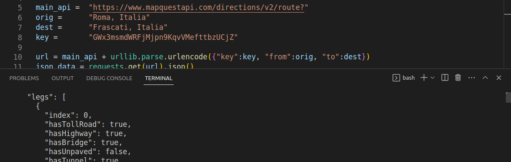

Como vemos tenemos un problema: la respuesta es tan larga que no se puede visualizar en la terminal de VS Code. Tampoco se puede en la terminal del sistema. Entonces, ¿qué hacer? Se nos ocurrió usar un comando para redirigir la salida de texto hacia un archivo, y funcionó mejor de lo que esperabamos:

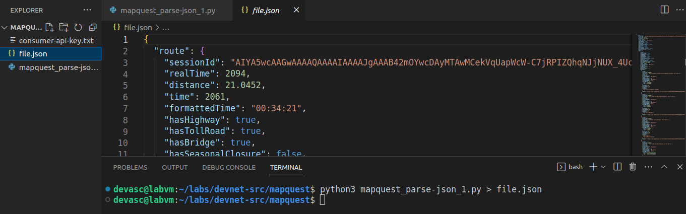

```
python3 mapquest_parse-json_1.py > file.json
```

Como VS Code puede analizar y resaltar la sintaxis de un texto formateado como JSON, con este método ahora podemos visualizar mejor las respuestas.

### Paso 5. Imprime la URL y verifica el estado de la solicitud JSON

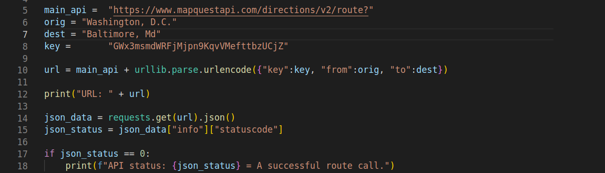

### Paso 6. Prueba los comandos de impresión y estado de URL

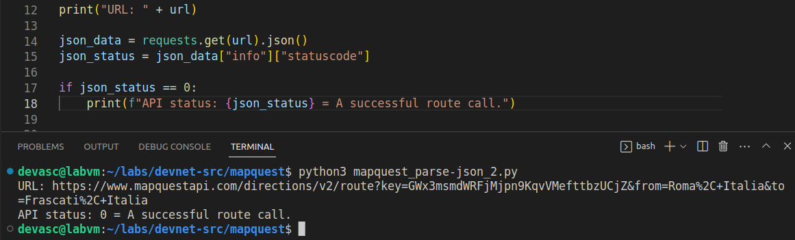


### Paso 7. Añade la entrada del usuario para la ubicación inicial y el destino

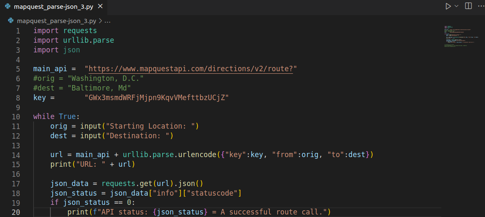

### Paso 8. Prueba la funcionalidad de entrada del usuario
Vemos que funciona; pide los parámetros de punto de partida y llegada. Sin embargo, la salida no es muy elegante (Control + D):

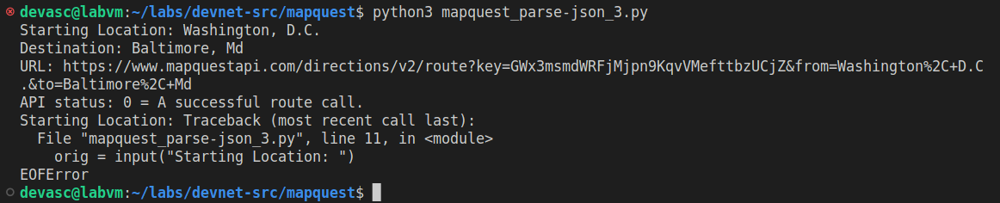

### Paso 9. Añade la funcionalidad de salir a la aplicación

Arreglamos esto con una lógica condicional muy sencilla:

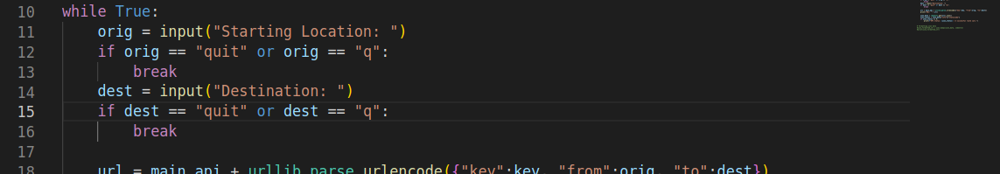

### Paso 10. Prueba la funcionalidad de salir
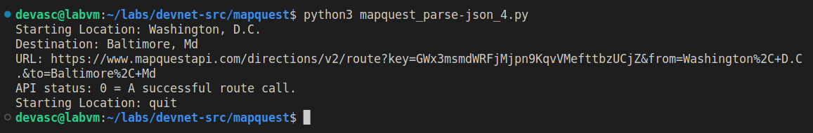

### Paso 11. Muestra los datos JSON en JSONView

Abrimos la URL en Chromium como hicimos aquí parea usar su herramienta incorporada JSONView:

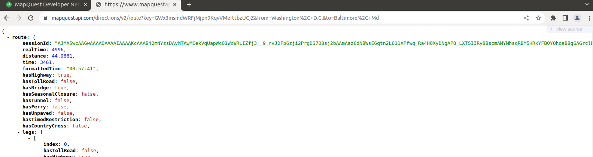

Pero ahora sabemos que podemos colapsar la información de la clave _route_ presionando el signo menos (-) que lo precede, el cual se convierte en más (+):

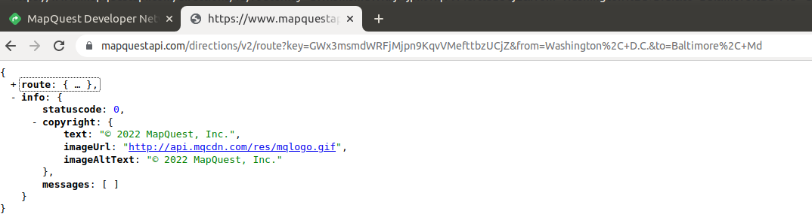

## Parte 5. Mejora la aplicación de direcciones de MapQuest con más características

### Paso 1. Muestra la información resumida del viaje

Queremos que incluya **duración, distancia y combustible utilizado.**

Para ello, seleccionamos escojemos las claves que nos interesan e imprimimos sus valores. Modificamos ligeramente las cadenas a imprimir para usar el formato de _f-string_, que a nuestro parecer es más legible.

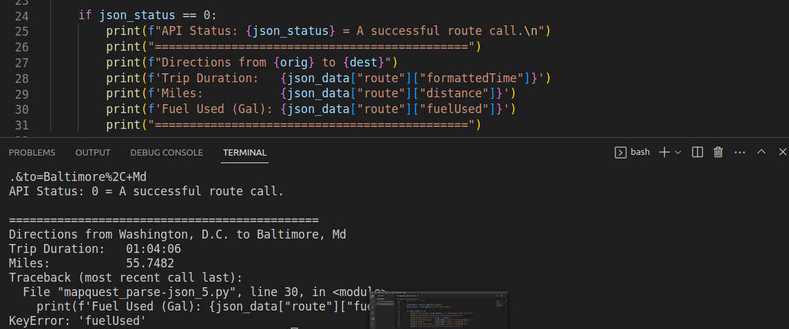

Todo va bien hasta que llega a la línea 30. Dice que la clave _fuelUsed_ es incorrecta. No encontramos la manera de arreglarlo. Y es el problema parace ser que la API ha cambiado, ya que inspeccionamos las claves de toda la respuesta y no encontramos _fuelUsed_ ni nada parecido. Por ello, optamos por eliminar esa línea de impresión.

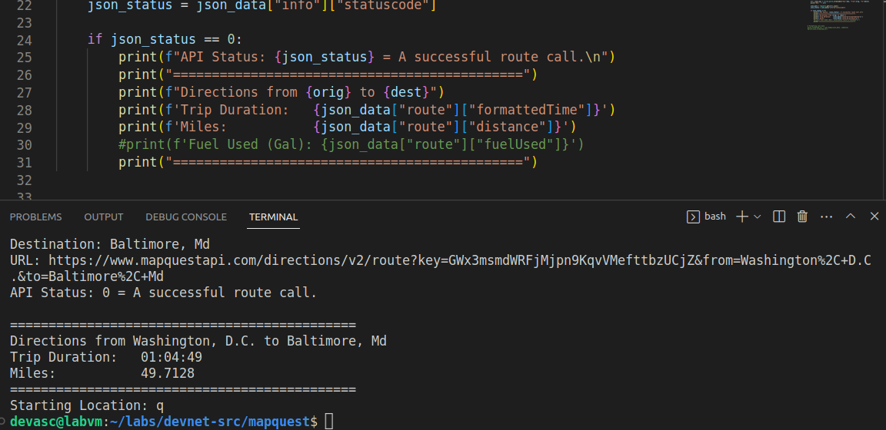

Como estamos recibiendo una distancia en el sistema imperial de millas y la API recibe parámetros para cambiar esto, haremos la conversión a kilómetros en el código:

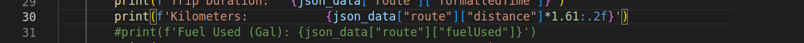

### Paso 2. Prueba la funcionalidad de análisis y formato

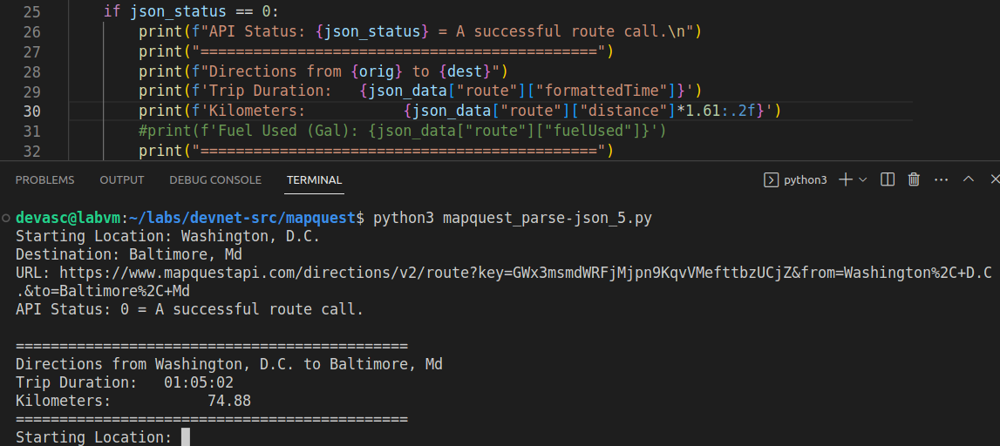

### Paso 3. Inspecciona la lista de maniobras en los datos JSON

En la guía dice que deberíamos encontrar siete maniobras, pero encontramos veinte. Además, la clave _hasFerry_ no está dentro de _maneuvers_, sino que está al mismo nivel líneas más arriba. Todo esto y lo de que no encontramos la clave _fuelUsed_ refuerza la idea de que la API ha sido reestructurada.

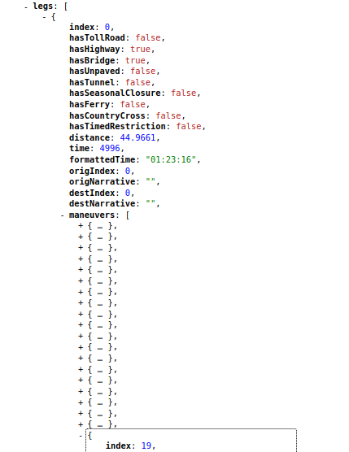

Nos interesa la clave _narrative_. Su valor es la indicación de la maniobra.

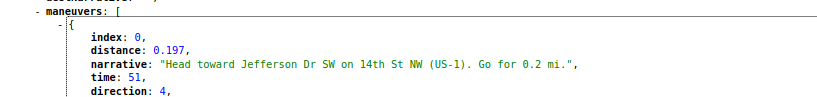

### Paso 4. Añade un bucle for para iterar a través de los datos JSON de las maniobras

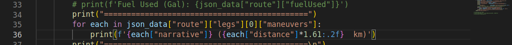

### Paso 5. Actividad - Prueba la iteración JSON

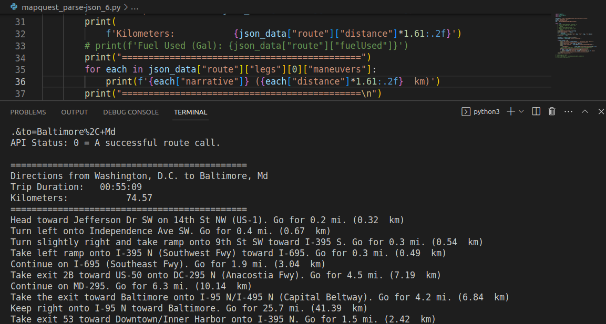

### Paso 6. Comprueba si hay una entrada del usuario no válida

Vemos que, si introducimos un destino que no existe o no es alcanzable a través de una ruta por tierra, la API falla y no hemos programado lo que debe hacer el scripet en estos casos:

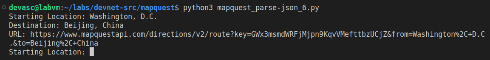

En el JSONView de Chromium vemos que en la respuesta el _statuscode_ es 402. 

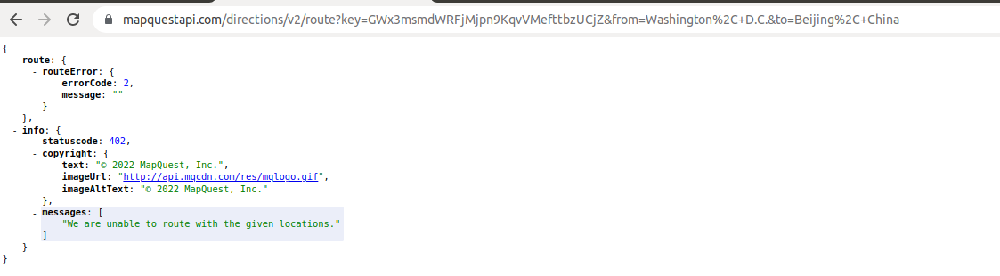

Eso significa que todo lo que programamos dentro del último _if_ no se ejecuta, ya que _statuscode_ en este caso no es 0.

Agregamos entonces las condiciones para manejar las posibles respuestas fallidas.

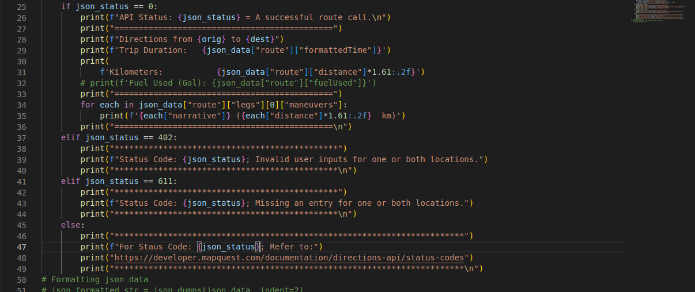

## Parte 6. Prueba la funcionalidad completa de la aplicación

Ahora probamos en una sola ejecución dos casos exitosos y tres fallidos.

Washington, D. C. --> Baltimore, Md
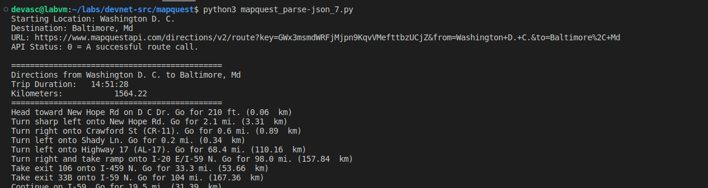

Moscow, Russia --> Beijing, China
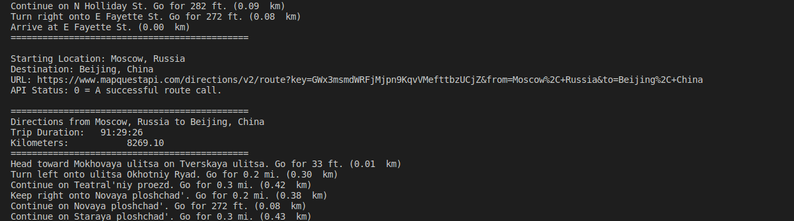

Washington, D. C. --> Beijing, China
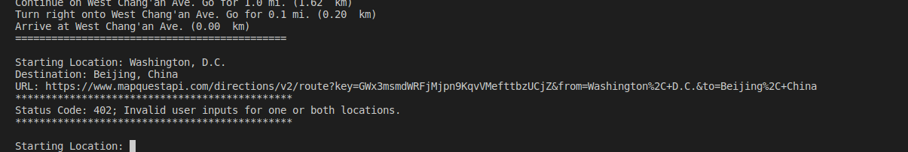

Washington, D. C. --> Bal
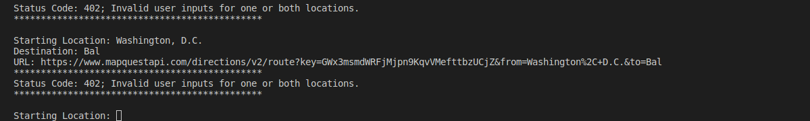

Washington, D. C. --> 
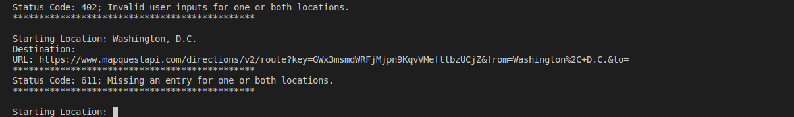

## Conclusiones y reflexiones

> Compartimos por aquí [todo el código](https://github.com/AldoLunaBueno/Curso-CC312-2023_Network-Administration/tree/main/Lab4b_Integrate-REST-API-in-py-app/code).

Hemos creado una app en Python que recupera datos JSON de una API Rest de MapQuest llamada _Directions API_. Además, hemos analizado estos datos, hemos seleccionado los que nos importaban y los hemos formateado para potencialmente mostrárselos a un usuario de nuestra app. La experiencia fue definitivamente muy útil e interesante.

