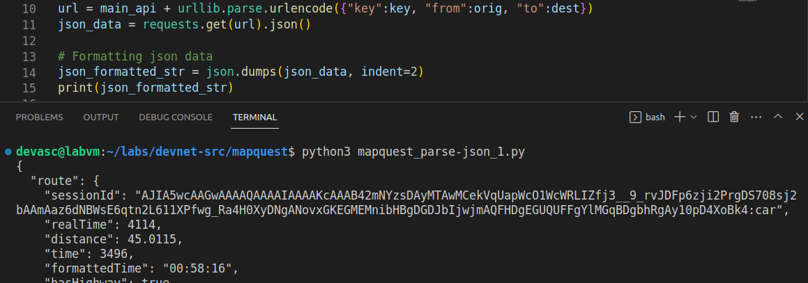

# Laboratorio 4b: Integra una API REST en una aplicación Python <!-- omit in toc -->

- [Parte 1. Lanza la VM de DEVASC](#parte-1-lanza-la-vm-de-devasc)
- [Parte 2. Demuestra la aplicación de direcciones de MapQuest](#parte-2-demuestra-la-aplicación-de-direcciones-de-mapquest)
- [Parte 3. Obtén una clave de API de MapQuest](#parte-3-obtén-una-clave-de-api-de-mapquest)
- [Parte 4. Construye la aplicación básica de direcciones de MapQuest](#parte-4-construye-la-aplicación-básica-de-direcciones-de-mapquest)
  - [Paso 1. Crea un nuevo archivo en VS Code](#paso-1-crea-un-nuevo-archivo-en-vs-code)
  - [Paso 2. Importa los módulos para la aplicación](#paso-2-importa-los-módulos-para-la-aplicación)
  - [Paso 3. Construye la URL para la solicitud a la API de direcciones de MapQuest](#paso-3-construye-la-url-para-la-solicitud-a-la-api-de-direcciones-de-mapquest)
  - [Paso 4. Prueba la solicitud de URL](#paso-4-prueba-la-solicitud-de-url)
  - [Paso 5. Imprime la URL y verifica el estado de la solicitud JSON](#paso-5-imprime-la-url-y-verifica-el-estado-de-la-solicitud-json)
  - [Paso 6. Prueba los comandos de impresión y estado de URL](#paso-6-prueba-los-comandos-de-impresión-y-estado-de-url)
  - [Paso 7. Añade la entrada del usuario para la ubicación inicial y el destino](#paso-7-añade-la-entrada-del-usuario-para-la-ubicación-inicial-y-el-destino)
  - [Paso 8. Prueba la funcionalidad de entrada del usuario](#paso-8-prueba-la-funcionalidad-de-entrada-del-usuario)
  - [Paso 9. Añade la funcionalidad de salir a la aplicación](#paso-9-añade-la-funcionalidad-de-salir-a-la-aplicación)
  - [Paso 10. Prueba la funcionalidad de salir](#paso-10-prueba-la-funcionalidad-de-salir)
  - [Paso 11. Muestra los datos JSON en JSONView](#paso-11-muestra-los-datos-json-en-jsonview)
- [Parte 5. Mejora la aplicación de direcciones de MapQuest con más características](#parte-5-mejora-la-aplicación-de-direcciones-de-mapquest-con-más-características)
  - [Paso 1. Muestra la información resumida del viaje](#paso-1-muestra-la-información-resumida-del-viaje)
  - [Paso 2. Prueba la funcionalidad de análisis y formato](#paso-2-prueba-la-funcionalidad-de-análisis-y-formato)
  - [Paso 3. Inspecciona la lista de maniobras en los datos JSON](#paso-3-inspecciona-la-lista-de-maniobras-en-los-datos-json)
  - [Paso 4. Añade un bucle for para iterar a través de los datos JSON de las maniobras](#paso-4-añade-un-bucle-for-para-iterar-a-través-de-los-datos-json-de-las-maniobras)
  - [Paso 5. Actividad - Prueba la iteración JSON](#paso-5-actividad---prueba-la-iteración-json)
  - [Paso 6. Comprueba si hay una entrada del usuario no válida](#paso-6-comprueba-si-hay-una-entrada-del-usuario-no-válida)
- [Parte 6. Prueba la funcionalidad completa de la aplicación](#parte-6-prueba-la-funcionalidad-completa-de-la-aplicación)
- [Conclusiones y reflexiones](#conclusiones-y-reflexiones)

Para este laboratorio seguimos [esta guía en inglés](https://itexamanswers.net/4-9-2-lab-integrate-a-rest-api-in-a-python-application-answers.html).

## Parte 1. Lanza la VM de DEVASC

## Parte 2. Demuestra la aplicación de direcciones de MapQuest

## Parte 3. Obtén una clave de API de MapQuest

No encontramos la opción _Approve All Keys_, pero vemos que ya tenemos una llave.

## Parte 4. Construye la aplicación básica de direcciones de MapQuest

### Paso 1. Crea un nuevo archivo en VS Code

En este punto, aparte de crear nuestro primero script _mapquest_parse-json_1.py_, aprovechamos para guardar la clave API de consumidor.

### Paso 2. Importa los módulos para la aplicación

### Paso 3. Construye la URL para la solicitud a la API de direcciones de MapQuest

Empezamos definiendo las siguientes variables:

Añadimos la línea para la URL y por curiosidad imprimimos la cadena `url`. Este fue el resultado:

Esta URL ya se puede utilizar directamente en el navegador:

Volviendo a las instrucciones del laboratorio, introducimos el código para hacer la petición a la URL obtenida y analizarla en formato JSON:

### Paso 4. Prueba la solicitud de URL

 Este es el resultado de la ejecución:

Lamentablemente no se aprecian bien los datos. Por eso recurrimos a la biblioteca `json`, la cual aprendimos a usar en el [Laboratorio 3b](https://github.com/AldoLunaBueno/Curso-CC312-2023_Network-Administration/tree/main/Lab3b_Parse-data-py). Como _json_data_ ya es un objeto JSON, lo podemos introducir directamente como primer parámetro en el método `json.dumps()`. Ejecutamos y obtenemos unos datos bien formateados:

Ahora sí podemos buscar dónde está la clave _info_:

La clave _statuscode_ se usará más adelante.

### Paso 5. Imprime la URL y verifica el estado de la solicitud JSON

### Paso 6. Prueba los comandos de impresión y estado de URL

### Paso 7. Añade la entrada del usuario para la ubicación inicial y el destino

### Paso 8. Prueba la funcionalidad de entrada del usuario

### Paso 9. Añade la funcionalidad de salir a la aplicación

### Paso 10. Prueba la funcionalidad de salir

### Paso 11. Muestra los datos JSON en JSONView

## Parte 5. Mejora la aplicación de direcciones de MapQuest con más características

### Paso 1. Muestra la información resumida del viaje

Queremos que incluya duración, distancia y combustible utilizado

### Paso 2. Prueba la funcionalidad de análisis y formato

### Paso 3. Inspecciona la lista de maniobras en los datos JSON

### Paso 4. Añade un bucle for para iterar a través de los datos JSON de las maniobras

### Paso 5. Actividad - Prueba la iteración JSON

### Paso 6. Comprueba si hay una entrada del usuario no válida

## Parte 6. Prueba la funcionalidad completa de la aplicación

## Conclusiones y reflexiones

