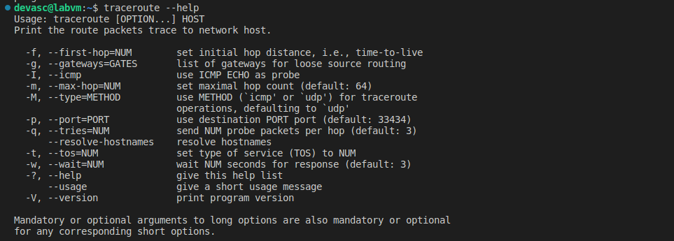

# Laboratorio 5: Herramientas de resolución de problemas de red  <!-- omit in toc -->

- [Parte 1. Inicia la máquina virtual de DEVASC.](#parte-1-inicia-la-máquina-virtual-de-devasc)
- [Parte 2. Explora la herramienta de solución de problemas ifconfig](#parte-2-explora-la-herramienta-de-solución-de-problemas-ifconfig)
  - [Paso 1. Observa las opciones ifconfig](#paso-1-observa-las-opciones-ifconfig)
  - [Paso 2. Observa el estado de todas las interfaces](#paso-2-observa-el-estado-de-todas-las-interfaces)
- [Parte 3. Explora la herramienta de solución de problemas de ping](#parte-3-explora-la-herramienta-de-solución-de-problemas-de-ping)
  - [Paso 1. Observa las opciones de ping](#paso-1-observa-las-opciones-de-ping)
  - [Paso 2. Haz ping a un host](#paso-2-haz-ping-a-un-host)
- [Parte 4. Explora la herramienta de solución de problemas de traceroute](#parte-4-explora-la-herramienta-de-solución-de-problemas-de-traceroute)
  - [Paso 1. Obsereva las opciones de traceroute](#paso-1-obsereva-las-opciones-de-traceroute)
  - [Paso 2. Utiliza traceroute para encontrar la ruta de acceso a un servidor web](#paso-2-utiliza-traceroute-para-encontrar-la-ruta-de-acceso-a-un-servidor-web)
- [Parte 5. Explora la herramienta de solución de problemas de nslookup](#parte-5-explora-la-herramienta-de-solución-de-problemas-de-nslookup)
  - [Paso 1. Consulta un dominio](#paso-1-consulta-un-dominio)
  - [Paso 2. Consulta una dirección IP](#paso-2-consulta-una-dirección-ip)
  - [Paso 3. Consulta un dominio mediante un servidor DNS específico](#paso-3-consulta-un-dominio-mediante-un-servidor-dns-específico)
- [Conclusiones y reflexiones](#conclusiones-y-reflexiones)

> Para este laboratorio seguimos [esta guía en inglés.](https://www.ccna6rs.com/5-6-7-lab-network-troubleshooting-tools-answers/)

---

## Parte 1. Inicia la máquina virtual de DEVASC.

## Parte 2. Explora la herramienta de solución de problemas ifconfig

### Paso 1. Observa las opciones ifconfig

En la guía nos dan algunas opciones de ifconfig ampliamente utilizadas:

- `add` o `del`: Esta opción permite añadir o eliminar direcciones IP y su máscara de subred (longitud del prefijo).
  - Estructura: `ifconfig <interface> inet6 add <ipv6address>/<prefixlength>`
  - Ejemplo: `ifconfig eth0 inet6 add 2001:0db8:0:f101::1/64`
- `hw ether`: Se utiliza para cambiar la dirección MAC física. Esto puede ser útil para, por ejemplo, cambiarla a un nombre fácilmente reconocible para que se destaque en los registros para la solución de problemas.
  - Ejemplo: `ifconfig eth0 hw ether 08:00:00:00:00:01`
- `up` y `down`: Estas opciones se utilizan para habilitar y deshabilitar interfaces. Asegúrese de qué interfaz está deshabilitando. Si es la que está utilizando para conectarse remotamente a un dispositivo, ¡se desconectará!
  - Ejemplo: `ifconfig eth0 down`

### Paso 2. Observa el estado de todas las interfaces

---

## Parte 3. Explora la herramienta de solución de problemas de ping

### Paso 1. Observa las opciones de ping

### Paso 2. Haz ping a un host

---

## Parte 4. Explora la herramienta de solución de problemas de traceroute

### Paso 1. Obsereva las opciones de traceroute

### Paso 2. Utiliza traceroute para encontrar la ruta de acceso a un servidor web

---

## Parte 5. Explora la herramienta de solución de problemas de nslookup

### Paso 1. Consulta un dominio

### Paso 2. Consulta una dirección IP

### Paso 3. Consulta un dominio mediante un servidor DNS específico

## Conclusiones y reflexiones

**¿De qué trato este laboratorio?**

Aprendimos lo básico de ifconfig e ip, ping, traceroute y nslookup.

- _ifconfig_ e _ip_ te permiten ver y modificar la configuración de las interfaces de red, así como la dirección IP, la máscara de subred, el estado, etc.
- _ping_ te permite enviar paquetes ICMP a ukn host y medir el tiempo de respuesta y la pérdida de paquetes para así evaluar la conectividad.
- _traceroute_ te permite ver la ruta que siguen los paquetes desde tu orgien hasta el destino, mostrando los saltos y los tiempos intermedios.
- _nslookup_ te permite consultar servidores DNS para obtener informacón sobre nombres de dominio, dirección IP, registros MX, etc.

Pero hay muchas otras [herramientas](https://blog.invgate.com/es/herramientas-de-diagnostico-de-red) que pueden ayudarnos en el análisis y resolución de problemas de red: nmap, wireshark, netstat, mtr, etc.

**Conceptos clave**

- Interfaz de red: Es el punto de conexión entre dos partes de equipos de red o capas de protocolo. Permite la comunicación entre dispositivos a través de redes privadas o públicas2.
Protocolo de red: Es un conjunto de reglas y formatos que definen cómo se intercambian los datos entre los dispositivos de una red. Algunos ejemplos son TCP/IP, Ethernet, SLIP, etc3.
- Dirección IP: Es un identificador único que se asigna a cada interfaz de red para identificarla en la red y permitir el enrutamiento de los paquetes. Puede ser IPv4 o IPv63.
Enrutamiento: Es el proceso de determinar la mejor ruta para enviar los paquetes desde el origen hasta el destino. Implica el uso de dispositivos como routers, switches y tablas de enrutamiento3.
- Fallo y rendimiento de la red: Son las medidas que indican el estado y la calidad de la red. El fallo se refiere a cualquier problema que impida el funcionamiento normal de la red, como un cable roto, una configuración incorrecta o un ataque malicioso. El rendimiento se refiere a la capacidad de la red para transmitir los datos con rapidez y eficiencia, como el ancho de banda, la latencia o la pérdida de paquetes4.
- Herramientas de administración de red: Son las soluciones que ayudan a los administradores de redes a identificar, diagnosticar y resolver los problemas de la red. Algunas herramientas son ping, traceroute, nmap, wireshark, netstat, etc4.

**La administración de redes puede ser impresionante**

Un día, un administrador de redes llamado John recibió una llamada de su jefe diciéndole que la página web de su empresa estaba caída y que no podían acceder a ella ni los clientes ni los empleados. John se conectó rápidamente a su consola de administración de redes y vio que el tráfico entrante a su servidor web era anormalmente alto y provenía de miles de direcciones IP diferentes. Se dio cuenta de que se trataba de un ataque DDoS, en el que los atacantes usan una red de computadoras infectadas (llamadas zombis) para enviar solicitudes falsas al servidor web y saturarlo.
> Una consola de administración de redes, como Nagios, puede mostrar el tráfico entrante y saliente usando gráficos, tablas o diagramas. Por ejemplo, puede mostrar el ancho de banda utilizado, el número de paquetes enviados y recibidos, el tipo y la dirección de los paquetes, etc. Estos datos pueden ayudar al administrador a identificar posibles problemas o anomalías en la red, así como a optimizar el rendimiento y la seguridad. 
> 
> Pero Nagios no puede mostrar gráficos por sí solo. Pnp es una herramienta que usa RRDtool para almacenar y generar gráficos a partir de los datos de rendimiento que recibe de Nagios. Pnp se integra con la interfaz web de Nagios y permite ver los gráficos de forma fácil y rápida.

John intentó bloquear las direcciones IP de los atacantes usando su firewall, pero eran tantas que el firewall no podía procesarlas todas. También intentó contactar con su proveedor de servicios de Internet (ISP) para pedirle que filtrara el tráfico malicioso, pero el ISP le dijo que no podía hacer nada al respecto. El ataque era demasiado grande y afectaba a toda la red. John se sentía impotente y frustrado, ya que cada minuto que pasaba sin que su página web funcionara significaba una pérdida de dinero y reputación para su empresa.

Entonces, John tuvo una idea brillante. Recordó que tenía una vieja computadora portátil en su casa que no usaba desde hacía años. Decidió usarla como un servidor web alternativo y redirigir el tráfico legítimo a ella. Para ello, hizo lo siguiente:

- Conectó la computadora portátil a su router doméstico y le asignó una dirección IP estática. 
  > Una dirección IP estática es una dirección IP fija que no cambia con el tiempo ni con las conexiones.
  
  John usó la dirección IP 192.168.0.100 para su computadora portátil, ya que pertenecía al rango privado de direcciones IP reservadas para redes locales.

- Instaló un software de servidor web en la computadora portátil y copió el contenido de la página web de su empresa desde una copia de seguridad que tenía guardada en un disco duro externo. 
  > El software de servidor web es un programa que permite alojar páginas web en una computadora y responder a las solicitudes HTTP de los clientes.
  
  John usó Apache, un software de servidor web gratuito y popular, para instalarlo en su computadora portátil.
- Configuró el software de servidor web para que sólo aceptara solicitudes provenientes de una dirección IP específica, que era la del router de su oficina. De esta manera, evitaba que los atacantes pudieran acceder a su servidor web alternativo desde Internet. John usó el archivo .htaccess para configurar esta restricción en Apache.

- Accedió al panel de control del dominio de su empresa y cambió el registro A (que indica la dirección IP del servidor web) por la dirección IP de su router doméstico. El dominio de su empresa era el nombre que identificaba a su página web en Internet, como www.miempresa.com. 
  > El registro A es un tipo de registro DNS (Domain Name System) que asocia un nombre de dominio con una dirección IP. 
  
  John usó el servicio de GoDaddy para acceder al panel de control de su dominio y cambiar el registro A por la dirección IP 200.100.50.25, que era la dirección IP pública de su router doméstico.
- Accedió al panel de control del router de su oficina y configuró una regla NAT (Network Address Translation) para que redirigiera todo el tráfico destinado al puerto 80 (el puerto del protocolo HTTP) a la dirección IP de su computadora portátil. 
  > Un router es un dispositivo que conecta una red local con Internet y le asigna una dirección IP pública. La regla NAT es una función que permite modificar las direcciones IP de los paquetes que pasan por el router, para que puedan llegar a su destino correctamente. 
  
  John usó el servicio de Cisco para acceder al panel de control de su router y configurar la regla NAT.

De esta manera, John logró crear una ruta alternativa para el tráfico legítimo a su página web, evitando el ataque DDoS. Los clientes y los empleados pudieron acceder a la página web sin problemas, mientras que los atacantes seguían enviando solicitudes inútiles al servidor web original, que estaba desconectado.

John se sintió aliviado y orgulloso por haber salvado a su empresa de una crisis. Su jefe lo felicitó por su ingenio y le dio un bono por su trabajo. John se convirtió en un héroe en su empresa y en un ejemplo para otros administradores de redes.
