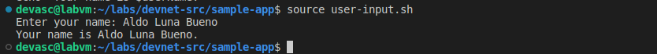
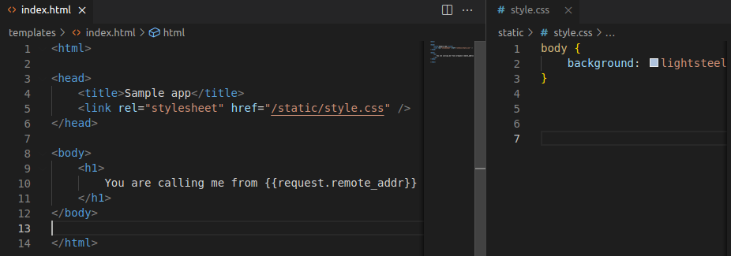

# Construye una aplicación web de muestra en un contenedor Docker <!-- omit in toc -->

- [Parte 1. Inicia la VM DEVASC](#parte-1-inicia-la-vm-devasc)
- [Parte 2. Crea un script Bash simple](#parte-2-crea-un-script-bash-simple)
  - [Paso 1. Crea un archivo de script bash vacío](#paso-1-crea-un-archivo-de-script-bash-vacío)
  - [Paso 2. Abre el archivo en el editor de texto nano](#paso-2-abre-el-archivo-en-el-editor-de-texto-nano)
  - [Paso 3. Añade el «she-bang» al principio del script](#paso-3-añade-el-she-bang-al-principio-del-script)
  - [Paso 4. Añade comandos bash simples al script](#paso-4-añade-comandos-bash-simples-al-script)
  - [Paso 5. Sal de nano y guarda tu script](#paso-5-sal-de-nano-y-guarda-tu-script)
  - [Paso 7. Cambia el modo del script a un archivo ejecutable para todos los usuarios](#paso-7-cambia-el-modo-del-script-a-un-archivo-ejecutable-para-todos-los-usuarios)
  - [Paso 8. Renombra el archivo para eliminar la extensión .sh](#paso-8-renombra-el-archivo-para-eliminar-la-extensión-sh)
  - [Paso 9. Ejecuta el script desde la línea de comandos](#paso-9-ejecuta-el-script-desde-la-línea-de-comandos)
  - [Paso 10. Investiga otros scripts bash](#paso-10-investiga-otros-scripts-bash)
- [Parte 3. Crea una aplicación web de muestra](#parte-3-crea-una-aplicación-web-de-muestra)
  - [Paso 1. Instala Flask y abre un puerto en el firewall de la VM DEVASC](#paso-1-instala-flask-y-abre-un-puerto-en-el-firewall-de-la-vm-devasc)
  - [Paso 2. Abre el archivo sample\_app.py](#paso-2-abre-el-archivo-sample_apppy)
  - [Paso 3. Añade los comandos para importar métodos de flask](#paso-3-añade-los-comandos-para-importar-métodos-de-flask)
  - [Paso 4. Crea una instancia de la clase Flask](#paso-4-crea-una-instancia-de-la-clase-flask)
  - [Paso 5. Define un método para mostrar la dirección IP del cliente](#paso-5-define-un-método-para-mostrar-la-dirección-ip-del-cliente)
  - [Paso 6. Configura la aplicación para que se ejecute localmente](#paso-6-configura-la-aplicación-para-que-se-ejecute-localmente)
  - [Paso 7. Guarda y ejecuta tu aplicación web de muestra](#paso-7-guarda-y-ejecuta-tu-aplicación-web-de-muestra)
  - [Paso 8. Verifica que el servidor está funcionando](#paso-8-verifica-que-el-servidor-está-funcionando)
  - [Paso 9. Detén el servidor](#paso-9-detén-el-servidor)
- [Parte 4. Configura la aplicación web para que utilice archivos del sitio web](#parte-4-configura-la-aplicación-web-para-que-utilice-archivos-del-sitio-web)
  - [Paso 1. Explora los directorios que utilizará la aplicación web](#paso-1-explora-los-directorios-que-utilizará-la-aplicación-web)
  - [Paso 2. Actualiza el código Python para la aplicación web de muestra](#paso-2-actualiza-el-código-python-para-la-aplicación-web-de-muestra)
  - [Paso 3. Guarda y ejecuta tu script](#paso-3-guarda-y-ejecuta-tu-script)
  - [Paso 4. Verifica que tu programa está funcionando](#paso-4-verifica-que-tu-programa-está-funcionando)
  - [Paso 5. Detén el servidor](#paso-5-detén-el-servidor)
- [Parte 5: Crea un script Bash para construir y ejecutar un contenedor Docker](#parte-5-crea-un-script-bash-para-construir-y-ejecutar-un-contenedor-docker)
  - [Paso 1. Crea directorios temporales para almacenar los archivos del sitio web](#paso-1-crea-directorios-temporales-para-almacenar-los-archivos-del-sitio-web)
  - [Paso 2. Copia los directorios del sitio web y sample\_app.py al directorio temporal](#paso-2-copia-los-directorios-del-sitio-web-y-sample_apppy-al-directorio-temporal)
  - [Paso 3. Crea un Dockerfile](#paso-3-crea-un-dockerfile)
  - [Paso 4. Construye el contenedor Docker](#paso-4-construye-el-contenedor-docker)
  - [Paso 5. Inicia el contenedor y verifica que está funcionando](#paso-5-inicia-el-contenedor-y-verifica-que-está-funcionando)
  - [Paso 6. Guarda tu script bash](#paso-6-guarda-tu-script-bash)
- [Parte 6. Construye, ejecuta y verifica el contenedor Docker](#parte-6-construye-ejecuta-y-verifica-el-contenedor-docker)
  - [Paso 1. Ejecuta el script bash](#paso-1-ejecuta-el-script-bash)
  - [Paso 2. Investiga el contenedor Docker en ejecución y la aplicación web](#paso-2-investiga-el-contenedor-docker-en-ejecución-y-la-aplicación-web)
  - [Paso 3. Paso 3. Accede y explora el contenedor en ejecución](#paso-3-paso-3-accede-y-explora-el-contenedor-en-ejecución)
  - [Paso 4. Detén y elimina el contenedor Docker](#paso-4-detén-y-elimina-el-contenedor-docker)
- [Conclusiones y reflexiones](#conclusiones-y-reflexiones)

> Para este laboratorio seguimos [esta guía en inglés.](https://infraexam.com/6-2-7-lab-build-a-sample-web-app-in-a-docker-container-answers/)

## Parte 1. Inicia la VM DEVASC 


## Parte 2. Crea un script Bash simple 


### Paso 1. Crea un archivo de script bash vacío 


```bash
touch user-input.sh
```

### Paso 2. Abre el archivo en el editor de texto nano 

```bash
nano user-input.sh
```

### Paso 3. Añade el «she-bang» al principio del script 

Añadimos la cabecera _#!/bin/bash_

### Paso 4. Añade comandos bash simples al script 


### Paso 5. Sal de nano y guarda tu script 

Luego de Control + X para salir, respondemos a la pregunta interactiva de guardar con Y, y presionamos Enter para guardar el archivo con un nombre que podemos modificar si queremos.


### Paso 6. Ejecuta tu script desde la línea de comandos



### Paso 7. Cambia el modo del script a un archivo ejecutable para todos los usuarios 


### Paso 8. Renombra el archivo para eliminar la extensión .sh 

```bash
mv user-input.sh user-input
```

### Paso 9. Ejecuta el script desde la línea de comandos 


### Paso 10. Investiga otros scripts bash 


## Parte 3. Crea una aplicación web de muestra 


### Paso 1. Instala Flask y abre un puerto en el firewall de la VM DEVASC 

Instalamos Flask


### Paso 2. Abre el archivo sample_app.py 


### Paso 3. Añade los comandos para importar métodos de flask 


### Paso 4. Crea una instancia de la clase Flask 


### Paso 5. Define un método para mostrar la dirección IP del cliente 


### Paso 6. Configura la aplicación para que se ejecute localmente 


### Paso 7. Guarda y ejecuta tu aplicación web de muestra 


### Paso 8. Verifica que el servidor está funcionando 


En la terminal recibimos los siguientes mensajes tras hacer ese par de peticiones http:


Vemos que también podemos enviar una cadena formateada usando etiquetas HTML.


El mensaje automáticamente se incorpora en el body del documento de la página.

Ahora probamos en la terminal usando el comando `curl`:


### Paso 9. Detén el servidor 

Lo detenemos presionando Control + C


## Parte 4. Configura la aplicación web para que utilice archivos del sitio web 

### Paso 1. Explora los directorios que utilizará la aplicación web 

Para estructurar el contenido de la aplicación web vamos a usar una página HTML llamada _index.html_ muy simple. Y para darle apariencia usaremos una hoja de estilo CSS aún más simple llamada _style.css_.



Por cierto, es nuevo para nosotros la forma en la que dentro de un html se hace referencia a una variable (en este caso un atributo) que pertenece al script.

```
{{request.remote_addr}}
```

Solo por curiosidad, hemos agregado una variable más como frase final:


### Paso 2. Actualiza el código Python para la aplicación web de muestra 

Agregamos otro módulo de Flask llamado _render_template_ y lo usamos en la función `main()` para que retorne el contenido de nuestra página html que le pasamos como parámetro. Además, agregamos la variable `goodbye` para ver cómo se comporta.


### Paso 3. Guarda y ejecuta tu script 

```bash
python3 sample_app.py
```

### Paso 4. Verifica que tu programa está funcionando 


El script funciona como se esperaba, excepto porque no aparece el valor de la variable que agregamos. Averiguamos en [este foro](https://stackoverflow.com/questions/31965558/how-to-display-a-variable-in-html) que, si queremos usar variables, no podemos solo definirlas en nuestro script y esperar a que mágicamente formen parte de la petición http y del html. No, hay que incluirlas como parámetros en el método `render_template`. Entonces, cambiamos el método `main()` para agregar esta variable:


Ahora sí obtenemos el resultado que queríamos:


Pero ¿por qué no tuvimos que pasar como parámetro también el atributo `request.remote_addr`? Seguramente porque está integrado en Flask, que es lo que está haciendo las peticiones al servidor tras bambalinas.

### Paso 5. Detén el servidor 

Presionamos Control +C.

## Parte 5: Crea un script Bash para construir y ejecutar un contenedor Docker 

### Paso 1. Crea directorios temporales para almacenar los archivos del sitio web 


### Paso 2. Copia los directorios del sitio web y sample_app.py al directorio temporal 


### Paso 3. Crea un Dockerfile 

En vez de que su definición esté dividida en líneas de comandos `echo`, pensamos que es mejor crear y definirlo ya como archivo Dockerfile dentro del directorio sample-app. Y luego solo lo copiamos mediante el script bash, igual que los demás archivos.


### Paso 4. Construye el contenedor Docker 

```bash
cd tempdir
docker build -t sampleapp .
```

### Paso 5. Inicia el contenedor y verifica que está funcionando 

```bash
docker run -t -d -p 8080:8080 -name samplerunning sampleapp
docker ps -a
```

### Paso 6. Guarda tu script bash 

Así quedó:


## Parte 6. Construye, ejecuta y verifica el contenedor Docker 


### Paso 1. Ejecuta el script bash 

Luego de crear los directorios y archivos dentro de _tempdir_ (esto es casi insteantáneo), el script bash ejecuta los comandos para contruir el contenedor Docker.


Nos salió este aviso de peligro:


Y terminó el paso 7:


Si leemos con atención, dice que se contruyó exitosamente algo llamado _8dbd6..._ Pensabamos que era el contenedor, pero parece que era la imagen. Luego hay un mensaje de error: _unkown shorthand flag: 'n' in -name. See docker run --help_. Nos faltó un guion delante de la bandera de opción para el nombre. Debe ser por este error trivial que no vemos ningún resultado por parte del comando `docker ps -a`.

Corregido esto, ahora sí genera el contenedor, y además lo hace rapidísimo porque la imagen ya fue contruida en la anterior ejecución:


### Paso 2. Investiga el contenedor Docker en ejecución y la aplicación web 


### Paso 3. Paso 3. Accede y explora el contenedor en ejecución


### Paso 4. Detén y elimina el contenedor Docker


## Conclusiones y reflexiones
