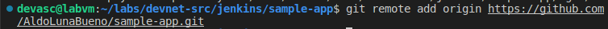
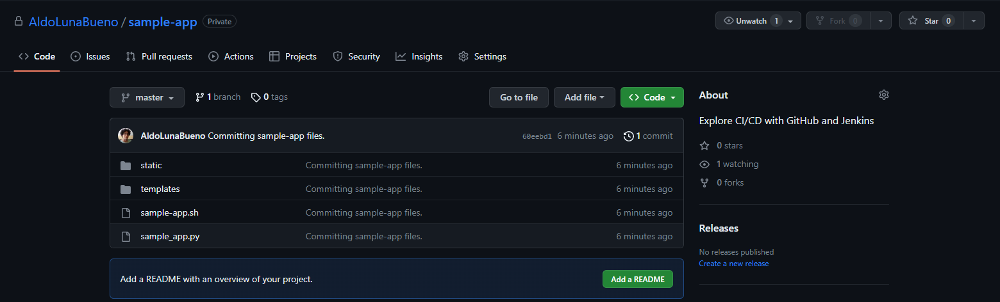
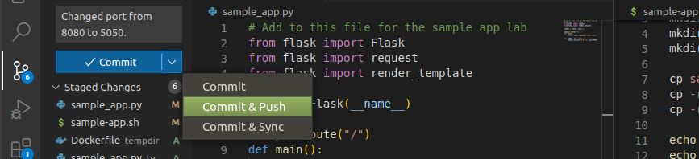

# Laboratorio 6b: Construye una canalización CI/CD usando Jenkins <!-- omit in toc -->

- [Parte 1. Inicia la VM Devasc](#parte-1-inicia-la-vm-devasc)
- [Parte 2. Confirma la aplicación de muestra a Git](#parte-2-confirma-la-aplicación-de-muestra-a-git)
  - [Paso 1. Inicia sesión en GitHub y cree un nuevo repositorio](#paso-1-inicia-sesión-en-github-y-cree-un-nuevo-repositorio)
  - [Paso 2. Configura sus credenciales de Git localmente en la VM](#paso-2-configura-sus-credenciales-de-git-localmente-en-la-vm)
  - [Paso 3. Inicializa un directorio como el repositorio de Git](#paso-3-inicializa-un-directorio-como-el-repositorio-de-git)
  - [Paso 4. Apunta el repositorio Git a GitHub repository](#paso-4-apunta-el-repositorio-git-a-github-repository)
  - [Paso 5. Almacena, confirma e inserta los archivos de aplicación de muestra en el repositorio de GitHub](#paso-5-almacena-confirma-e-inserta-los-archivos-de-aplicación-de-muestra-en-el-repositorio-de-github)
- [Parte 3. Modifica la aplicación de muestra y envia cambios a Git](#parte-3-modifica-la-aplicación-de-muestra-y-envia-cambios-a-git)
  - [Paso 1. Abre los archivos de aplicación de ejemplo](#paso-1-abre-los-archivos-de-aplicación-de-ejemplo)
  - [Paso 2. Edita los archivos de aplicación de muestra](#paso-2-edita-los-archivos-de-aplicación-de-muestra)
  - [Paso 3. Crea y verificar la aplicación de muestra](#paso-3-crea-y-verificar-la-aplicación-de-muestra)
  - [Paso 4. Envia sus cambios a GitHub](#paso-4-envia-sus-cambios-a-github)
- [Parte 4. Descarga y ejecuta la imagen de Jenkins Dockeer](#parte-4-descarga-y-ejecuta-la-imagen-de-jenkins-dockeer)
  - [Paso 1. Descarga la imagen de Jenkins Docker](#paso-1-descarga-la-imagen-de-jenkins-docker)
  - [Paso 2. Arranca el contenedor de Jenkins Docker](#paso-2-arranca-el-contenedor-de-jenkins-docker)
  - [Paso 3. Verifica que el servidor Jenkins se esté ejecutando](#paso-3-verifica-que-el-servidor-jenkins-se-esté-ejecutando)
  - [Paso 4. Investiga los niveles de abstracción que se están ejecutando actualmente en el equipo](#paso-4-investiga-los-niveles-de-abstracción-que-se-están-ejecutando-actualmente-en-el-equipo)
- [Parte 5. Configura Jenkins](#parte-5-configura-jenkins)
  - [Paso 1. Abre una pestaña del navegador](#paso-1-abre-una-pestaña-del-navegador)
  - [Paso 2. Instala los complementos de Jenkins recomendados](#paso-2-instala-los-complementos-de-jenkins-recomendados)
  - [Paso 3. Omite la creación de un nuevo usuario administrador](#paso-3-omite-la-creación-de-un-nuevo-usuario-administrador)
  - [Paso 4. Omite la creación de una instancia](#paso-4-omite-la-creación-de-una-instancia)
  - [Paso 5. Empieza a usar Jenkins](#paso-5-empieza-a-usar-jenkins)
- [Parte 6. Usa Jenkins para ejecutar una compilación de su aplicación](#parte-6-usa-jenkins-para-ejecutar-una-compilación-de-su-aplicación)
  - [Paso 1. Crea un nuevo trabajo](#paso-1-crea-un-nuevo-trabajo)
  - [Paso 2. Configura el Jenkins BuildAppJob](#paso-2-configura-el-jenkins-buildappjob)
  - [Paso 3. Que Jenkins compile la aplicación](#paso-3-que-jenkins-compile-la-aplicación)
  - [Paso 4. Accede a los detalles de compilación](#paso-4-accede-a-los-detalles-de-compilación)
  - [Paso 5. Observa la salida de la consola](#paso-5-observa-la-salida-de-la-consola)
  - [Paso 6. Abre otra pestaña del navegador web y verifica que se esté ejecutando la aplicación de muestra](#paso-6-abre-otra-pestaña-del-navegador-web-y-verifica-que-se-esté-ejecutando-la-aplicación-de-muestra)
- [Parte 7. Usa Jenkins para probar una compilación](#parte-7-usa-jenkins-para-probar-una-compilación)
  - [Paso 1. Inicia un nuevo trabajo para probar su aplicación de muestra](#paso-1-inicia-un-nuevo-trabajo-para-probar-su-aplicación-de-muestra)
  - [Paso 2. Configura Jenkins TestAppJob](#paso-2-configura-jenkins-testappjob)
  - [Paso 3. Escribe el script de prueba que debe ejecutarse luego de una compilación estable del BuildAppJob](#paso-3-escribe-el-script-de-prueba-que-debe-ejecutarse-luego-de-una-compilación-estable-del-buildappjob)
  - [Paso 4. Haz que Jenkins ejecute el trabajo BuildAppJob de nuevo](#paso-4-haz-que-jenkins-ejecute-el-trabajo-buildappjob-de-nuevo)
  - [Paso 5. Verifica que ambos trabajos hayan finalizado](#paso-5-verifica-que-ambos-trabajos-hayan-finalizado)
- [Parte 8. Crea una tubería o canalización en Jenkins](#parte-8-crea-una-tubería-o-canalización-en-jenkins)
  - [Paso 1. Crea un trabajo de tubería/canalización](#paso-1-crea-un-trabajo-de-tuberíacanalización)
  - [Paso 2. Configura el trabajo SamplePipeline](#paso-2-configura-el-trabajo-samplepipeline)
  - [Paso 3. Ejecuta SamplePipeline](#paso-3-ejecuta-samplepipeline)
  - [Paso 4. Comprueba la salida de SamplePipeline](#paso-4-comprueba-la-salida-de-samplepipeline)
- [Conclusiones y reflexiones](#conclusiones-y-reflexiones)


> Para este laboratorio seguimos [esta guía en inglés](https://ccna7.org/6-3-6-lab-build-a-ci-cd-pipeline-using-jenkins-answers/)

---
## Parte 1. Inicia la VM Devasc
## Parte 2. Confirma la aplicación de muestra a Git
### Paso 1. Inicia sesión en GitHub y cree un nuevo repositorio


### Paso 2. Configura sus credenciales de Git localmente en la VM

Ingresamos nuestras credenciales:


Por si acaso, las verificamos con el comando `git config --list`:


### Paso 3. Inicializa un directorio como el repositorio de Git


### Paso 4. Apunta el repositorio Git a GitHub repository



### Paso 5. Almacena, confirma e inserta los archivos de aplicación de muestra en el repositorio de GitHub

Vemos que VS Code ya resalta los archivos según el sistema de versionado de git. Como es de esperar, salen en verde y además se nos informa que son _Untracked_. Git no les está haciendo seguimiento.


Con el comando `git add *` añadimos todos los archivos que están en el repositorio local.Los archivos cambian de estado, de _Untracked_ a _Added_.


Algo parecido podemos ver con el comando `git status`:


Hacemos el commit con `git commit -m "mensaje"`:


Ahora hacemos el push al repositorio remoto con `git push origin master`. Este paso siempre requiere, como es lógico, la autenticación de quien está haciendo el push. Esta autenticación ahora se ha vuelto un poco más compleja que cuando se redactaron las instrucciones de esta guía. En la guía nos dicen que este mensaje solo aparece si no hemos introducido correctamente nuestras credenciales o la URL del repo. Sin embargo, pensamos que esta se ha vuelto la única forma de autenticación, al menos desde la terminal de VS Code. Aquí capturamos la mayoría de los pasos que tuvimos que seguir:


Aquí escogemos hacerlo directamente con VS Code, la segunda opción:


El repositorio ha sido actualizado:



---
## Parte 3. Modifica la aplicación de muestra y envia cambios a Git

### Paso 1. Abre los archivos de aplicación de ejemplo

Verificamos que en la terminal estamos ubicados en el repositorio local que creamos para la aplicación de muestra, y abrimos los archivos en donde se define el puerto expuesto (8080):


### Paso 2. Edita los archivos de aplicación de muestra

Cambiamos este puerto de 8080 a 5050 para que el contenedor de Jenkins que crearemos más adelante pueda exponer el 8080.


### Paso 3. Crea y verificar la aplicación de muestra

Ejecutamos el bash _sample-app.sh_:


Este bash crea un directorio temporal donde se guardan todos los archivos para la applicación web, y luego corre un contenedor docker que bebe del contenido de este directorio para contruir la aplicación.


Detenemos el servidor (el contenedor, en este caso), con el comando `docker stop samplerunning`.

### Paso 4. Envia sus cambios a GitHub

VS Code nos puede apoyar con el manejo del control del versionado. A la izquierda se muestra el apartado Control Source (su ícono son tres nodos enlazados).


Tenemos que ir ahí y darle al símbolo más (+) a la derecha de Changes. Con esto agregamos todos los cambios (archivos modificados o que recién fueron creados y no están en seguimiento) al commit. Y no podemos olvidar agregar un mensaje, ya que es obligatorio.


Por último, en vez de hacer solo un commit, haremos un commit y un push. La opción correspondiente se encuntra desplegando la flecha del botón azul de Commit:



El repo ya está actualizado:


---
## Parte 4. Descarga y ejecuta la imagen de Jenkins Dockeer

### Paso 1. Descarga la imagen de Jenkins Docker


### Paso 2. Arranca el contenedor de Jenkins Docker

Usamos el siguiente comando de una sola línea:

```
docker run --rm -u root -p 8080:8080 -v jenkins-data:/var/jenkins_home -v $(which docker):/usr/bin/docker -v /var/run/docker.sock:/var/run/docker.sock -v "$HOME":/home --name jenkins_server jenkins/jenkins:lts
```


Vemos que nos dan una contraseña y la ubicación en donde esta se guarda: _/var/jenkins_home/secrets/initialAdminPassword_

Como en la guía nos dicen que tenemos que volver a ingresar este comando si accidentalmente paramos el servidor, hicimos un alias permanente llamado `jenkins` para este comando en el archivo oculto _.bashrc_:


Guardamos, aplicamos el comando `bash` y ya lo tenemos. Detenemos el servidor para comprobar que funciona:


### Paso 3. Verifica que el servidor Jenkins se esté ejecutando

### Paso 4. Investiga los niveles de abstracción que se están ejecutando actualmente en el equipo

<pre>
+————————————————————————————————+
|Your Computer’s Operating System|
|+——————————————————————————————+|
||DEVASC VM                     ||
||+————————————————————————————+||
|||Docker container            |||
|||+——————————————————————————+|||
|||| Jenkins server           ||||
||||+————————————————————————+||||
|||||Docker container        |||||
||||+————————————————————————+||||
|||+——————————————————————————+|||
||+————————————————————————————+||
|+——————————————————————————————+|
+————————————————————————————————+
</pre>

---
## Parte 5. Configura Jenkins

### Paso 1. Abre una pestaña del navegador


### Paso 2. Instala los complementos de Jenkins recomendados


### Paso 3. Omite la creación de un nuevo usuario administrador

Le damos a _Skip and continue as admin_:


### Paso 4. Omite la creación de una instancia

Le damos a _Not now_:


### Paso 5. Empieza a usar Jenkins

Le damos a _Start using Jenkins_:


---
## Parte 6. Usa Jenkins para ejecutar una compilación de su aplicación
### Paso 1. Crea un nuevo trabajo
### Paso 2. Configura el Jenkins BuildAppJob
### Paso 3. Que Jenkins compile la aplicación
### Paso 4. Accede a los detalles de compilación
### Paso 5. Observa la salida de la consola
### Paso 6. Abre otra pestaña del navegador web y verifica que se esté ejecutando la aplicación de muestra
---
## Parte 7. Usa Jenkins para probar una compilación
### Paso 1. Inicia un nuevo trabajo para probar su aplicación de muestra
### Paso 2. Configura Jenkins TestAppJob
### Paso 3. Escribe el script de prueba que debe ejecutarse luego de una compilación estable del BuildAppJob
### Paso 4. Haz que Jenkins ejecute el trabajo BuildAppJob de nuevo
### Paso 5. Verifica que ambos trabajos hayan finalizado
---
## Parte 8. Crea una tubería o canalización en Jenkins
### Paso 1. Crea un trabajo de tubería/canalización
### Paso 2. Configura el trabajo SamplePipeline
### Paso 3. Ejecuta SamplePipeline
### Paso 4. Comprueba la salida de SamplePipeline
---
## Conclusiones y reflexiones

> Así quedó [nuestro código](/Lab6b_CI-CD-Jenkins/codes).