# Laboratorio 7: Utilizar Ansible para realizar copias de seguridad y configurar un dispositivo <!-- omit in toc -->

- [Parte 1. Inicia la VM DEVASC y la VM CSR1000v](#parte-1-inicia-la-vm-devasc-y-la-vm-csr1000v)
- [Parte 2. Configura Ansible](#parte-2-configura-ansible)
  - [Paso 1. Abre el directorio de Ansible en VS Code](#paso-1-abre-el-directorio-de-ansible-en-vs-code)
  - [Paso 2. Edita el archivo de inventario de Ansible](#paso-2-edita-el-archivo-de-inventario-de-ansible)
  - [Paso 3. Muestra la versión de Ansible y la ubicación predeterminada de ansible.cfg](#paso-3-muestra-la-versión-de-ansible-y-la-ubicación-predeterminada-de-ansiblecfg)
  - [Paso 4. Muestra el archivo ansible.cfg predeterminado](#paso-4-muestra-el-archivo-ansiblecfg-predeterminado)
  - [Paso 5. Cambia la ubicación del archivo ansible.cfg](#paso-5-cambia-la-ubicación-del-archivo-ansiblecfg)
  - [Paso 6. Edita el archivo ansible.cfg](#paso-6-edita-el-archivo-ansiblecfg)
  - [Paso 7. Resumen: tus archivos de configuración de Ansible](#paso-7-resumen-tus-archivos-de-configuración-de-ansible)
- [Parte 3. Utiliza Ansible para realizar copias de seguridad de una configuración](#parte-3-utiliza-ansible-para-realizar-copias-de-seguridad-de-una-configuración)
  - [Paso 1. Crea tu playbook de Ansible](#paso-1-crea-tu-playbook-de-ansible)
  - [Paso 2. Examina tu playbook de Ansible](#paso-2-examina-tu-playbook-de-ansible)
  - [Paso 3. Ejecuta el playbook de copia de seguridad de Ansible](#paso-3-ejecuta-el-playbook-de-copia-de-seguridad-de-ansible)
  - [Paso 4. Verifica que se haya creado el archivo de copia de seguridad](#paso-4-verifica-que-se-haya-creado-el-archivo-de-copia-de-seguridad)
  - [Extra](#extra)
- [Parte 4. Usar Ansible para configurar un dispositivo](#parte-4-usar-ansible-para-configurar-un-dispositivo)
  - [Paso 1. Observa tu archivo de inventario de hosts](#paso-1-observa-tu-archivo-de-inventario-de-hosts)
  - [Paso 2. Crea un nuevo playbook](#paso-2-crea-un-nuevo-playbook)
  - [Paso 3. Examina tu playbook de Ansible](#paso-3-examina-tu-playbook-de-ansible)
  - [Paso 4. Ejecuta el playbook de Ansible para configurar el direccionamiento IPv6 en CSR1000v](#paso-4-ejecuta-el-playbook-de-ansible-para-configurar-el-direccionamiento-ipv6-en-csr1000v)
  - [Paso 5. Verifica que se haya creado el archivo de la salida](#paso-5-verifica-que-se-haya-creado-el-archivo-de-la-salida)
- [Conclusiones y reflexiones](#conclusiones-y-reflexiones)

> Para este laboratorio seguimos [esta guía en inglés.](http://www.ccna6rs.com/7-4-7-lab-use-ansible-to-back-up-and-configure-a-device-answers/)

---
## Parte 1. Inicia la VM DEVASC y la VM CSR1000v

## Parte 2. Configura Ansible

### Paso 1. Abre el directorio de Ansible en VS Code

En este laboratorio solo usaremos el directorio _ansible-csr1000v_:

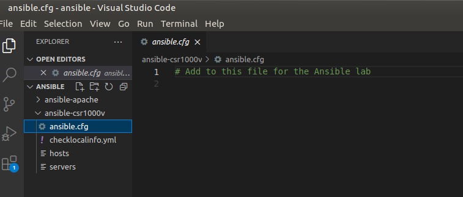

### Paso 2. Edita el archivo de inventario de Ansible

Entramos a CSR1kv e ingresamos el comando para saber qué dirección IP usar:
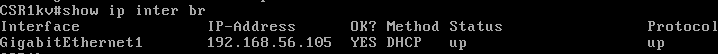

Ingresamos esta dirección en el campo _ansible_host_:
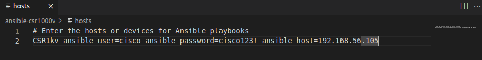

### Paso 3. Muestra la versión de Ansible y la ubicación predeterminada de ansible.cfg

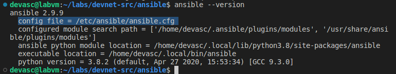

### Paso 4. Muestra el archivo ansible.cfg predeterminado

Usamos este el comando en la terminal: `cat /etc/ansible/ansible.cfg | less`

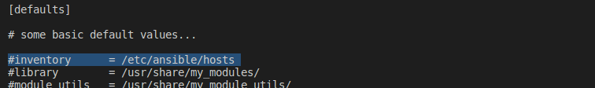
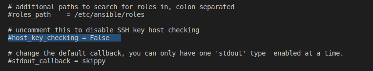

Algo conveniente del comando `less` es que se puede buscar en un archivo abierto.

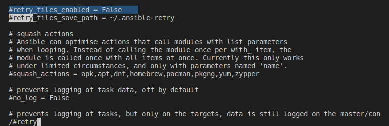

La información que encontramos es la esperada.

Además, inspeccionamos también el archivo 'hosts' de Ansible por defecto:

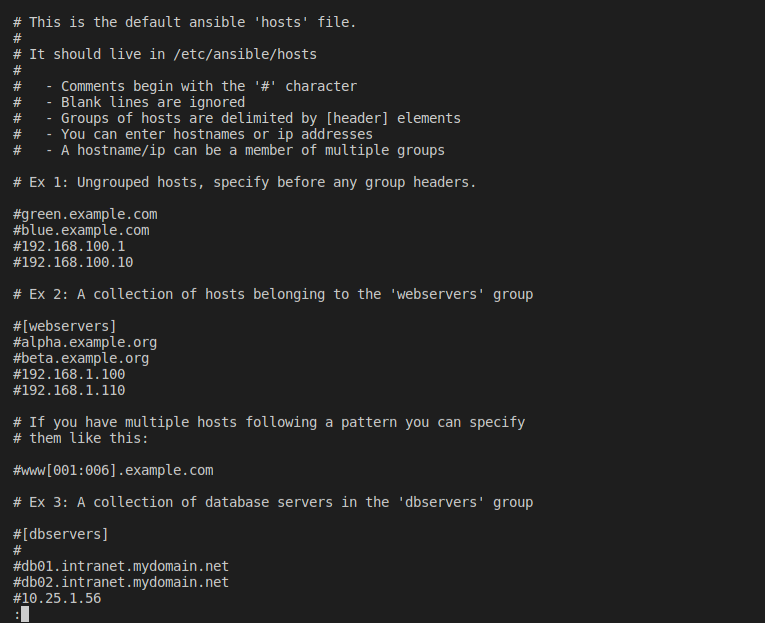

Aquí podemos documentarnos acerca de la sintaxis que se usa en este tipo de archivos.

### Paso 5. Cambia la ubicación del archivo ansible.cfg

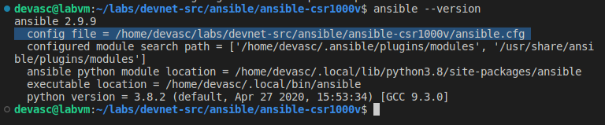

### Paso 6. Edita el archivo ansible.cfg

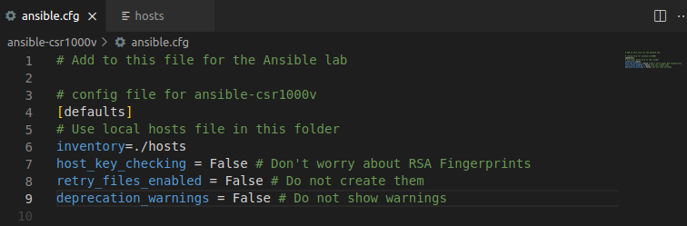

### Paso 7. Resumen: tus archivos de configuración de Ansible

Básicamente editamos los archivos _hosts_ y _ansible.cfg_:
- _hosts_ contiene información para conectarnos con el router virtual.
- _ansible.cfg_ define el archivo anterior como el inventario que usa Ansible al ser ejecutado en el directorio en el que estamos.

---
## Parte 3. Utiliza Ansible para realizar copias de seguridad de una configuración

Aquí se nos explica a groso modo qué son las jugadas y las tareas. Entendemos que se puede hacer el paralelísmo de estos conceptos con los de programa y función, que vienen de la programación.

También nos hablan de los objetos. En laboratorios anteriores vimos que los objetos de YAML son muy parecidos a los objetos JSON, e incluso vimos en [este laboratorio](/Lab3b_Parse-data-py) que traducir la información entre estos estándares era muy simple con las bibliotecas _yaml_ y _json_ de Python. En esencia estos objetos son como un diccionario de Python.

### Paso 1. Crea tu playbook de Ansible

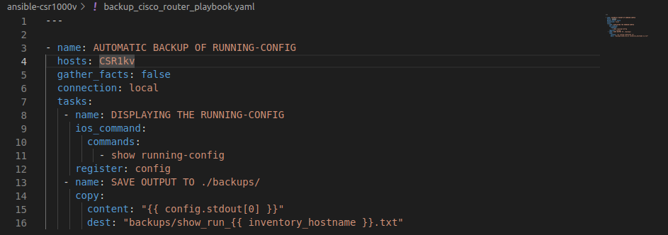

### Paso 2. Examina tu playbook de Ansible

Usamos en la terminal el comando `ansible-doc ios_command` para documentarnos un poquito sobre el módulo _ios_command_.

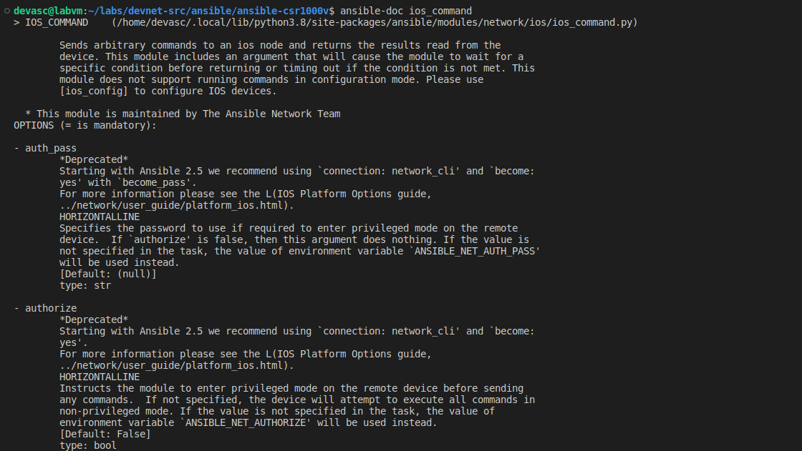

Encontramos un ejemplo de uso:

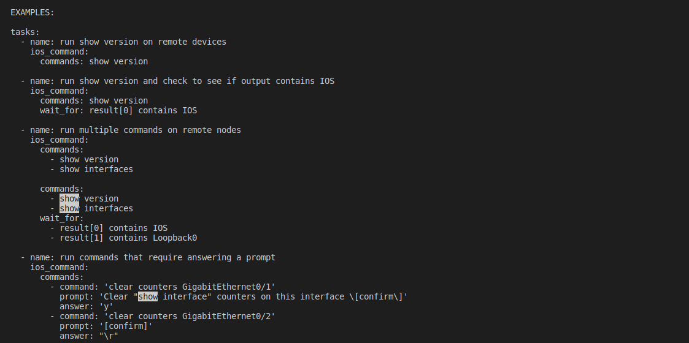

Y aprendimos más sobre la salida de una tarea que use este módulo.

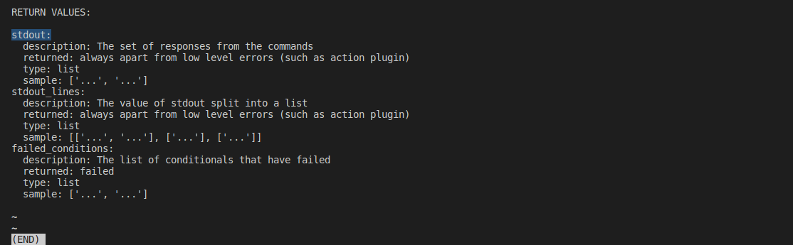

Usaremos esta salida en la segunda tarea, en la línea `content: "{{ config.stdout[0] }}"`

### Paso 3. Ejecuta el playbook de copia de seguridad de Ansible

Verificamos que tenemos acceso al router virtual desde nuestra VM con el comando ping:

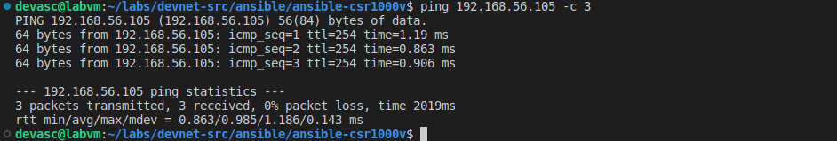

Ejecución del comando:

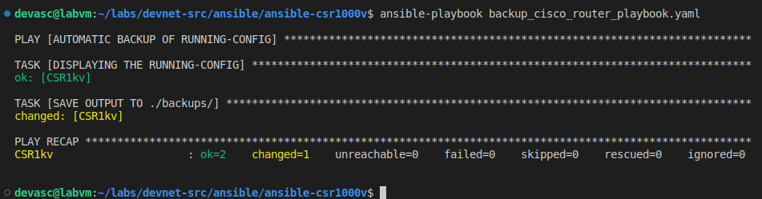

### Paso 4. Verifica que se haya creado el archivo de copia de seguridad

Vemos que obtenemos el resultado esperado de la ejecución del comando `show running-config` en el router virtual:

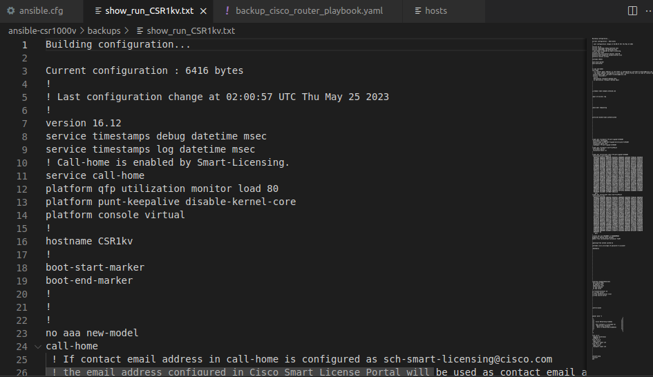

### Extra

En este punto nos podemos preguntar cómo Ansible hizo para saber la información del router si no especificamos el archivo de inventario en el comando `nsible-playbook backup_cisco_router_playbook.yaml`

Esto sucedió porque, por defecto, Ansible verifica si hay algún archivo llamado _ansible.cfg_. Nosotros definimos aquí el archivo de inventario en la línea `inventory=./hosts`. Entonces, si quitamos temporalmente el archivo _ansible.cfg_ del directorio actual, el comando `ansible-playbook backup_cisco_router_playbook.yaml` debería fallar, que es justamente lo que sucede:

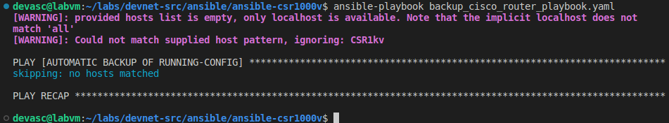

Si queremos que el comando se ejecute sin la presencia del archivo ansible.cfg, debemos agregar el archivo de inventario: `ansible-playbook backup_cisco_router_playbook.yaml -i hosts`

Aunque no logramos que funcione:

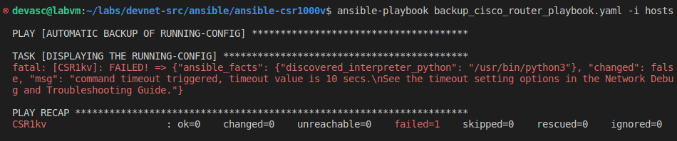

---
## Parte 4. Usar Ansible para configurar un dispositivo

### Paso 1. Observa tu archivo de inventario de hosts

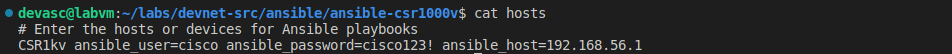

### Paso 2. Crea un nuevo playbook

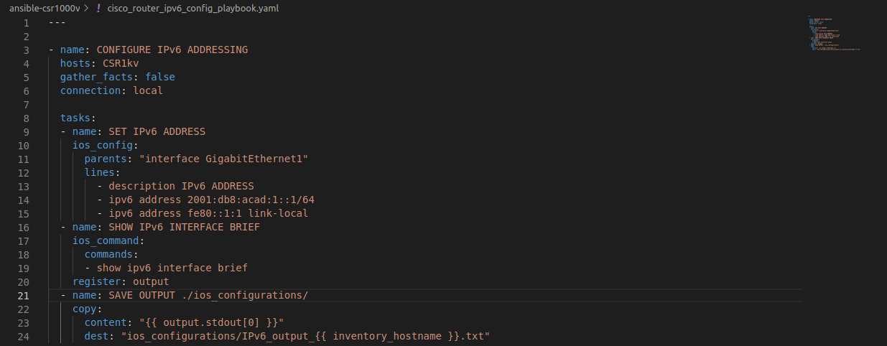

### Paso 3. Examina tu playbook de Ansible

### Paso 4. Ejecuta el playbook de Ansible para configurar el direccionamiento IPv6 en CSR1000v

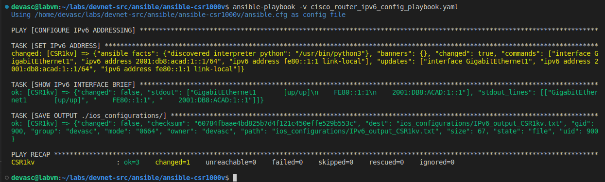

### Paso 5. Verifica que se haya creado el archivo de la salida

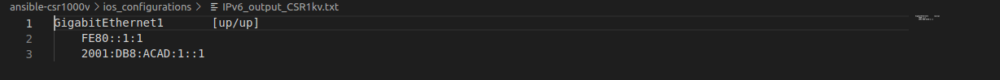

---
## Conclusiones y reflexiones

