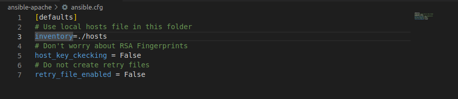
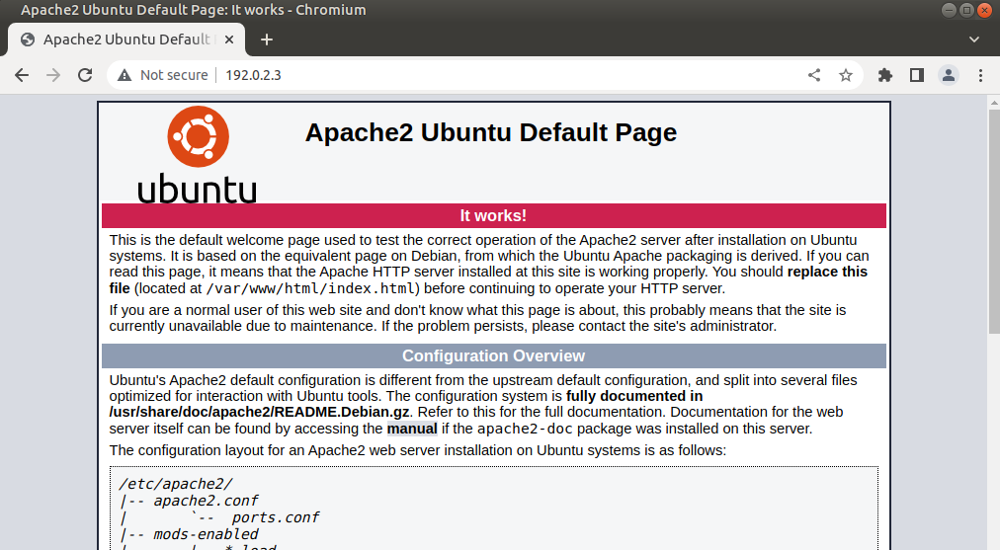

# Utiliza Ansilble para automatizar la instalación de un servidor web <!-- omit in toc -->

- [Parte 1. Inicia las máquinas virtuales DEVASC y CSR1000v](#parte-1-inicia-las-máquinas-virtuales-devasc-y-csr1000v)
- [Parte 2. Configura Ansible](#parte-2-configura-ansible)
  - [Paso 1. Abre una terminal en el DEVASC-LABVM](#paso-1-abre-una-terminal-en-el-devasc-labvm)
  - [Paso 2. Habilita el servidor SSH](#paso-2-habilita-el-servidor-ssh)
  - [Paso 3. Abre el directorio de Ansible en VS Code](#paso-3-abre-el-directorio-de-ansible-en-vs-code)
  - [Paso 4. Edita el archivo de inventario de Ansible](#paso-4-edita-el-archivo-de-inventario-de-ansible)
  - [Paso 5. Edita el archivo ansible.cfg](#paso-5-edita-el-archivo-ansiblecfg)
- [Parte 3. Verifica las comunicaciones con el servidor web local](#parte-3-verifica-las-comunicaciones-con-el-servidor-web-local)
  - [Paso 1. Usa el módulo ping para verificar que Ansible pueda hacer ping al servidor web](#paso-1-usa-el-módulo-ping-para-verificar-que-ansible-pueda-hacer-ping-al-servidor-web)
  - [Paso 2. Usa el módulo de comando para verificar que Ansible pueda comunicarse con el servidor web](#paso-2-usa-el-módulo-de-comando-para-verificar-que-ansible-pueda-comunicarse-con-el-servidor-web)
- [Parte 4. Creación de Playbooks Ansible para Automatizar la Instalación del Servidor We](#parte-4-creación-de-playbooks-ansible-para-automatizar-la-instalación-del-servidor-we)
  - [Paso 1. Crea tu playbook de Ansible para probar tu grupo de servidores web](#paso-1-crea-tu-playbook-de-ansible-para-probar-tu-grupo-de-servidores-web)
  - [Paso 2. Ejecuta el playbook de Ansible para probar tu grupo de servidores web](#paso-2-ejecuta-el-playbook-de-ansible-para-probar-tu-grupo-de-servidores-web)
  - [Paso 3. Crea tu playbook de Ansible para instalar Apache](#paso-3-crea-tu-playbook-de-ansible-para-instalar-apache)
  - [Paso 4. Examina tu playbook de Ansible](#paso-4-examina-tu-playbook-de-ansible)
  - [Paso 5. Ejecuta el playbook de Ansible para instalar Apache](#paso-5-ejecuta-el-playbook-de-ansible-para-instalar-apache)
  - [Paso 6. Verifica que Apache haya sido instalado](#paso-6-verifica-que-apache-haya-sido-instalado)
- [Parte 5. Añade opciones a su Ansible Playbook para servidores web Apache](#parte-5-añade-opciones-a-su-ansible-playbook-para-servidores-web-apache)
  - [Paso 1. Crea tu playbook de Ansible para instalar Apache](#paso-1-crea-tu-playbook-de-ansible-para-instalar-apache)
  - [Paso 2. Examina los dos archivos que serán modificados por el playbook](#paso-2-examina-los-dos-archivos-que-serán-modificados-por-el-playbook)
  - [Paso 3. Ejecuta el playbook de Ansible](#paso-3-ejecuta-el-playbook-de-ansible)
  - [Paso 4. Verifica que Apache haya sido instalado](#paso-4-verifica-que-apache-haya-sido-instalado)
- [Conclusiones y reflexiones](#conclusiones-y-reflexiones)

> Para este laboratorio usamos [esta guía en inglés.](http://www.ccna6rs.com/7-4-8-lab-use-ansible-to-automate-installing-a-web-server-answers/)

---
## Parte 1. Inicia las máquinas virtuales DEVASC y CSR1000v


## Parte 2. Configura Ansible

### Paso 1. Abre una terminal en el DEVASC-LABVM

### Paso 2. Habilita el servidor SSH

```bash
sudo systemctl start ssh
```

### Paso 3. Abre el directorio de Ansible en VS Code


### Paso 4. Edita el archivo de inventario de Ansible


### Paso 5. Edita el archivo ansible.cfg



---
## Parte 3. Verifica las comunicaciones con el servidor web local

### Paso 1. Usa el módulo ping para verificar que Ansible pueda hacer ping al servidor web

```bash
ansible webservers -m ping
```


### Paso 2. Usa el módulo de comando para verificar que Ansible pueda comunicarse con el servidor web

```bash
ansible webservers -m command -a “/bin/echo hello world”
```


---
## Parte 4. Creación de Playbooks Ansible para Automatizar la Instalación del Servidor We

### Paso 1. Crea tu playbook de Ansible para probar tu grupo de servidores web


### Paso 2. Ejecuta el playbook de Ansible para probar tu grupo de servidores web

```bash
ansible-playbook -v test_apache_playbook.yaml
```


### Paso 3. Crea tu playbook de Ansible para instalar Apache


### Paso 4. Examina tu playbook de Ansible


### Paso 5. Ejecuta el playbook de Ansible para instalar Apache


...


### Paso 6. Verifica que Apache haya sido instalado




---
## Parte 5. Añade opciones a su Ansible Playbook para servidores web Apache

### Paso 1. Crea tu playbook de Ansible para instalar Apache


### Paso 2. Examina los dos archivos que serán modificados por el playbook


### Paso 3. Ejecuta el playbook de Ansible


### Paso 4. Verifica que Apache haya sido instalado


---
## Conclusiones y reflexiones

