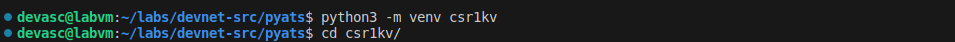
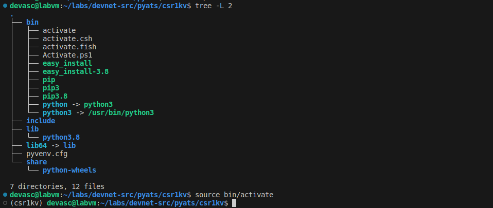
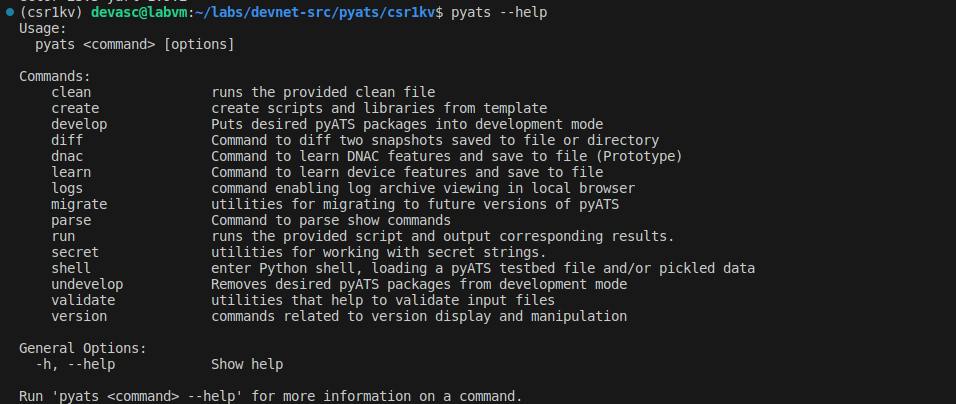
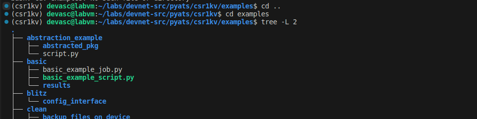
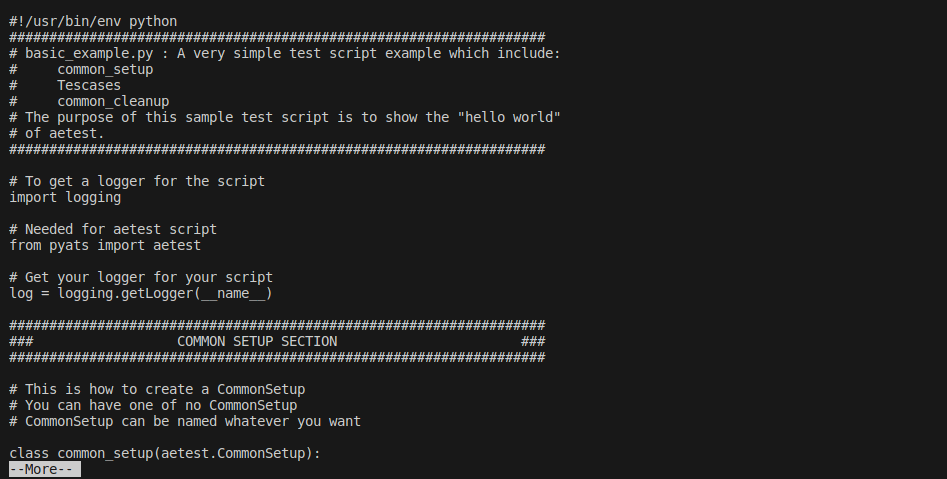

# Pruebas automatizadas usando pyATS y Genie <!-- omit in toc -->

- [Parte 1. Lanza la VM DEVASC](#parte-1-lanza-la-vm-devasc)
- [Parte 2. Crea un entorno virtual de Python](#parte-2-crea-un-entorno-virtual-de-python)
  - [Paso 1. Abre una terminal en el DEVASC-LABVM](#paso-1-abre-una-terminal-en-el-devasc-labvm)
  - [Paso 2. Creando un entorno virtual de Python (venv)](#paso-2-creando-un-entorno-virtual-de-python-venv)
  - [Paso 3. Revisa tu entorno virtual de Python (venv)](#paso-3-revisa-tu-entorno-virtual-de-python-venv)
- [Parte 3. Usa la biblioteca de pruebas pyATS](#parte-3-usa-la-biblioteca-de-pruebas-pyats)
  - [Paso 1. Instalando pyATS](#paso-1-instalando-pyats)
  - [Paso 2. Verificando pyATS](#paso-2-verificando-pyats)
  - [Paso 3. Clona y examina los scripts de muestra de pyATS desde GitHub](#paso-3-clona-y-examina-los-scripts-de-muestra-de-pyats-desde-github)
  - [Paso 4. Examina los archivos de script básicos](#paso-4-examina-los-archivos-de-script-básicos)
  - [Paso 5. Ejecuta pyATS manualmente para invocar el caso de prueba básico](#paso-5-ejecuta-pyats-manualmente-para-invocar-el-caso-de-prueba-básico)
- [Parte 4. Usa Genie para analizar la salida del comando IOS](#parte-4-usa-genie-para-analizar-la-salida-del-comando-ios)
  - [Paso 1. Crea un archivo YAML de testbed](#paso-1-crea-un-archivo-yaml-de-testbed)
  - [Paso 2. Usa Genie para analizar la salida del comando show ip interface brief en JSON](#paso-2-usa-genie-para-analizar-la-salida-del-comando-show-ip-interface-brief-en-json)
  - [Paso 3. Usa Genie para analizar la salida del comando show version en JSON](#paso-3-usa-genie-para-analizar-la-salida-del-comando-show-version-en-json)
- [Parte 5. Usa Genie para comparar configuraciones](#parte-5-usa-genie-para-comparar-configuraciones)
  - [Paso 1. Agrega una dirección IPv6 a CSR1kv](#paso-1-agrega-una-dirección-ipv6-a-csr1kv)
  - [Paso 2. Usa Genie para verificar la configuración y analizar la salida en JSON](#paso-2-usa-genie-para-verificar-la-configuración-y-analizar-la-salida-en-json)
  - [Paso 3. Modifica la dirección Link-Local IPv6](#paso-3-modifica-la-dirección-link-local-ipv6)
  - [Paso 4. Usa Genie para verificar la configuración y analizar la salida en JSON](#paso-4-usa-genie-para-verificar-la-configuración-y-analizar-la-salida-en-json)
  - [Paso 5. Usa Genie para comparar la diferencia entre las configuraciones](#paso-5-usa-genie-para-comparar-la-diferencia-entre-las-configuraciones)
- [Parte 6. Limpieza del laboratorio y más investigación](#parte-6-limpieza-del-laboratorio-y-más-investigación)
  - [Paso 1. Desactiva tu entorno virtual de Python](#paso-1-desactiva-tu-entorno-virtual-de-python)
  - [Paso 2. Explora más casos de uso de pyATS y Genie](#paso-2-explora-más-casos-de-uso-de-pyats-y-genie)
- [Conclusiones y reflexiones](#conclusiones-y-reflexiones)

> Para este laboratorio seguimos [esta guía en inglés.](https://itexamanswers.net/7-6-3-lab-automated-testing-using-pyats-and-genie-answers.html)

---
## Parte 1. Lanza la VM DEVASC

## Parte 2. Crea un entorno virtual de Python 

### Paso 1. Abre una terminal en el DEVASC-LABVM 

### Paso 2. Creando un entorno virtual de Python (venv) 

### Paso 3. Revisa tu entorno virtual de Python (venv)

---
## Parte 3. Usa la biblioteca de pruebas pyATS 

### Paso 1. Instalando pyATS 

Instalamos con el comando `pip3 install pyats`.

### Paso 2. Verificando pyATS 

### Paso 3. Clona y examina los scripts de muestra de pyATS desde GitHub 

### Paso 4. Examina los archivos de script básicos 

### Paso 5. Ejecuta pyATS manualmente para invocar el caso de prueba básico

---
## Parte 4. Usa Genie para analizar la salida del comando IOS 

### Paso 1. Crea un archivo YAML de testbed 

### Paso 2. Usa Genie para analizar la salida del comando show ip interface brief en JSON 

### Paso 3. Usa Genie para analizar la salida del comando show version en JSON

---
## Parte 5. Usa Genie para comparar configuraciones 

### Paso 1. Agrega una dirección IPv6 a CSR1kv 

### Paso 2. Usa Genie para verificar la configuración y analizar la salida en JSON 

### Paso 3. Modifica la dirección Link-Local IPv6 

### Paso 4. Usa Genie para verificar la configuración y analizar la salida en JSON 

### Paso 5. Usa Genie para comparar la diferencia entre las configuraciones

---
## Parte 6. Limpieza del laboratorio y más investigación 

### Paso 1. Desactiva tu entorno virtual de Python 

### Paso 2. Explora más casos de uso de pyATS y Genie

## Conclusiones y reflexiones