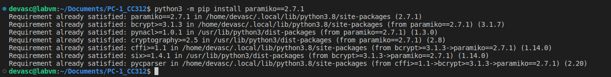

# Práctica 1: Paramiko y Netmiko, configuración de dispotivos de red <!-- omit in toc -->

- [Parte 1. Usando Paramiko para conexión a dispositivos de red a través de SSH](#parte-1-usando-paramiko-para-conexión-a-dispositivos-de-red-a-través-de-ssh)
  - [Paso 1. Iniciar una sesión SSH con Paramiko](#paso-1-iniciar-una-sesión-ssh-con-paramiko)
  - [Paso 2. Ejecución de un comando a través de SSH](#paso-2-ejecución-de-un-comando-a-través-de-ssh)
  - [Paso 3. Leer la salida de un comando ejecutado](#paso-3-leer-la-salida-de-un-comando-ejecutado)
  - [Paso 4. Ejecución de comandos en múltiples dispositivos](#paso-4-ejecución-de-comandos-en-múltiples-dispositivos)
  - [Paso 5. Ejecución de una secuencia de comandos](#paso-5-ejecución-de-una-secuencia-de-comandos)
  - [Paso 6. Usar claves públicas/privadas para la autenticación](#paso-6-usar-claves-públicasprivadas-para-la-autenticación)
  - [Paso 7. Cargando la configuración SSH local](#paso-7-cargando-la-configuración-ssh-local)
- [Parte 2. Usando Netmiko para la configuración de dispositivos de red](#parte-2-usando-netmiko-para-la-configuración-de-dispositivos-de-red)
  - [Paso 1. Conexión a un dispositivo de red usando netmiko](#paso-1-conexión-a-un-dispositivo-de-red-usando-netmiko)
  - [Paso 2. Enviar comandos usando netmiko](#paso-2-enviar-comandos-usando-netmiko)
  - [Paso 3. Recuperar salidas de comandos como datos estructurados de Python usando netmiko y Genie](#paso-3-recuperar-salidas-de-comandos-como-datos-estructurados-de-python-usando-netmiko-y-genie)
  - [Paso 4. Recopilación de datos con netmiko](#paso-4-recopilación-de-datos-con-netmiko)
  - [Paso 5. Conexión a varios dispositivos](#paso-5-conexión-a-varios-dispositivos)

## Parte 1. Usando Paramiko para conexión a dispositivos de red a través de SSH

> Nota: Instalar python3 -m pip install paramiko o python3 -m pip install paramiko==2.7.1

### Paso 1. Iniciar una sesión SSH con Paramiko

### Paso 2. Ejecución de un comando a través de SSH

### Paso 3. Leer la salida de un comando ejecutado

### Paso 4. Ejecución de comandos en múltiples dispositivos

### Paso 5. Ejecución de una secuencia de comandos

### Paso 6. Usar claves públicas/privadas para la autenticación

### Paso 7. Cargando la configuración SSH local

## Parte 2. Usando Netmiko para la configuración de dispositivos de red

### Paso 1. Conexión a un dispositivo de red usando netmiko

### Paso 2. Enviar comandos usando netmiko

### Paso 3. Recuperar salidas de comandos como datos estructurados de Python usando netmiko y Genie

### Paso 4. Recopilación de datos con netmiko

### Paso 5. Conexión a varios dispositivos
