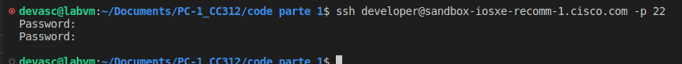
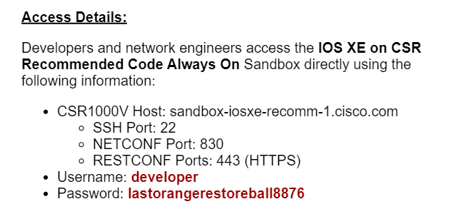
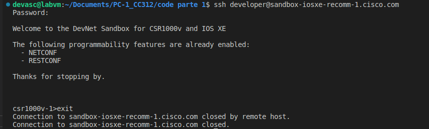
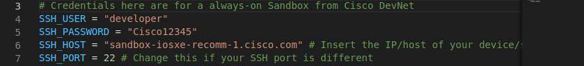
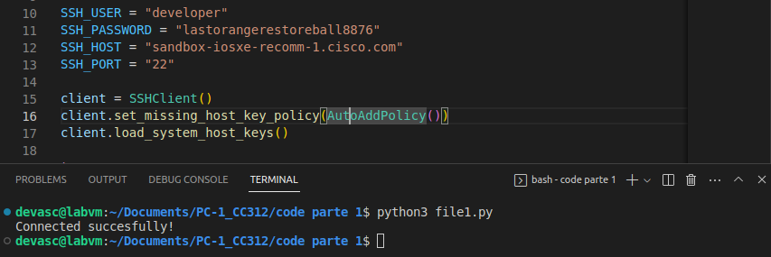
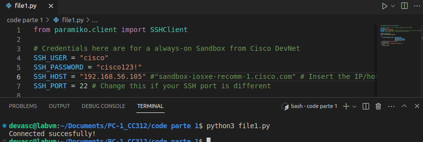
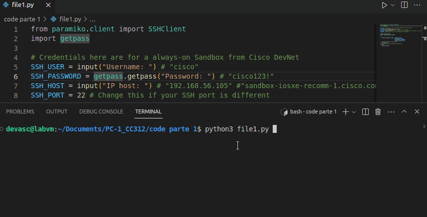

# Práctica 1: Paramiko y Netmiko, configuración de dispotivos de red <!-- omit in toc -->

- [Parte 1. Usando Paramiko para conexión a dispositivos de red a través de SSH](#parte-1-usando-paramiko-para-conexión-a-dispositivos-de-red-a-través-de-ssh)
  - [Paso 1. Iniciar una sesión SSH con Paramiko](#paso-1-iniciar-una-sesión-ssh-con-paramiko)
  - [Paso 2. Ejecución de un comando a través de SSH](#paso-2-ejecución-de-un-comando-a-través-de-ssh)
  - [Paso 3. Leer la salida de un comando ejecutado](#paso-3-leer-la-salida-de-un-comando-ejecutado)
  - [Paso 4. Ejecución de comandos en múltiples dispositivos](#paso-4-ejecución-de-comandos-en-múltiples-dispositivos)
  - [Paso 5. Ejecución de una secuencia de comandos](#paso-5-ejecución-de-una-secuencia-de-comandos)
  - [Paso 6. Usar claves públicas/privadas para la autenticación](#paso-6-usar-claves-públicasprivadas-para-la-autenticación)
  - [Paso 7. Cargando la configuración SSH local](#paso-7-cargando-la-configuración-ssh-local)
- [Parte 2. Usando Netmiko para la configuración de dispositivos de red](#parte-2-usando-netmiko-para-la-configuración-de-dispositivos-de-red)
  - [Paso 1. Conexión a un dispositivo de red usando netmiko](#paso-1-conexión-a-un-dispositivo-de-red-usando-netmiko)
  - [Paso 2. Enviar comandos usando netmiko](#paso-2-enviar-comandos-usando-netmiko)
  - [Paso 3. Recuperar salidas de comandos como datos estructurados de Python usando netmiko y Genie](#paso-3-recuperar-salidas-de-comandos-como-datos-estructurados-de-python-usando-netmiko-y-genie)
  - [Paso 4. Recopilación de datos con netmiko](#paso-4-recopilación-de-datos-con-netmiko)
  - [Paso 5. Conexión a varios dispositivos](#paso-5-conexión-a-varios-dispositivos)
- [Conclusiones](#conclusiones)

## Parte 1. Usando Paramiko para conexión a dispositivos de red a través de SSH

> Nota: Instalar python3 -m pip install paramiko o python3 -m pip install paramiko==2.7.1

### Paso 1. Iniciar una sesión SSH con Paramiko

En este paso nos muestran lo que hace el script _file1.py_ y nos dan unas credenciales que  debemos usar. Además, presuponen que ya deberíamos haber establecido una conexión SSH con el dispositivo para que el host sea conocido. Entonces, hacemos esto primero como sigue:

La contraseña, el nombre de usuario y la dirección del host son los mismos datos que nos entregan en la guía. Además, verificamos que la conexión SSH usa el puerto 22:

Por lo tanto, las credenciales que nos han dado son incorrectas. Es por ello que buscamos en la web una solución para este problema. En [esta página de Cisco](https://devnetsandbox.cisco.com/RM/Diagram/Index/27d9747a-db48-4565-8d44-df318fce37ad?diagramType=Topology) explican básicamente que han actualizado este dispositivo virtual. Ahora estas son las nuevas credenciales que debemos usar para establecer la conexión:

Con estos datos por fin logramos establecer la conexión SSH:

Como mencionamos más arriba, en la guía se explica que este es un paso previo para establecer la conexión SSH usando el primer script de python, ya que de esta forma el host pasa a ser conocido y debería ser recuperado con la línea `client.load_system_host_keys()`. Sin embargo, aún con estas nuevas credenciales, no es posible establecer la conexión:

Hay una forma de cargar las llaves del host que creamos al establecer la conexión en terminal. Se copian manualmente con comandos en el archivo _~/.ssh/known_hosts_. Pero nosotros optamos por la solución más fácil dada por el mismo módulo `paramiko.client`: la clase `AutoAddPolicy`. En la guía se nos explica cómo usarla.

Ahora sí la conexión SSH al dispositivo always-on usando el script fue exitosa.

Alternativamente, probamos este script para conectarnos al mismo dispositivo, pero alojado localmente como una máquina virtual.

**Máquina virtual CSR1000v**

Documentamos la instalación de este dispositivo [aquí](https://github.com/AldoLunaBueno/Curso-CC312-2023_Network-Administration/tree/main/Annex_CSR1000v-installation). Cambiamos las credenciales en el script para establecer esta nueva conexión. Todo funciona sin problemas:

Probamos la clase `getpass`, que sirve para introducir la contraseña de forma segura. Esto lo logra impidiendo que se pueda recuperar en el historial del terminal:

### Paso 2. Ejecución de un comando a través de SSH

### Paso 3. Leer la salida de un comando ejecutado

### Paso 4. Ejecución de comandos en múltiples dispositivos

### Paso 5. Ejecución de una secuencia de comandos

### Paso 6. Usar claves públicas/privadas para la autenticación

### Paso 7. Cargando la configuración SSH local

## Parte 2. Usando Netmiko para la configuración de dispositivos de red

### Paso 1. Conexión a un dispositivo de red usando netmiko

### Paso 2. Enviar comandos usando netmiko

### Paso 3. Recuperar salidas de comandos como datos estructurados de Python usando netmiko y Genie

### Paso 4. Recopilación de datos con netmiko

### Paso 5. Conexión a varios dispositivos

## Conclusiones

¿Qué es DevNet Sandbox? DevNet Sandbox pone la difusión gratuita de la tecnología de Cisco a disposición de desarrolladores e ingenieros proporcionando laboratorios empaquetados que llamamos Sandboxes. Así es, ¡totalmente gratis! Hay dos tipos de Sandboxes, Always-On y Reservation.