# Práctica 1: Paramiko y Netmiko en la configuración de dispotivos de red <!-- omit in toc -->

- [Parte 1. Usando Paramiko para conexión a dispositivos de red a través de SSH](#parte-1-usando-paramiko-para-conexión-a-dispositivos-de-red-a-través-de-ssh)
  - [Paso 1. Iniciar una sesión SSH con Paramiko](#paso-1-iniciar-una-sesión-ssh-con-paramiko)
  - [Paso 2. Ejecución de un comando a través de SSH](#paso-2-ejecución-de-un-comando-a-través-de-ssh)
  - [Paso 3. Leer la salida de un comando ejecutado](#paso-3-leer-la-salida-de-un-comando-ejecutado)
  - [Paso 4. Ejecución de comandos en múltiples dispositivos](#paso-4-ejecución-de-comandos-en-múltiples-dispositivos)
  - [Paso 5. Ejecución de una secuencia de comandos](#paso-5-ejecución-de-una-secuencia-de-comandos)
  - [Paso 6. Usar claves públicas/privadas para la autenticación](#paso-6-usar-claves-públicasprivadas-para-la-autenticación)
  - [Paso 7. Cargando la configuración SSH local](#paso-7-cargando-la-configuración-ssh-local)
- [Parte 2. Usando Netmiko para la configuración de dispositivos de red](#parte-2-usando-netmiko-para-la-configuración-de-dispositivos-de-red)
  - [Paso 1. Conexión a un dispositivo de red usando netmiko](#paso-1-conexión-a-un-dispositivo-de-red-usando-netmiko)
  - [Paso 2. Enviar comandos usando netmiko](#paso-2-enviar-comandos-usando-netmiko)
  - [Paso 3. Recuperar salidas de comandos como datos estructurados de Python usando netmiko y Genie](#paso-3-recuperar-salidas-de-comandos-como-datos-estructurados-de-python-usando-netmiko-y-genie)
  - [Paso 4. Recopilación de datos con netmiko](#paso-4-recopilación-de-datos-con-netmiko)
  - [Paso 5. Conexión a varios dispositivos](#paso-5-conexión-a-varios-dispositivos)
- [Conclusiones y reflexiones](#conclusiones-y-reflexiones)

Para este laboratorio seguimos [esta guía.](/PC1_Paramiko-Netmiko/sources/PC-1_CC312.pdf)

---

## Parte 1. Usando Paramiko para conexión a dispositivos de red a través de SSH

> Nota: Instalar python3 -m pip install paramiko o python3 -m pip install paramiko==2.7.1


### Paso 1. Iniciar una sesión SSH con Paramiko

En este paso nos muestran lo que hace el script _file1.py_ y nos dan unas credenciales que  debemos usar. Además, presuponen que ya deberíamos haber establecido una conexión SSH con el dispositivo para que el host sea conocido. Entonces, hacemos esto primero como sigue:


La contraseña, el nombre de usuario y la dirección del host son los mismos datos que nos entregan en la guía. Además, verificamos que la conexión SSH usa el puerto 22:


Por lo tanto, las credenciales que nos han dado son incorrectas. Es por ello que buscamos en la web una solución para este problema. En [esta página de Cisco](https://devnetsandbox.cisco.com/RM/Diagram/Index/27d9747a-db48-4565-8d44-df318fce37ad?diagramType=Topology) explican básicamente que han actualizado este dispositivo virtual. Ahora estas son las nuevas credenciales que debemos usar para establecer la conexión:


Con estos datos por fin logramos establecer la conexión SSH:


Como mencionamos más arriba, en la guía se explica que este es un paso previo para establecer la conexión SSH usando el primer script de python, ya que de esta forma el host pasa a ser conocido y debería ser recuperado con la línea `client.load_system_host_keys()`. Sin embargo, aún con estas nuevas credenciales, no es posible establecer la conexión:


Hay una forma de cargar las llaves del host que creamos al establecer la conexión en terminal. Se copian manualmente con comandos en el archivo _~/.ssh/known_hosts_. Pero nosotros optamos por la solución más fácil dada por el mismo módulo `paramiko.client`: la clase `AutoAddPolicy`. En la guía se nos explica cómo usarla.


Ahora sí la conexión SSH al dispositivo always-on usando el script fue exitosa.

Alternativamente, probamos este script para conectarnos al mismo dispositivo, pero alojado localmente como una máquina virtual.

**Usamos nuestra máquina virtual local CSR1000v**

Documentamos la instalación de este dispositivo [aquí](https://github.com/AldoLunaBueno/Curso-CC312-2023_Network-Administration/tree/main/Annex_CSR1000v-installation). Cambiamos las credenciales en el script para establecer esta nueva conexión. Todo funciona sin problemas:


Probamos la clase `getpass`, que sirve para introducir la contraseña de forma segura. Esto lo logra impidiendo que se pueda recuperar en el historial del terminal:


### Paso 2. Ejecución de un comando a través de SSH


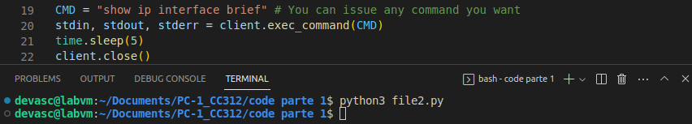

### Paso 3. Leer la salida de un comando ejecutado

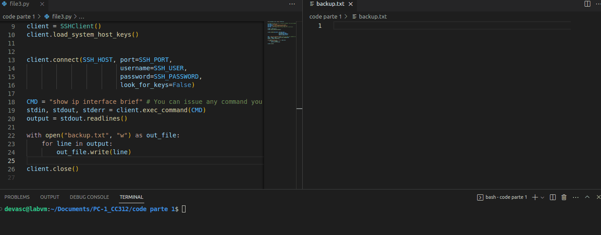

### Paso 4. Ejecución de comandos en múltiples dispositivos

Aquí aplicamos una recomandación para que ya no salga la excepción del buffer que, si bien no parece afectar los resultados del laboratorio, estorba un poco.

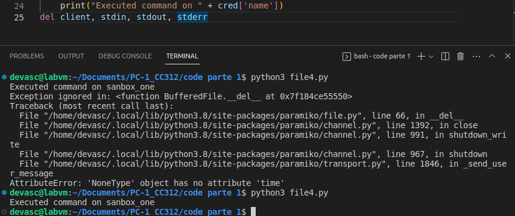

Simplemente agregamos al script esta línea para vaciar el buffer:

```
del client, stdin, stdout, stderr
```

Volviendo a este paso, vemos que el comando se ejecutó, ya que obtenemos el mensaje _Executed command on sanbox_one_ y, además, se crea un archivo con la respuesta de este dispositivo. Pero esta respuesta dice que el comando es inválido:

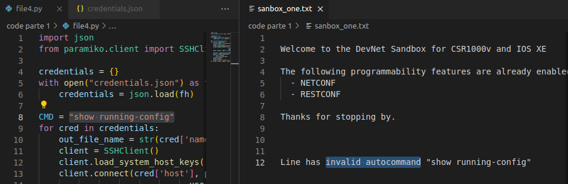

Establecemos la conexión SSH manualmente, y vemos que volvemos a tener el problema:

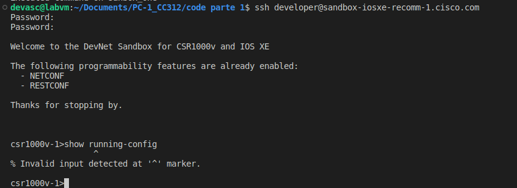

En [esta página](https://community.cisco.com/t5/devnet-sandbox/no-access-to-sandbox-iosxe-recomm-1-cisco-com/m-p/4800896) reportan este mismo problema. Al parecer, están trabajando en ello actualmente.

Todo indica que no se nos están otorgando los permisos necesarios para ejecutar este comando. Si nos fijamos en el símbolo que aparece encabezando la línea de comandos, vemos que es un mayor que (>), mas no una almohadilla (#). La diferencia es que el (>) está asociado con un acceso más restringido a los comandos que (#). Quizás con el script también se inicia la sesión SSH en este modo restringido, y por eso es que no se puede ejecutar el comando.

Hay un comando llamado `enable` que permite desbloquear estas restricciones, pero necesita una contraseña que no aparece por ninguna parte. Probamos las siguientes, pero ninguna funcionó:

- lastorangerestoreball8876
- cisco123!
- Cisco123!
- cisco12345
- Cisco12345
- c1isco12345
- C1isco12345

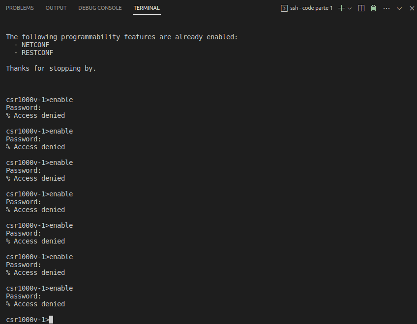


**Usamos nuestra máquina virtual local CSR1000v**

Ahora probamos en nuestro CSR1000v el `show running-config` en el modo restringido (>) y logramos reproducir un mensaje de error bastante parecido:

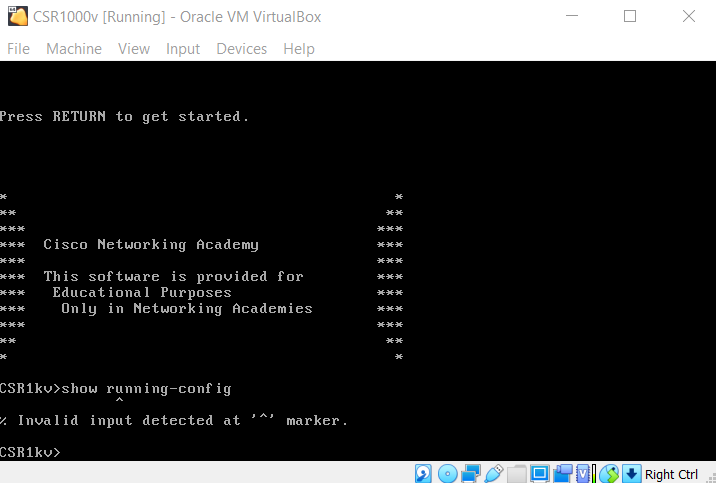

Pero logramos solucionarlo con el comando `enable`, el cuál no nos pide contraseña como en el Sandbox:

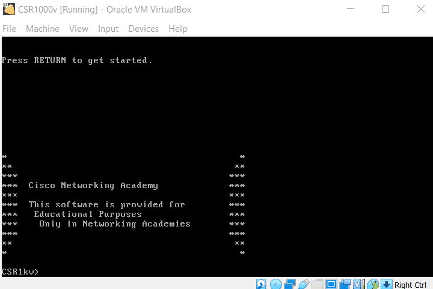

Lo dejamos en modo restringido como estaba al inicio y vamos a VS Code para agregar las credenciales de esta VM para usarlas en el script.

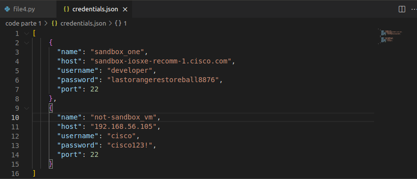

Corremos el script y vemos que el comando se ejecutó en ambos dispositivos. El Sanbox sigue fallando, pero nuestra VM sí acepta el comando:

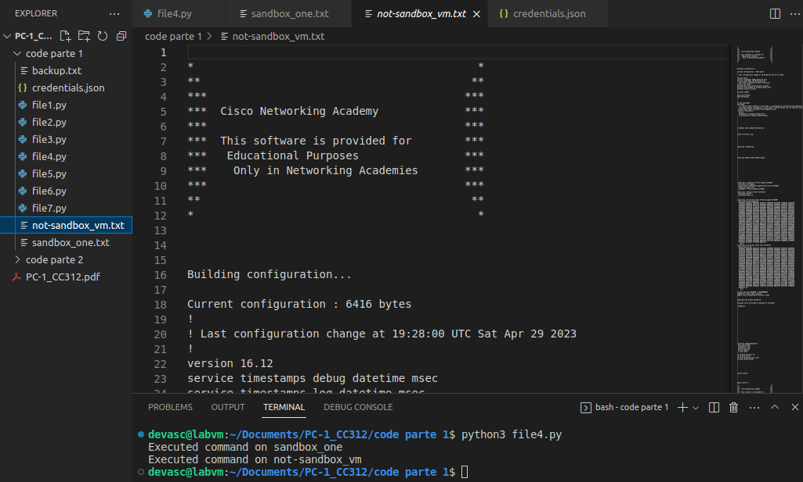

Como vemos en el margen derecho de la captura, VS Code muestra en pequeño el contenido de los archivos, y así comprobamos que la salida de este comando es extensa.

Considerando estos resultados, damos por concluido este paso. Además, en los próximos pasos usaremos la VM local sin máyores preámbulos.

### Paso 5. Ejecución de una secuencia de comandos

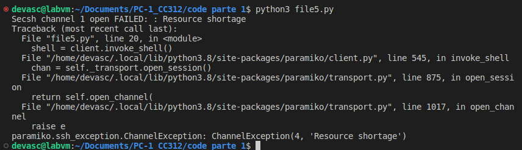

El mensaje de error dice que hay una escasez de recursos («resourse shortage»), y es producido por la segunda de estas líneas:

```py
channel = client.get_transport().open_session()
shell = client.invoke_shell()
```

A pesar de este error, en la VM local la línea de comandos está encabezada por _test>_, así que los comandos fueron ejecutados:

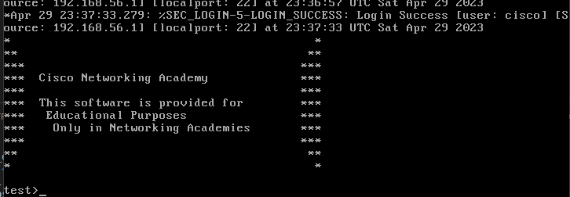

Entonces, el problema biene a la hora de recibir la información. Probamos quitar la primera línea de las dos que citamos del script, y este es el resultado de la ejecución:

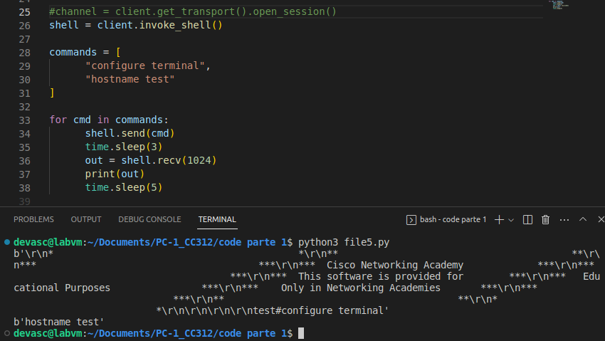

Entonces, al parecer lo que falla es el canal. El canal que define la línea que dejamos comentada es un canal de tipo sesión, como dice la documentación:

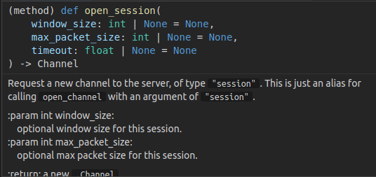

Con esta línea comentada, posiblemente el canal que se habre por defecto sea otro que si permite recibir los datos del shell. En este punto consideramos que logramos parcialmente el objetivo de este paso.

### Paso 6. Usar claves públicas/privadas para la autenticación

Vamos a seguir esta guía para crear el archivo con clave ssh que nos piden: https://upcloud.com/resources/tutorials/use-ssh-keys-authentication

Además, documentaremos esto como un anexo.

### Paso 7. Cargando la configuración SSH local

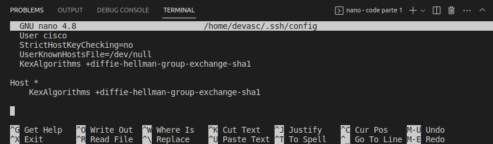

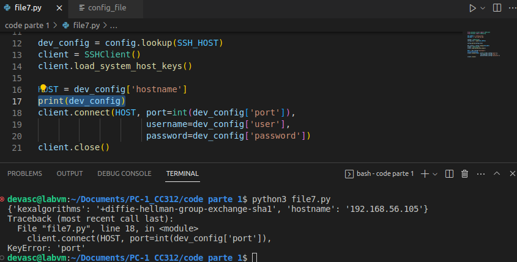

## Parte 2. Usando Netmiko para la configuración de dispositivos de red

### Paso 1. Conexión a un dispositivo de red usando netmiko

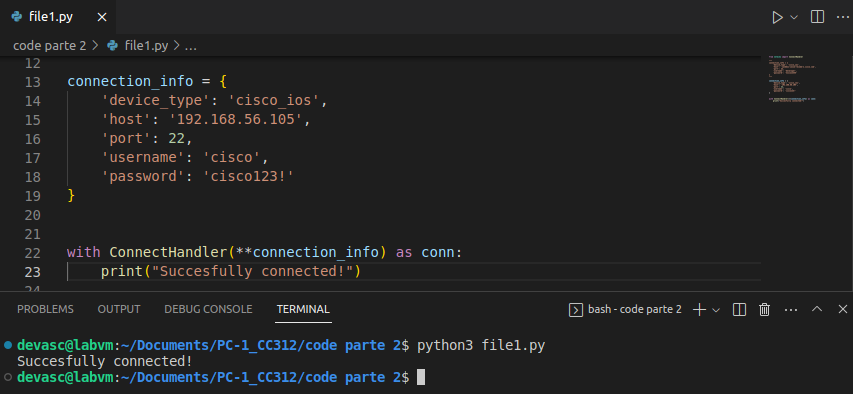

### Paso 2. Enviar comandos usando netmiko

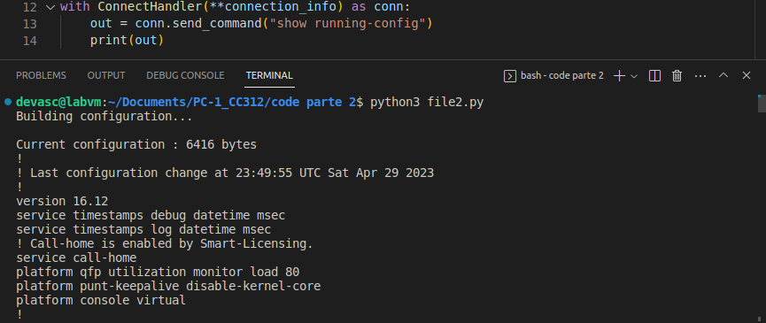

### Paso 3. Recuperar salidas de comandos como datos estructurados de Python usando netmiko y Genie


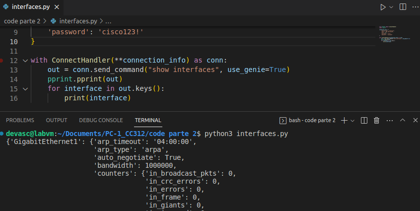

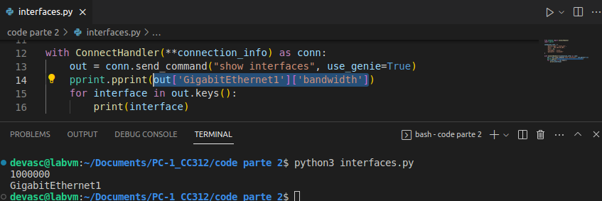

### Paso 4. Recopilación de datos con netmiko

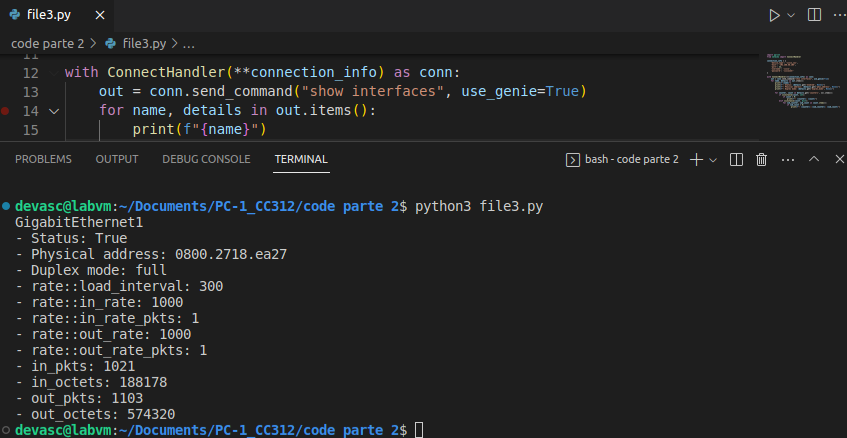

### Paso 5. Conexión a varios dispositivos

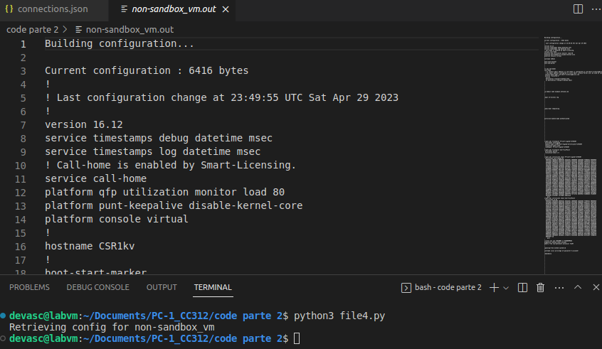

## Conclusiones y reflexiones

**¿Qué hicimos en este laboratorio?**

En este laboratorio vimos las herramientas de Paramiko y Netmiko para establecer una conexión SSH desde Devasc hacia otra VM llamada CSR100v, que en realidad es un router virtual. A través de esta conexión SSH fuimos capaces de introducir comandos para configurarlo y recoger información de forma automática usando scripts de Python soportados por las herramientas mencionadas.

Tuvimos problemas con el router virtual que Cisco tiene en su nube como servicio sandbox always-on, pero usamos como alternativa un router virtual local del mismo modelo.

**¿Qué aprendimos sobre las herramientas utilizadas?**

**Paramiko** es una implementación en Python del protocolo **SSHv2** que proporciona tanto funcionalidad de cliente como de servidor. Pero **Netmiko**, como vimos, es una versión más amigable de Paramiko que también se basa en Paramiko y que facilita el control de los dispositivos de red mediante scripts de Python. Ambas herramientas nos permiten establecer una conexión SSH desde una máquina virtual hacia otra máquina virtual o un dispositivo físico. **Genie** es una biblioteca de complemento que hace que Netmiko aumente aún más su facilidad de uso y sus posibilidades, ya que te permite analizar y manipular la salida de los comandos de red en forma de datos estructurados. También nos apoyamos en la biblioteca **pptrier** para presentar mejor estos datos.

La máquina virtual CSR100v es un **router virtual** de Cisco que ofrece servicios de red y seguridad en entornos virtuales y en la nube. Al usar estas herramientas, podemos configurar y recoger información del router virtual de forma automática y segura.

**¿Qué hay más allá de estas herramientas básicas?**

Hay otras bibliotecas de Python para la automatización de redes, como NAPALM, Ansible o PyATS.

- NAPALM: Es una librería que simplifica las interacciones automatizadas con dispositivos de red de diferentes sistemas operativos mediante una API unificada. Te permite obtener información y configurar los dispositivos usando métodos comunes para todos los fabricantes.
- Ansible: Es una plataforma de automatización que usa Python como lenguaje base y que te permite gestionar la configuración, el despliegue y la orquestación de múltiples dispositivos y sistemas mediante un lenguaje declarativo llamado YAML.
- PyATS: Es un framework de testing de redes que te permite escribir y ejecutar pruebas automatizadas usando Python. Te ayuda a validar el funcionamiento y el rendimiento de tu red mediante scripts personalizados o plantillas predefinidas. Genie también se integra con PyATS y te permite analizar y manipular la salida de los comandos de red en forma de datos estructurados.